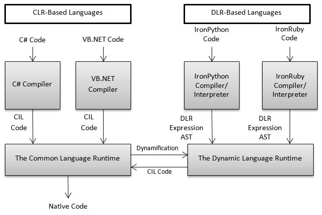
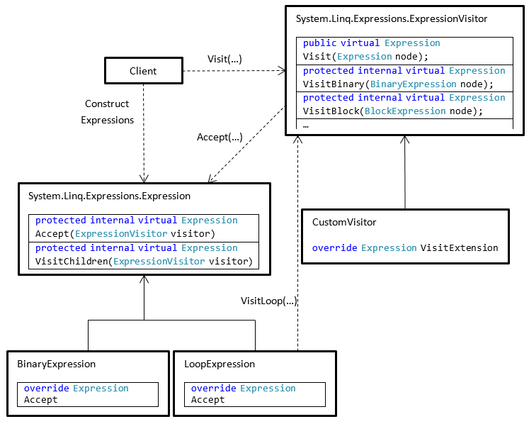
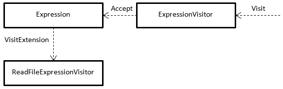
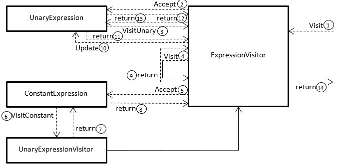
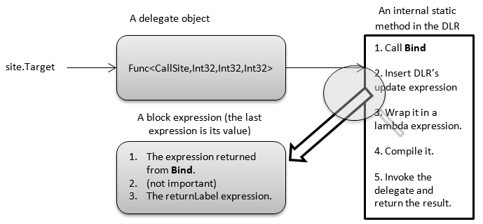
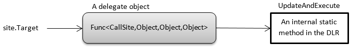
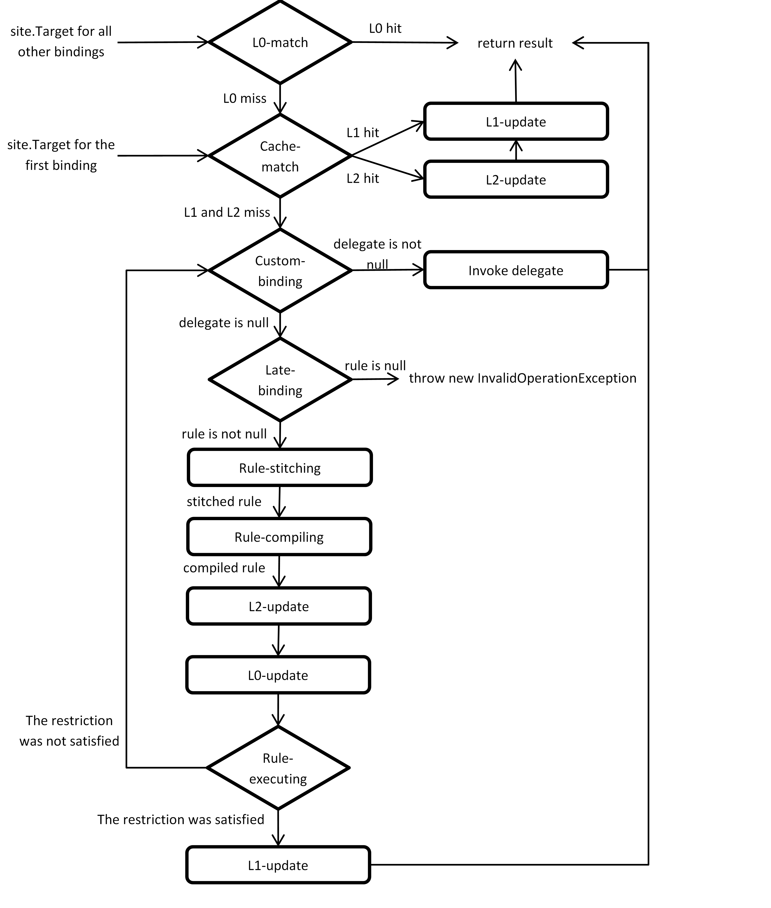
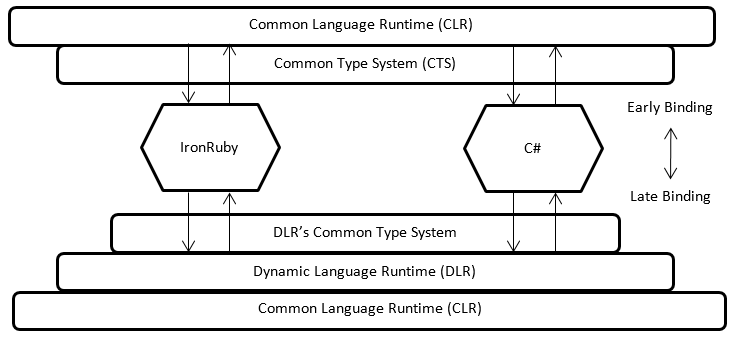
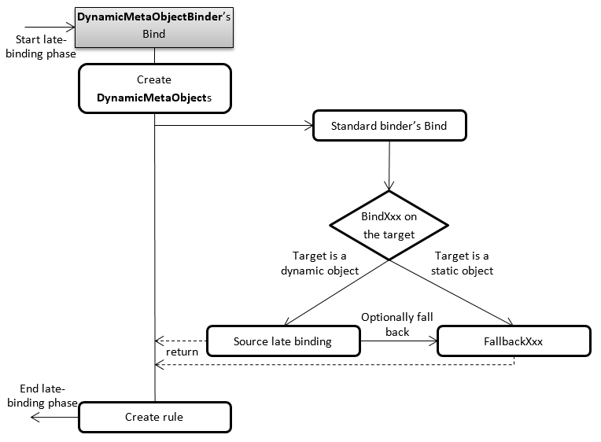

# Chapter 11: The Dynamic Language Runtime

## 11.1 Static and Dynamic Languages

All fields, local variables, and parameters in C# are typically _statically typed_. That is, their types are determined at compile-time. Types such as **System.Object** , **System.Int32** , and **System.String** are static types. If a local variable of type **System.Int32** is defined , the C# compiler exactly knows the operators and methods that can be applied to this type. The compiler also knows those types whose instances can be assigned to that variable.  If, at compile-time, you attempted to call a method on an **Int32** instance that is not defined by **Int32** or one of its base types, the compiler will emit an error indicating that the method does not exist. Similarly, if you attempted at compile-time to use an operator or access a field of a variable that is not provided by the type of that variable, the compiler will emit an error. Finally, if you attempted to assign an instance of **String** to an instance of **Int32**, then the compiler will emit an error indicating that **String** cannot be assigned to **Int32**. The C# compiler emits these errors because it performs a process called _type checking_. This process inspects all constructs of your program including definitions, statements, and expressions and emits an error when it finds something that is considered by the compiler _semantically invalid_ (such as assigning **String** to **Int32** ).

The question is: why does the C# compiler performs type checking? Let me rephrase this question as follows: what happens if the C# compiler did not perform type checking? Or in a third form: what happens at _run-time_ if the C# compiler did not perform type checking? Well, if the compiler allowed an expression that assigns a **String** to an **Int32** then when this code is executed, the runtime will perform type checking, thereby detecting this inconsistency. Since the CLR is a _type-safe runtime_, it will immediately stop the execution of the code and throw an exception. The reason for this is that the CLR is aware that it a variable of **String** cannot be assigned to a location of type **Int32** because these two types have no relationship that permits such operation. Type safety is a mechanism that enables us to effectively shorten the application development life cycle by detecting bugs _as exceptions_ much earlier in the cycle.

Now when the C# compiler detects an attempt to assign a **String** to an **Int32** , it knows for sure that the type-safe runtime will throw an exception. So instead of telling the programmer that this is not allowed when the code executes, the compiler can also perform type checking to inform the programmer that this is not allowed at compile-time. _Compile-time type-safety enables the programmer to detect bugs that might be detected later at testing or might not be detected and escape even to the end user._ When the C# compiler emits an error about this assignment, the programmer quickly knows about this issue in the program. All rules of type-safety that are respected by the runtime are optionally respected by the compiler. However, in general, the compiler knows very little about the code. The compiler is able to detect that it's not safe to assign a **String** to an **Int32** because it knows everything about **String** , **Int32** , and the assignment operator. In many situations, the compiler cannot determine whether an operation is type-safe or not. Consider for the example the following code that involves an assignment:

```
Object obj = GetObject();
Int32 integer = obj;
```

**GetObject** is a method that may be defined by you or by someone else. This method could contain any code that possibly involves various statements such as loops, if-else, and other method calls. At compile-time, the compiler does not know what type of object **GetObject** will return. All it knows is that **obj** is a reference of type **Object** that identifies to the returned object. The returned object could be an instance of any **Object** -derived type. It could be an **Int32** or a **String** or something else. The compiler also knows that **integer** is of type **Int32**. Now when the compiler performs type checking on this code, it will see that it's attempting to assign an **Object** to an **Int32**. If the compiler can determine that **obj** references a boxed **Int32** all the time, then it can emit code that unboxes and copies this value to **interger**. However, since the compiler may not have enough information to make this guarantee, it determines that this is not safe and so it will emit the following error: **"Cannot implicitly convert type 'object' to 'int'. An explicit conversion exists (are you missing a cast?)"**. The compiler is telling us that it cannot guarantee that this conversion will succeed at run-time, and casting has to be used as follows:

```
Int32 integer = (Int32)obj;
```

When casting is used, it communicates to the compiler that the programmer is responsible for the results of this conversion. Therefore, the compiler will respect that and allows this code to be compiled. Now the type-safety of the runtime comes into play. The CLR doesn't care whether the CIL code that it is executing is emitted by a type-safe language like C# or not. All that it cares about is that this code should be type-safe. While the code is executing, the CLR has all the information that it requires to ensure all rules of type-safety. When **GetObject** is executed, it will return an instance of some type and a reference to this instance is stored in **obj**.  This means, when the the casting operation is about to be executed, the CLR knows the type of this instance and can always determine whether this casting is safe or not and respond appropriately. For example, if **obj** refers to an instance of **String** then it is not safe to convert it to **Int32**. In this case, the CLR throws an **InvalidCastException** exception. But if **obj** refer to a boxed **Int32** then it is safe to convert it to **Int32**. In this case, the CLR would perform this conversion.

The CLR is the only component of .NET that must ensure type-safety by performing type checking. Other tools and compilers may also perform type checking _with various degrees_. For example, the C# compiler performs nearly full type checking. However, the C# compiler allows us to write code that is not guaranteed to be safe at compile-time by explicitly stating to the compiler that the programmer is responsible for the results. The benefit of a type-safe compiler is that it effectively helps to write perfectly correct programs. _The runtime being type-safe does not affect the syntax and the amount of code that needs to be written to develop a program. In contrast, the compiler being type-safe does affect the syntax and the amount of code that needs to be written._ That's the disadvantage of using a type-safe language. You have already seen an example of this where **obj** is assigned to **integer**. Since C# is type-safe, more code needed to be written to specify casting to perform this assignment. If C# is not type-safe, then there would be no need to explicitly write the casting syntax, resulting in a simpler code.

From this, it can be seen that programming languages that are not type-safe could have some advantages over type-safe languages. Does it pay to develop _type-unsafe_ programming languages? Well, one advantage is the ability to write less and simpler code. But there are other significant advantages. Consider the following code:

```
Object obj = GetObject();
obj.Run();
```

At compile-time, the run-time type of the object referenced by **obj** is unkown. What is known is that **obj** is a reference of type **Object** and that **Object** does not provide an instance method called **Run**. In a type-safe language like C#, the compiler will emit an error indicating that the method does not exist. However, in a type-unsafe language, this code would compile with no errors. That's because the compiler does not care about type-safety. If you want to call a method that may not exist, then you can do it. However, at run-time, the CLR doesn't care at all whether the code was written in a type-safe language. It will enforce type-safety anyway. So assume that **GetObject** has returned an instance of **DateTime**, the CLR would then see that this type and all of its base types do not define an accessible instance method called **Run**. Therefore, the CLR will throw an exception.

Is it useful to write such code? Well, yes it is. For example, that would make it easier to develop an application using a top-down approach. In this approach, it's possible to compile code that attempts to call methods that may have not yet been declared or implemented and modify type definitions at run-time. For example, you could have a type that does not define any member but then at run-time, you can add more fields and methods when when needed. This technique could be used to have smaller and simpler types that you can expand or shrink as needed. Another useful scenario is when developing a domain-specific programming language (DSL) that is used by end users of an application. Ends users (who are usually not programmers) find it much more convenient to use a DSL without worrying about types of variables and conversions. In all of these scenarios, it is really better to have type-unsafe languages.

Note that whether you're using a type-safe language or a type-unsafe language, the runtime must always be type-safe. Otherwise, it will impossible to develop robust and secure systems. This means that type-checking performed sooner or later. The difference between a type-safe language and a type-unsafe language is when type-checking is performed.

The term _compile-time type-checking_ means that type-safety is ensured by the compiler and the term _run-time type checking_ means that type-safety is ensured by the runtime. For a programming language compiler/interpreter that performs type-checking, the language is described as _static_. For a programming language compiler/interpreter that does not perform type-checking, it's described as _dynamic_. The term "static" means doing things at compile-time. The term "dynamic" means doing things at run-time.

A programming language being a static or dynamic is a matter of degree. This degree is determined by the degree of type-checking statically performed. More type-checking means that the language is more like static. Less type-checking means that the language is more like dynamic. Before .NET 4.0, the only way to write dynamic code is by using reflection. For example, the following code attempts to call a method called **Run** that has two parameters: one of type **String** and the other of type **Int32**. We would like to perform this call whether it's guaranteed that it exists or not:

```
Object obj = GetObject();
MethodInfo mi = obj.GetType().GetMethod("Run");
Object[] args = new Object[] { "String", 4 };
mi.Invoke(obj, args);
```

When compiling this code, the C# compiler will perform type-checking as usual. Since everything is Ok as far as the compiler knows, the compiler will emit the CIL code with no complaints. That is, the type-checking on the invocation of the method **Run** has been deferred until run-time. However, this code is not very convenient to an end user who does not know anything about programming or to programmers that care most about productivity.

Dynamic programming languages allow us to write code very quickly without worrying about types of variables, fields, and parameters. A variable can simply be declared and assigned to it a value like 10 or a value like "Some string" and then use these variables to perform some operations and call some methods to achieve some required functionality. When this code is executed, type checking is performed by the runtime to make sure that everything is sound. If it finds out that a method is beign called that is not provided by the type of an instance, then the runtime will throw an exception. If it finds out that an argument of type **String** is being passed to a parameter of type **Int32** , then it will throw an exception because there is no conversion from **String** to **Int32**. Examples of dynamic languages are Lisp, Smalltalk, PHP, Ruby, and Python.

The Dynamic Language Runtime (DLR) is a component of .NET that enables us to easily develop dynamic programming languages for the .NET framework. However, the DLR is capable of much more than that. You can also use the DLR to develop metaprograms which are programs that generate and manipulate programs. The DLR also allows us to develop scripting capabilities into applications to allow end users to perform complex tasks and automate them. Even more, the DLR has a hosting API that allows code of one language to be executed within code of another language. For example, you can use IronPython code from IronRuby which in turn can be used from C#.  Note that the DLR not only enables us to implement dynamic langauges, but also enables us to make traditionally static languages like C# provide dynamic features like the **dynamic** keyword.

The C# programming language is mostly static. However, it enables dynamic typing via the **dynamic** keyword. This will considerably simplify the syntax when interoperating with COM objects. This also enables us to host code of dynamic languages such as IronPython and using types and objects defined in that language. The **dynamic** keyword is rarely used for other situations. The relation between the DLR and C# is baked into the **Microsoft.CSharp.dll** assembly and will be explained throughout this chapter. This assembly references three more assemblies: **System.dll** , **System.Core.dll** , and **System.Dynamic.dll**. So when using the **dynamic** keyword, not only the performance will suffer because of late binding, but also more assemblies will be loaded, consuming more memory.

The DLR consists of the following components:

- Expression trees: The DLR uses expression trees to represent code as data. This allows language implementers to avoid creating several parts of compilers for dynamic languages such as code generators and optimizers. Compilers can emit expression trees which will be compiled to CIL code by the DLR and executed. The hard work of compiling is done by the DLR. It is considerably easier to emit expression trees then emitting CIL code. This simplifies the implementation of dynamic languages for the DLR. Expression trees actually have many other applications. They are extensively used by various technologies such as LINQ providers, Windows WorkFlow (WF), and Managed Extensibility Framework (MEF). They will be discussed in Section 11.3 "DLR Expression."
- Call site caching: A call site is a place in code where operations like a + b and obj.ToString() are performed. A call site is said to be dynamic when at least one of the operands of the operation is dynamically typed. As will be discussed later in this chapter, resolving and executing dynamic operations is quite expensive compared to static operations. For this reason, the DLR provides a caching mechanism that will cache the result of resolving the operation in the call site. This can significantly enhance the performance of dynamic code. This will be discussed in Section 11.4.4 "Writing Cache-Friendly Dynamic Code."
- Dynamic object interoperability: While you can create dynamic languages using the DLR, you can also interoperate between these languages. The DLR enables language interoperability by providing a meta-object protocol. This enables dynamic objects from one DLR-based language to be passed to code in another DLR-based language while still preserving the source language's semantics.  This feature is what makes it possible to share libraries written in different languages that support the DLR. This will be discussed in Section 11.5 "Language Interoperability."
- Hosting API: This feature enables us to use code written in one DLR-based language in another DLR-based language. For example, you can use IronRuby objects in C# code. You can even create instances of IronRuby types in C#. This API works because of the dynamic object interoperability of the DLR. I will not discuss the Hosting API in this book.
- Debugging API: This API enables us to implement debuggers for DLR-based languages. It will not be covered in this book.

The DLR is open-source and can be downloaded from CodePlex together with the source code of several dynamic languages including IronPython and IronRuby. According to the source code, the following assemblies make up the DLR: **Microsoft.Dynamic.dll** , **Microsoft.Scripting.dll** , **Microsoft.Scripting.Core.dll** , and **Microsoft.Scripting.Metadata.dll**. However, the fundamental types of these assemlbies are packaged in different assemlbies of .NET.  These types can be found in the **System.Dynamic** , **System.Linq.Expressions** and **System.Runtime.CompilerServices** namespaces in the **System.Core.dll** assembly, and in the **Microsoft.CSharp.dll** assembly.

## 11.2 Introduction to Dynamic Programming in C#

C# originated as a static language. C# 4 allows us to write dynamic code via the **dynamic** keyword. When a local variable is defined as **dynamic** , it indicates that this variable is of some type that is unknow at compile-time and will be determined at run-time. C# considers **dynamic** as one of its primitive types like **int** and **object**.  Consider for example the following local variables and conversions:

```
Int32 variable1 = 10; // Explicit static typing.
String str1 = variable1; // Compiler error.
Console.WriteLine(str1.ToUpper()); // Early binding to Console.WriteLine(String).

var variable2 = 10; // Implicit static typing.
String str2 = variable2; // Compiler error.
Console.WriteLine(str2.ToUpper());// Early binding to Console.WriteLine(String).

dynamic variable3 = 10; // Dynamic typing.
variable3 = "Now I am String"; // OK.
Console.WriteLine(variable3.ToUpper()); // Late binding to Console.WriteLine(String).

dynamic variable4 = 10; // Dynamic typing.
String str4 = variable4; // Exception.
Console.WriteLine(str4.ToUpper()); // Late binding.
```

**variable1** is of type **Int32** and **str1** is of type **String**. When assigning **variable1** to **str1** , the compiler will emit an error that indicates **Int32** cannot be assigned to **String**. **variable1** is described to have an _explicit static type_. Next, **variable2** is defined as **var** and **str2** is **String**. The keyword **var** indicates that the type is inferred by the compiler. So the compiler will look at the initial value and according to this value will infer the type of **variable2**. Since the initial value is of type **Int32** , the compiler infers **variable2** to be **Int32**. Therefore, a compiler error will occur when **varibale2** is assigned to **str2** as in the first case. *variable2** is described to have an _implicit static type_. Things get more interesting when **dynamic** is used. I have defined **variable3** to be of type **dynamic**. This tells the compiler that this local variable is dynamically typed. So the compiler will neither determine a type for this variable nor perform type checking on expressions involving this variable. The C# compiler also will not complain about the call to **ToUpper**. At run-time, **variable3** when assign the value 10 will be of type **Int32**. Next, when **String** is assigned to **variable3** , it becomes of type **String**. This is okay because a dynamic variable like **variable3** is treated as if it was of type **Object**. A reference of type **Object** can refer to a boxed **Int32** and can refer to a **String**. Now when **ToUpper** is called on **variable3** , the CLR determines that **String** defines this method and calls it. The last case has **variable4** of type **dynamic** and **str4** of type **String**. When assigning **variable4** to **str4** , the CLR determines the **variable4** is a reference to a box **Int32** and **str4** is a reference to a **String**. This is not allowed and so the runtime will throw an exception of type **Microsoft.CSharp.RuntimeBinder.RuntimeBinderException** defined in the **Microsoft.CSharp.dll** assembly. The program will crash at this moment and the last call to **ToUpper** will not execute.

The **dynamic** keyword can be used for local variables, fields, parameters, return types, expressions, and generic type/method/delegate type arguments. Here is another example:

```
using System;

internal static class Program {
    private static void Main() {
        Int32 anInt32 = 5;
        String aString = "string";
        Console.WriteLine(Add(anInt32)); // Add(Int32 integer).
        Console.WriteLine(Add(aString)); // Add(String integer).
        Object obj = anInt32;
        Console.WriteLine(Add(obj)); // Add(dynamic integer).
    }

    // Statically typed parameter and return value.
    private static Int32 Add(Int32 integer) {
        return integer + integer;
    }

    // Statically typed parameter and return value.
    private static String Add(String str) {
        return str + str;
    }

    // Going dynamic using generics.
    private static  T Add<T>(T arg) {
        return arg + arg; // Oops! Compiler error.
    }

    // Going dynamic using dynamic.
    private static dynamic Add(dynamic arg) {
        return arg + arg; // OK.
    }
}
```

There are four methods called **Add** , one of them is generic. The first **Add** takes an **Int32** and returns an **Int32**. The second takes a **String** and returns a **String**. Both of those methods use static types **Int32** and **String**. Both of these types support the + operator. At compile-time, the compiler can determine what CIL code to emit to execute these operators. The third **Add** method is a generic method that takes a **T** and returns a **T**. The problem here is that compiler has no idea how to emit the CIL code for the + operator and in fact, not all **T** s support this operator. So the compiler will emit an error as type-safety requires. However, the last overload of **Add** has a parameter of type **dynamic** and a return type **dynamic**. In this case, the compiler will not care whether it is guaranteed that the type of **arg** supports the + operator or not. The compiler will emit special CIL code that checks at run-time whether there is a + operator. If there is then it will be called. Otherwise, an exception is thrown as required by runtime type-safety.

Let's examine the code in **Main**. Each time a method is called, the compiler has to determine which method that should be called. Similarly, each time an operator is used, the compiler has to determine which code that performs that required operation. This is not an easy task because methods and operators could be overloaded and so the compiler has to correctly figure out one of the overloads or emits an error when there is ambiguity. When **Add** is called and an instance of **Int32** is passed to it, the compiler checks all overloads of **Add** and sees which one takes an **Int32**. Since such an overload exists, the compiler will emit CIL code that calls this overload. Next, when **Add** is called and an instance of **String** is passed to it, the compiler checks all overloads of **Add** and sees which one takes a **String**. Since such an overload exists, the compiler will emit CIL code that calls this overload. Both of these cases are an example of _early binding_. Early method binding means that the resolution of a method call or an operator is done at compile-time. That is, the compiler is the one that determines and emits code to call a specific method.

Now the third call to **Add** , I am passing a reference of type **Object**. The compiler, again, checks all overloads of **Add** and sees which one takes an **Object**.  But since there is no overload of **Add** that takes an **Object** , the compiler concludes that there is no early binding to **Add** for an argument of type **Object**. The compiler now checks whether there is an overload that has a parameter of type **dynamic**. Since there is such an overload, the compiler emits CIL code that calls it. The interesting part is compiling the code of **Add** that takes a dynamic object and returns a dynamic object. The compiler determines that the expression **arg + arg** is a dynamic expression and therefore, it will dispatch the operator dynamically (_late binding_).

Here is an example that shows one of the useful applications of dynamic types when working with an Excel workbook from C#:

```
using System;
using Microsoft.Office.Interop.Excel;

internal static class Program {
    private static void Main() {
        Application excel = new Application();
        excel.Visible = true;
        excel.Workbooks.Add();

        // Without dynamic.
        ((Range)excel.Cells[1, 1]).Value = 10; // One cast!
        Int32 value1 = (Int32)((Range)excel.Cells[1, 1]).Value; // Two casts!

        // Using dynamic expressions.
        excel.Cells[1, 1].Value = 10; // Resolved at run-time.
        Int32 value2 = excel.Cells[1, 1].Value; // Resolved at run-time.
    }
}
```

Without the dynamic type, the code will get really complicated. This is because the value returned from **excel.Cells[1, 1]** is of type **Object** and in order to access the **Value** property, it has to be converted to **Excel.Range**. Also when retrieving a value from a cell, it needs to be cast to **Range**. In addition, the value returned from **Value** needs to be converted to **Int32**. With the dynamic type, you can avoid writing all of these casts using a process called _dynamification_. This process enables us to treat all uses of **VARIANT** by a COM object to **dynamic**. This means the value returned from **excel.Cells[1, 1]** and from **Value** are treated as dynamic objects. The C# compiler allows us to avoid type casting and will leave it to the runtime to type-check all operations that involve dynamic objects.

I have many more things to say about the **dynamic** keyword in section 11.6 "C# Dynamicity". You should know that using the **dynamic** keyword results in a significant performance hit due to the CIL code that is emitted to perform dynamic operations. For this reason, consider carefully the use of this keyword. From C# perspective, the **dynamic** keyword is all about syntax simplification. So unless you get great overall simplification, don't use it. From interoperability perspective, the **dynamic** keyword enables us to use types, variables, and methods defined in a dynamic language like IronPython in C#.

### 11.2.1 Dynamic Conditional Statements

Let's see how dynamic objects could affect the way conditional statements are written. In C#, all conditional statements must have one return type. That is, the returned values from all branches must be implicitly convertible to a single type. However, with the use of **dynamic** , you can have more flexibility. Consider for example the following code:

```
using System;

internal static class Program {
    private static void Main() {
        // Without using dynamic.
        Int32 value = 5;
        if (value >= 0) {
            String str= Method(new Int32[value]);
            Console.WriteLine(str + str);
        }

        else {
            Int32 integer= Method(value);
            Console.WriteLine(integer + integer);
        }

        // With dynamic.
        dynamic value2 = 5;
        dynamic result2 = (value2 >= 0) ? new Int32[value2] : value2;
        value2 = Method(result2);
        Console.WriteLine(value2 + value2);
    }

    private static String Method(Int32[] arg) { return "string"; }

    private static Int32 Method(Int32 arg) { return 1; }
}
```

This example demonstrates how using **dynamic** can greatly simplify code. The problem is that there is an integer and we want to construct an array of type **Int32[]** when this integer is non-negative and do nothing otherwise. In each case, the appropriate overload of **Method** has to be called, where one overload takes an **Int32[]** and the other takes an **Int32**. Another complexity arises when these overloads have difference return types; one returns a **String** and the other returns an **Int32**. We want to apply the + operator on the return value and pass it to **Console.WriteLine**. Without **dynamic** , code has to be written for each case. The reason for this is that the following code that depends on which branch is taken would be type-unsafe. With **dynamic** , the compiler type checking can be skipped and the ternary operator can be used even though each branch returns a value of a different type.

### 11.2.2 Dynamic Type Conversion

A dynamically typed variable has a type that is determined at run-time. All method calls and operators on dynamic variables are dynamically dispatched. The same idea is also applied to dynamic type conversion. It is easy to see that any statically typed variable (except for unmanaged pointers) can be implicitly converted to a dynamically type variable because the compiler treats **dynamic** as if it was **Object**. A dynamically typed variable can also be implicitly converted to a statically typed variable. Here is an example that illustrates this:

```
Object obj = 10;
Int32 int1 = obj; // Compiler error.
Int32 int2 = (Int32)obj; // OK.

dynamic dyn = 10;
Int32 int3 = dyn; // OK.
```

When the compiler sees that a variable of type **Object** is assigned to a variable of type **Int32** , it determines that the success of this conversion is not always guaranteed. So an error is emitted. To fix this, a explicit conversion from **Object** to **Int32** is required, indicating that the programmer takes responsibility for the results of the conversion. The compiler now loosens type checking and allows this cast to be compiled, relying on the CLR to detect invalid conversions. However, when converting a dynamically typed local variable to a statically typed local variable, it indicates to the compiler that this is a dynamic conversion and it should skip type checking on it. So the compiler will allow this implicit conversion. As usual, the runtime will throw an exception when type-safety violation is attempted.

### 11.2.3 ExpandoObject

You have seen that the dynamic type enables us to create dynamically-typed variables so you can perform various operations on these variables such as accessing members, calling methods, and performing arithmetic. However, you can do even more. The DLR provides a type called **ExpandoObject** that enables you to add and remove members dynamically. This is interesting because there is no way in C# to add or remove members from an object. The internal details of **ExpandoObject** will be explained later in this chapter. I'll show you how to develop a similar type called **MiniExpandoObject** in Section 11.5.3.1 "Example: MiniExpandoObject."

The **ExpandoObject** can be used from any .NET language because it is defined in the **System.Dynamic** namespace in the **System.Core.dll** assembly. However, the language should support the DLR so it can emit the appropriate code. This type is declared as follows

```
publicsealedclassExpandoObject : IDynamicMetaObjectProvider, IDictionary<String, Object>, INotifyPropertyChanged { }
```

It implements three interfaces. The first interface is **IDynamicMetaObjectProvider**. The explanation of this interface is deferred to sections 11.5.2 "Binder Interoperability Protocol" and 11.5.3 "Dynamic Objects." The second interface is **IDictionary<String,Object>** , meaning that **ExpandoObject** is a dictionary collection and can be enumerated. The third interface is **INotifyPropertyChanged** indicates that **ExpandoObject** provides notification when its state changes. All of these features of **ExpandoObject** make it attractive to be used.

The code below shows how to properly use it. When creating a new instance of **ExpandoObject** , you use **dynamic** instead of **ExpandoObject**. This will tell the compiler that it should treat the local variable **expando** as dynamically typed and so it should resolve all its operations at run-time. That's why the compiler will not emit errors for accessing fields that don't exist such as **StudentName** and **PhoneNumber**. The compiler will emit special code that ultimately call into methods internal to **ExpandoObject** that knows how and when to add, retrieve, remove members. When executing this code, **expando** will see that there is no field called **StudentName** so it will dynamically add one together with its value. Similarly, it will also see that **PhoneNumber** and **Grades** do not exits and so will add them dynamically. **expando** will hold references of type **Object** to these values so if any of them are of a value type then it will get boxed. However, the negative effect of boxing here is pretty small compared to the performance hit incurred by dynamically typed variables.

```
using System;
using System.Dynamic;

internal static class Program {
    private static void Main() {
        // Must be dynamically typed.
        dynamic expando = new ExpandoObject();

        expando.StudentName = "Bob"; // A new field of type String.
        expando.PhoneNumber = 53652282; // A new field of type Int32.
        // A new field of type Tuple<Single, Single>
        expando.Grades = new Tuple<Single, Single>(89.5f, 71.0f);

        // This will print Object's ToString.
        Console.WriteLine(expando); // System.Dynamic.ExpandoObject.

        // A new field of type Func<String>.
        expando.ToString = new Func<String>(() => ExpandoToString(expando));

        // So what do you think about these?
        Console.WriteLine(expando.ToString()); // Bob 53652282 (89.5, 71)
        Console.WriteLine(expando); // System.Dynamic.ExpandoObject.
    }

    private static String ExpandoToString(dynamic expando) {
        // Access the fields which was dynamically added.
        return String.Format("{0} {1} {2}", expando.StudentName, expando.PhoneNumber,
            expando.Grades);
    }
}
```

A number of fields have been dynamically added to the **expando** object. However, **ExpandoObject** does not override this method and so the implementation provided by **Object** will get executed, which will print the qualified type name of the object. Although you cannot change **ExpandoObject** so that it overrides **ToString** (without modifiyng the source code of the type), you can dynamically add a new field called **ToString** of type **Func<String>** , meaning it refers to a delegate object which wraps the method **ExpandoToString**. This method will manually print the fields that have been added. In this way, when **ToString** is called on the dynamically typed variable the C# compiler will emit code that resolves the call at run-time. This code will call **ExpandoObject** which in turn knows that it should invoke the **ToString** field. The **ToString** is not related to the static member **ToString**. In the last call to **WriteLine** , **expando** is passed without calling the dynamically added field **ToString**. This method considers the argument as a reference of type **Object**. For this reason, when it calls **ToString** on it, the implementation provided by **Object** will be called, not the **ToString** field. So it will print again the qualified type name of the variable. Also, when retrieving the value of a field, it should have already been added to the object. Otherwise, retrieving the value of a field that has never been set before results in an exception of type **Microsoft.CSharp.RuntimeBinder.RuntimeBinderException** .

## 11.3 DLR Expression

The CLR provides a set of services and features (such as garbage collection, security system, delegates, thread pool, and so on) to those programs that are written in CIL. Programming languages such as C# and VB.NET can take advantage of these services by targeting the CLR. So the C# compiler compiles C# code to CIL code and the VB.NET compiler compiles VB.NET code to CIL code. Now the CLR, given CIL code, will provide these services to our applications. The Common Intermediate Language (CIL) is the only language the CLR understands and therefore, all compilers need to compiler to CIL.

It's really tedious to develop dynamic programming languages that target the CLR because the CIL is a static language. It's too difficult for example to build metaprograms in CIL or to manipulate type definitions in CIL or to perform dynamic invocations. We need a way that facilitates the development of dynamic languages that are CLR-based. The idea is that to represent _code as data_. That is, all statements, expressions, methods, types, and other constructs are represented as objects. Then, we can easily manipulate these objects to provide a required functionality. The DLR Expression is a new programming language that is based on this idea. Programs of this language are represented as objects.

  
Figure 11.1: Illustrates how CLR-based and DLR-based languages are compiled and executed.

The DLR Expression to the DLR is like the CIL to the CLR. The DLR Expression is the language that is understood by the DLR and all dynamic languages have to deal with code written DLR expression. Figure 11.1 illustrates the role of the DLR Expression. Dynamic languages like IronPython and IronRuby compile their code into DLR Expression ASTs (Abstract Syntax Trees). The DLR now can either compile this DLR Expression AST to CIL code that is then managed like any other CIL code by the CLR, or it can interprets the DLR Expression AST to be directly executed.

As I mentioned, code in DLR Expression is really objects of some types. These types are defined in the **System.Linq.Expressions** namespace in the **System.Code.dll** assembly and in the **Microsoft.Scripting.Ast** namespace in the **Microsoft.Dynamic.dll** assembly. For example, the IronPython compiler will convert IronPython code to instances of types in these namespaces. Now when you want to execute these objects, you have to convert them back to code. This is the responsibility of the DLR. Note that DLR Expression is a superset of LINQ expressions. The DLR Expression together with types from **System.Reflection** and **System.Reflection.Emit** are essential to the DLR to provide dynamic features for languages.

The base type of all expressions is **System.Linq.Expressions.Expression**. There are numerous types derived from **Expression** that are used to represent various code constructs. The following code snippet shows a simple example of expressions:

```
Int32 x=4, y=7;
ConstantExpression xExpr = Expression.Constant(x); // left operand.
ConstantExpression yExpr = Expression.Constant(y); // right operand.
ParameterExpression resultExpr = Expression.Variable(typeof(Int32),"result"); // result.
BinaryExpression addExpr = Expression.Add(xExpr, yExpr); // add expression.
BinaryExpression assignExpr = Expression.Assign(resultExpr, addExpr);// assignment expression.
Console.WriteLine(assignExpr); // (result = (4 + 7))

// Compile & Execute.
BlockExpression blockExpr =
    Expression.Block( new ParameterExpression[]{ resultExpr}, assignExpr);
Expression<Func<Int32>> lambdaExpr = Expression.Lambda<Func<Int32>>(blockExpr);
Func<Int32> add = lambdaExpr.Compile(); // Compile to a delegate
Console.WriteLine(add()); // Print the result.
```

An expression is a construct that has a value. In this example, I am using expressions to represent an addition of two values and an assignment. **ConstantExpression** represents a constant value. I have defined two instances of this type to represent the operands of the addition operator. **ParameterExpression** represents a variable. I have defined an instance of this type to represent the result of the addition. The **addExpr** is of type **BinaryExpression** that represents the addition of the two **ConstantExpression** s that I have defined. A binary expression is an expression that consists of left and right operands. All C# binary arithmetic operators are represented by **BinaryExpression**. Note that assignment is also a binary expression since it has left and right operands. In this example, I have defined another instance of **BinaryExpression** to represent the assignment operation. All of these expressions are built using static methods from the base type **Expression**. Writing **assignExpr** to the console shows all nodes that make up the expression. The expression has a left node that is a variable and a right node that is an addition expression. The addition expression consists of a left and a right node, both of them are constants.

Let's see how this expression is compiled and executed. An instance of **BlockExpression** is needed to represent a sequence of expressions that involve the use of variables. There is only one variable, namely **resultExpr** , and one expression, namely **assignExpr**. These objects are used to construct a block expression. In general, the value of the block expression is the value of the last expression of the block. In this example, the block expression has only one expression and therefore the value of **blockExpr** is the same as the value of **assignExpr**. In order to compile an expression, an instance of type **Expression<TDelegate>** is needed. This expression represents a method that has the same signature as **TDelegate**. Since the value of **blockExpr** is **Int32** then **TDelegate** is **Func<Int32>**. So An instance of type **Expression<Func<Int32>>** can be constructed. This type offers an instance method called **Compile** that returns the delegate object of type **Func<Int32>** that wraps the method representing the tree of expressions. When invoking this delegate object, all expressions in **lambdaExpr** are executed bottom-up. There are two expressions in this example, the addition binary expression is at the bottom and executed first and the assignment binary expression is at the higher level and expected next. The value of the top expression is returned by the delegate object. This is the value hold by the variable represented by **resultExpr**.

DLR Expression is a really powerful language. Almost all programs that can be expressed in C# can also be expressed as objects in DLR Expression. When building a dynamic language like IronPython and IronRuby, only those expressions that are needed by the specification of the language are used. This is analogous to C# and CIL. C# only exposes those CIL features that are included in the C#'s specification. There many other modifiers and instructions provided by CIL but not by C#. However, the CIL has to be powerful enough to cover the needs of all kinds of programming languages. Similarly, DLR Expression needs to powerful enough to cover the needs of all kinds of dynamic languages. Let's take a more complicated example that shows what you can do with DLR Expression. Suppose you want to represent the following C# program in DLR Expression:

```
using System;

internal static class Program {
    private static void Main() {
        Int32[] array = GetArray();
        if (array.Length > 0) {
            Action<Int32[]> print = new Action<Int32[]>(PrintArray);
            print(array);
        }
        else
            Console.WriteLine("Array is empty.");
    }

    publicstaticvoid PrintArray(Int32[] array) {
        for (Int32 index = 0; index < array.Length; index++)
            Console.WriteLine(array[index].ToString());
    }

    publicstaticInt32[] GetArray() {
        return new Int32[] { 1, 2, 3, 4, 5 };
    }
}
```

This is a very simple C# program. However, the corresponding code in DLR Expression is relatively complicated. The reason for this is that it needs to represent _everything_ as objects. All details of the code needs to be somehow represented as an expression tree. Here is the code that builds the expression tree of the **Main** method:

```
private static void Main() {
    // Define a local variable of type Int32[].
    ParameterExpression arrayExpr = Expression.Variable(typeof(Int32[]), "array");

    // An expression that calls GetArray.
    MethodCallExpression getArrayExpr = Expression.Call(null,
        typeof(Program).GetMethod("GetArray"));

    // Assign the return value of GetArray to the expression arrayExpr.
    BinaryExpression assignmentExpr = Expression.Assign(arrayExpr, getArrayExpr);

    // Get the length of the array to test it later.
    UnaryExpression arrayLength = Expression.ArrayLength(arrayExpr);

    // When Length is positive, call PrintArray to print the array.
    MethodCallExpression printArrayExpr = Expression.Call(null,
        typeof(Program).GetMethod("PrintArray", new Type[] { typeof(Int32[]) }),
        arrayExpr);

    // An expression that represents a delegate object of type Action<Int32[]>>.
    Expression<Action<Int32[]>> printDelExpr =
        Expression.Lambda<Action<Int32[]>>(printArrayExpr, arrayExpr);

    // An expression that represents invoking the delegate object.
    InvocationExpression elseExpr = Expression.Invoke(printDelExpr, arrayExpr);

    // When Length is not posisitive, just print "Array is empty.".
    MethodCallExpression thenExpr = Expression.Call(null,
        typeof(Console).GetMethod("WriteLine", new Type[] { typeof(String) }),
        Expression.Constant("Array is empty."));

    // This is the top level node that represents the whole program.
    BlockExpression topExpr = Expression.Block(
        new ParameterExpression[] { arrayExpr }, assignmentExpr,
        Expression.IfThenElse(Expression.LessThanOrEqual(arrayLength,
        Expression.Constant(0)), thenExpr, elseExpr));

    // Print the expression tree to see what's going on.
    PrintExpressions(topExpr.Expressions);
    Console.WriteLine();

    // Convert data to code and execute it.
    Action action = Expression.Lambda<Action>(topExpr).Compile();
    action();
}
```

The **Expression** type provides several static methods that allows accessing information concerning an array object. I have used the **ArrayLength** factory method to get a unary expression that represents the array length. Also I need to wrap the method **PrintArray** in a delegate object of type **Action<Int32[]>**. This can be achieved this by first representing the callback method as an expression of type **MethodCallExpression** and then constructing an instance of **Expression<Action<Int32>>** which represents a delegate object, passing the method call expression and any parameters for the callback method. The invocation of the delegate object should also be represented as an expression. This can be represented by **InvocationExpression**. Invoking **PrintArray** is going to be the else part of the if-then-else expression. The then part will be calling **WriteLine** to print the string "Array is empty".

The top-level expression of the expression tree can now be constructed using **BlockExpression**. **arrayExpr** is included as a parameter expression which is required by other expressions of the block expression. The first expression is assigning the array by invoking **GetArray**. The second expression is of type **ConditionalExpression** to represent the if-then-else logic. The condition compares the value of **arrayLength** and the constant expression of 0. If the value of the expression **arrayLength** is less than or equal to 0 then "Array is empty" is printed. Otherwise, the array is printed by invoking the delegate object that wraps **PrintArray**.

**PrintExpressions** is an auxiliary method that is not related to the expression tree. I have written this method to show the whole expression tree that has been constructed. When calling this method and passing the top-level expression, the following is printed:

```
(array = GetArray())
If (ArrayLength(array) <= 0)
WriteLine("Array is empty.")
Else
Invoke(array => PrintArray(array), array)
```

This output exactly corresponds to the logic of the code in C#. The code of **PrintExpressions** will be shown shortly. The expression tree can now be compiled and the resulting code can be executed. Here is the expression tree that corresponds to the code in **PrintArray** which prints the elements of the array:

```
public static void PrintArray(Int32[] array) {
    // Represent the parameter as an expression.
    ConstantExpression arrayExpr = Expression.Constant(array);

    // Define a local variable for the loop.
    ParameterExpression indexExpr = Expression.Variable(typeof(Int32), "index");

    // An expression that prints an element of an array.
    MethodCallExpression printExpr = Expression.Call(null,
        typeof(Console).GetMethod("WriteLine", new Type[] { typeof(Int32) }),
        Expression.ArrayAccess(arrayExpr, indexExpr));

    // Initialize the loop to 0.
    BinaryExpression assignExpr = Expression.Assign(indexExpr, Expression.Constant(0));

    // Define a label to exit the loop.
    LabelTarget labelTarget = Expression.Label();
    LabelExpression label = Expression.Label(labelTarget);

    // This expression represents the whole loop.
    BlockExpression topExpr = Expression.Block(new ParameterExpression[] { indexExpr },
        assignExpr, Expression.Loop(
        Expression.IfThenElse(
        Expression.LessThan(indexExpr, Expression.ArrayLength(arrayExpr)),
        Expression.Block(printExpr, Expression.AddAssign(indexExpr, Expression.Constant(1))),
        Expression.Break(labelTarget))), label);

    // Print the expression tree to see what's going on.
    PrintExpressions(topExpr.Expressions);
    Console.WriteLine();

    // Convert data to code and execute it.
    Action action = Expression.Lambda<Action>(topExpr).Compile();
    action();
}
```

You should be familiar with all expressions that are used here except for the interesting expression is **LoopExpression**. This expression simply wraps another expression that represents the body of the loop. An instance of **LoopExpression** has no bounds. That is, the body of the loop will be executed indefinitely. To control this behavior as required by the logic of the code, you take advantage of an expression returned from **Expression.Break**. This expression is of type **GotoExpression** that can be used to control code execution by transferring it to another place indicated by **LabelTarget**. In each loop, you see whether the value of **indexExpr** is less than the length of the array. If it is, then the current element of the array is printed and the value of **idnexExpr** is incremented. Otherwise, the code jumps to outside the loop as indicated by the expression **label**. These expressions together represent the logic of the C#'s **for** loop statement. Next, **PrintExpressions** is used again to show the expression tree that has been constructed. This method will print the following:

```
(index = 0)
If (index < ArrayLength(value(System.Int32[])))
WriteLine(value(System.Int32[])[index])
(index += 1)
Else
breakUnamedLabel_0
{ ... } UnamedLabel_0:
```

From this, you can make sure that the expression tree that has been constructed really represents the logic of the C# code. Note the unusual names **breakUnamedLabel_0** and **UnamedLabel_0:**. These names are printed for the object **labelTarget** and the expression **label**. The similarity between them is intended and indicates a connection between them. An instance of **LabelTarget** that prints **breakXxx** means that it will transfer control to the expression **Xxx**.  The { … } represents the expression that expresses the value of the label expression. The type of value of label is **System.Void**. For some reason, it is shown as { … }.

Now the expression tree can wrapped with an **Expression<Action>** , compiled it to CIL, and executed.

The last method that needs to be converted to an expression tree is **GetArray**. Here is the construction of the tree:

```
public static Int32[] GetArray() {
    NewArrayExpression array =  Expression.NewArrayInit(typeof(Int32),
        Expression.Constant(1), Expression.Constant(2),
        Expression.Constant(3), Expression.Constant(4),
        Expression.Constant(5));
    Func<Int32[]> get = Expression.Lambda<Func<Int32[]>>(array).Compile();
    return get();
}
```

The **Expression.NewArrayInit** factory method creates a new array and initializes it. The first parameter of this method specifies the element type of the array. The rest of parameters specify the initial values of the elements of the array. The method returns an expression of type **NewArrayExpression**. This expression does not represent an array, it represents an array initialization. In order to get an object of type **Int32[]**, this expression needs to be compiled and executed. The result is the array object that will be retured from **GetArray**.

Here is the **PrintExpressions** method that takes a collection of expressions and prints them in a special way so more information can be obtained about conditional, loop, and block expressions.

```
private static void PrintExpressions(IEnumerable<Expression> exprs) {
    foreach (Expression expr in exprs) {
        ConditionalExpression ce = expr as ConditionalExpression;
        LoopExpression le = expr as LoopExpression;
        BlockExpression be = expr as BlockExpression;

        if (ce == null && le == null && be == null)
            Console.WriteLine(expr);

        elseif (ce != null) {
            Console.WriteLine("If " + ce.Test);
            PrintExpressions(new Expression[] { ce.IfTrue });
            Console.WriteLine("Else");
            PrintExpressions(new Expression[] { ce.IfFalse });
        }

        else if (le != null) PrintExpressions(new Expression[] { le.Body });

        else PrintExpressions(be.Expressions);
    }
}
```

This concludes the example. Of course, DLR Expression is not directly used by C# to compiler dynamic C# code. It is used by all DLR-based languages as an intermediate language between them and the DLR.

There are many other expressions that I have not discussed. The expressions **TryExpression** and **CatchExpression** can be used to represent the try/catch/finally statements in C# to handle exceptions. The expression **SwitchExpression** represents a C# switch statement. The expression **ListInitExpression** represents a collection initializer. And the expression **DynamicExpression** represents an expression that its operation is resolved at run-time. There are many other expressions defined in **system.Linq.Expressions** and **Microsoft.Scripting.Ast** namespaces.

### 11.3.1 Extending DLR Expression

Expressions represent the semantics of dynamic languages. A dynamic language needs to compile code in its own syntax to the corresponding semantics so the DLR can understand the code and execute it. The DLR knows how to execute all of the built-in expressions. You can also build your own expressions that represent by defining types that derive from either **Expression** or from one of the **Expression** -derived types. The DLR now has to find a way to compile/interpret your expressions. This is possible because of a DLR feature called _expression reduction_. The DLR can understand custom **Expression** -derived expressions by reducing them to build-in expressions. The Expression type provides a virtual method called **Reduce** and the virtual properties **CanReduce** , **NodeType** , and **Type**. A custom expression type should override these methods in order to be understood by the DLR. They are defined as follows:

```
public virtual Expression Reduce();
public virtual Boolean CanReduce { get; }
public virtual ExpressionType NodeType { get; }
public virtual Type Type { get; }
```

The **Reduce** method should be implemented by the custom expression so that it returns one of the built-in expressions. This is described by the object returned from the **NodeType** property. **ExpressionType** is an enumeration type defined in the **System.Linq.Expression** namespace. It includes names of all built-in expression types. In addition, it defines the symbol **ExpressionType.Extension**. This value should be returned by all custom expression types to indicate to the DLR that they are custom. If a custom expression type did not override **NodeType** then an **InvalidOperationException** is thrown. You can also return other values such as **ExpressionType.Constant** and **ExpressionType.Call** when they make sense. When deriving directly from **Expression** , **NodeType** should return **ExpressionType.Extension**.

The **Type** property returns an instance of **Type** that represents the type of the value of the expression. You should override this type for your custom expressions. If a custom expression did not override **Type** then an **InvalidOperationException** is thrown. All built-in expression types override both **Type** and **NodeType** to return an appropriate value. However, none of them overrides **Reduce** and **CanReduce**. **CanReduce** will return **false** for all built-in expressions. But you can call **Reduce** on any of them. This method is implemented internally by **Expression** to return the value of the expression represented by an instance of the **ConstantExpression** type.

A custom expression type should override **CanReduce** and the implementation should return **true**. If this property is not overridden or if it returns **false** for a custom expression type then an **ArgumentException** is thrown. Similarly, a custom expression type should override **Reduce** and the implementation should return either a built-in expression or an extension expression that is reducible. Otherwise, an **ArgumentException** is thrown. It is useful but not required to override **ToString** to get a string representation of the custom expression.

Let's see an example of a custom expression. Suppose you are developing a dynamic language that is focused on file system operations such as reading, writing, copying, appending, erasing, encrypting, decompressing, monitoring, and so on. This language should provide specific operators for each file system operation. For example, the keyword **read** could be an operator that takes a **String** and returns the contents of the file identified by the **String**.

There are two ways to implement this language: either by constructing an expression tree each time the **read** operator is used or by developing a custom expression that can be simply used to represent an expression tree that is responsible for reading from a file. This is where DLR Expression extensibility shines. Each operator that is required by a language can be packaged into a custom expression and reused each time the operator is used. It would be now easier to emit the full DLR Expression AST using custom expressions for this file system dynamic language. I will only show you how to implement a custom expression for the **read** operator. Other operators can be similarly implemented. Here is the expression type for **read** :

```
using System; // String, Console, Type, and Func<String>.
using System.IO; // File.
using System.Text; // Encoding.
using System.Reflection; // MethodInfo.

using System.Linq.Expressions; // Expression and ExpressionType.

internal static class Program {
    private static void Main() {
        ReadFileExpression rfExpr = new ReadFileExpression("profile.txt");
        Func<String> readFile = Expression.Lambda<Func<String>>(rfExpr).Compile();
        Console.WriteLine(readFile());
    }
}

internal class ReadFileExpression : Expression {
    private String m_fileName;
    private Encoding m_fileEncoding;
    private static MethodInfo s_readText = typeof(File).GetMethod("ReadAllText",
        new Type[] { typeof(String), typeof(Encoding) });

    public ReadFileExpression(String fileName) : this(fileName, Encoding.UTF8) { }

    public ReadFileExpression(String fileName, Encoding fileEncoding) {
        m_fileName = fileName;
        m_fileEncoding = fileEncoding;
    }

    public Encoding FileEncoding { get { return m_fileEncoding; } }

    public String FileName { get { return m_fileName; } }

    public override bool CanReduce { get { returntrue; } }

    public override Expression Reduce() {
        return Expression.Call(s_readText,
            Expression.Constant(m_fileName),
            Expression.Constant(m_fileEncoding));
    }

    public override ExpressionType NodeType { get { return ExpressionType.Extension; } }

    public override Type Type { get { return s_readText.ReturnType; } }

    public override string ToString() {
        return String.Format("{0}({1}, {2})", s_readText.Name, m_fileName, m_fileEncoding);
    }
}
```

The expression that represents the read operator is called **ReadFileExpression**. Note that it derives from Expression and appropriately overrides **CanReduce** , **Reduce** , **NodeType** , and **Type**.  It also overrides **ToString** to get a string representation of the expression. This is an example of custom binary expressions since there are two operands for the **read** operator. One operand is the name of the file and the other is the encoding of the file. It is interesting to note that there is a constructor that takes only the file name. In this case, the other operand is implicitly specified. A programming language can provide more flexibility for programmers when using the **read** operator. They can either specify the file name and the use the default encoding or they can also specify the encoding.  In both cases, the file name is required.

To read from a file, I used the static method **File.ReadAllText** that takes a **String** and an **Encoding**. This method is wrapped by a static field called **s_readText** of type **MethodInfo** to enhance performance. **Reduce** calls the **Expression.Call** factory method to wrap the call to this method with its arguments. The returned expression is of type **MethodCallExpression** and hence it is understood by the DLR and can be executed.

When compiling a program in the file system language, each use of the **read** operator will be represented by an instance of the custom expression **ReadFileExpression**. **Main** shows this expression can be used. When constructing an instance of **ReadFileExpression** , the DLR is not involved. However, when wrapping this expression by an instance of type **Expression<Func<String>>** , the DLR needs to understand the nature of the expression being wrapped. First, **NodeType** is called to see what kind of expression it is dealing with. For the custom expression, it will return **ExpressionType.Extension**. The DLR then calls **Type** to see the type of the value of the expression, which is **String** for **ReadFileExpression**. I will discuss shortly what happens when **NodeType** and **Type** returns different values. But for now, let us focus on **ReadFileExpression**. The DLR now sees that everything is sound and constructs an instance of **Expression<Func<String>>** which is returned from the factory method **Expression.Lambda<Func<String>>**. Next, **Compile** is called on the lambda expression to get the underlying delegate object. This method accesses the **NodeType** property and since it returns **ExpressionType.Extension** , it will check the **CanReduce** property. If this property returned **false** then an **ArgumentException** is thrown. In the **ReadFileExpression** , it will return **true**. Now it will call **Reduce** to convert the custom expression to an expression that it can really compile. **Reduce** will return an instance of **MethodCallExpression** which is compiled to **Func<String>** and a reference to this delegate object is returned.

As I have mentioned, all expressions including build-in expressions must override **NodeType** and **Type** in order to be used by the DLR. Otherwise, an **InvalidOperationException** is thrown. **CanReduce** and **Reduce** are only used when **NodeType** returns **ExpressionType.Extension**. You can build custom expressions that return other values of **ExpressionType** and the DLR will act accordingly. For example, if **NodeType** returned **ExpressionType.Assign** then when calling **Compile** , it will attempt convert the current expression to **BinaryExpression**.  The reason for this is that **ExpressionType.Assign** means that the expression is a binary expression. This conversion succeeds when the expression type derives from **BinaryExpression** instead of **Expression**. Otherwise, an **InvalidCastException** is thrown. If the conversion succeeded, then the DLR will not use **CanReduce** and **Reduce** because it knows how to compile a **BinaryExpression**.

Now I would like to say a few more words about **Type** and **Reduce**. In **ReadFileExpression** , the **Type** property returns the return type of the method wrapped by **s_readText**. This is the **String** type. In addition, the **Type** property of the **MethodCallExpression** returned from **Reduce** also returns **String**. Also the lambda expression being constructed is of type **Expression<Func<String>>**. Internally, type conversion rules and delegate covariance and contravariance affect the validity of the expressions. For example, **Type** of **ReadFileExpression** should return a type that is the same as the type of the expression **MethodCallExpression**. It also can be one of its base types such as **System.Object**. And whatever this type is, it must adhere to  delegate covariance and contravariance rules as required for constructing an instance of **Expression<Func<String>>** , which represents a method that returns a **String**. Converting between compatible value types is not allowed because it usually requires different conversions.

Expression reduction to DLR Expression is analogous to custom attributes to C#. Just like custom attributes enable extending the C# programming language by introducing attributes to be applied on C# constructs. Expression reduction allows us to extend DLR Expression by introducing new semantics represented as new expression types. Also you can think of expression reduction as type conversion. Reducing an expression to another expression is similar to converting a base type to a derived type. In other words, extension expressions provide higher abstractions of built-in expressions. Dynamic languages extensively use expression reduction to define their own abstractions over built-in expressions. These abstractions are usually standard programming constructs that are frequently emitted by dynamic language compilers and interpreters. This may considerably reduce the difficulty of dynamic language development. Both IronPython and IronRuby take advantage of expression reduction and provide their own expressions that can be easily used to express their semantics.

### 11.3.2 Expression Visitors

Each expression object is immutable. It does not provide a way to change any of its child expressions. This is similar to the immutablity of delegate objects and strings. Once an immutable object is constructed, it preserves its state though all its lifetime. By nature, immuatable objects are thread-safe because if one thread attempts to manipulate an immutbale object, then a new object will be consructed with each modification. Therefore, other threads can access the same immutable object without worrying about race conditions, improving performance. Also, immutable objects can be exposed from different objects safely.

The problem with expression immutability is that it would be difficult to make a change to the expression tree. This is because if you want to change a node of the expression tree, you need to change the nodes along the path to the root of the tree. In other words, you need to create new expression objects that correspond to all of these expression objects along this path. And then reformulate the whole tree again. It is really tedious to change even a single node of the expression tree.

This problem can be solved by using the Visitor design pattern. The essence of this pattern is decoupling the logic of manipulating expressions from expression types. This pattern involves an immutable type, a visitor type, and a client. **Expression** corresponds to the immutable type that needs to be easily manipulated. **ExpressionVisitor** is the visitor type that defines methods for visiting expression objects and manipulates them. When an expression object needs to be changed, it's visited using an instance of a visitor type that knows how to reconstruct the whole expression tree. For each type derived from **Expression** , there is a corresponding virtual method in **ExpressionVisitor** that knows how to manipulate instances of this expression. For example, the method that knows how to change a **BinaryExpression** is called **VisitBinary**. And the method that knows how to change a **BlockExpression** is called **VisitBlock**. For those expression types that have **NodeType** returning **ExpressionType.Extension** , the **VisitExtension** method knows how to change instances of them. All of these methods are **virtual**. This means that a new type be built that is derived from **ExpressionVisitor** and that overrides one of them to change the functionality of visiting a node. In this way, visitors can be defined to extend expressions.

An expression object may be a root of an expression tree that consists of many levels of various expression objects. If you want to visit the root of this tree, you need to check for the value **NodeType** and then call the corresponding specific method of **ExpressionVisitor**. But this is not practical since there are many node types. For this reason, there is a general method called **Visit** that can be used for all expressions. The following code shows how this method is implemented:

  
Figure 11.2: The Visitor pattern implementation in DLR Expression. The solid lines reflect inheritance relationship between types. The dashed lines reflect a message to the defining type.

```
public virtual Expression Visit(Expression node) {
    if (node == null) { return null; }
    else { return node.Accept(this); }
}
```

This method figures what specific visit method to call by asking the expression node. Each expression type is aware of the visit method that it should call to visit its instances. This general **Visit** method can easily determine the specific visit method by calling **Accept** on the expression node. The **Accept** method is defined by **Expression** as follows:

```
protected internal virtual Expression Accept(ExpressionVisitor visitor) {
    return visitor.VisitExtension(this);
}
```

The implementation of the abstract **Expression** considers that the current expression object is of an extension expression type and so it will call the **VisitExtension** visit method. However, this implementation is not suitable for all the built-in expression types. Each of these types will override this method to call the appropriate visit method. For example, **BinaryExpression** overrides this method as follows:

```
protected internal override Expression Accept(ExpressionVisitor visitor) {
    return visitor.VisitBinary(this);
}
```

All built-in expressions override this method so they call the appropriate visitor method. However, extension expressions need not to override it because the default implementation provided by **Expression** works just fine. The goal of the **Accept** method is to have the general **Visit** method. This general method can be used without worrying about the type of the expression node. Let the expression node determines how to be visited. **ExpressionVisitor** provides visit methods for all built-in expression types. But it does not know how to visit an extension expression like **ReadFileExpression**. To achieve this, **ExpressionVisitor** defines **VisitExtension** as follows:

```
protected internal virtual Expression VisitExtension(Expression node) {
    return node.VisitChildren(this);
}
```

Again, only the extension expression **ReadFileExpression** knows how to visit its instances. When visiting an instance of this type, all of its children need to also be visited, if any. If an instance of **ReadFileExpression** is by itself an expression tree, then it should override **VisitChildren** to specify how to visit its children. This method is defined by **Expression** as follows:

```
protected internal virtual Expression VisitChildren(ExpressionVisitor visitor) {
    if (this.CanReduce) { return visitor.Visit(this.ReduceAndCheck()); }
    else { throw new ArgumentException(); }
}
```

The default implementation will first reduce the current expression object and then call the general **Visit** method. Note that none of the built-in expressions need to implement this method or to use it because there are specific visit methods for each of them. This method is designated for extension expressions. If an extension expression did not override this method then when visiting it, the reduced expression is the one that will be visited. In order to for an extension expression to be used with the Visitor pattern, **VisitChildren** needs to be overriden. A typical implementation of this method is to visit each of the node's children and then if any of them change, the method should construct a new expression node using these children and return it. Other developers may choose to build a type derived from **ExpressionVisitor** to build their own logic of visiting a node. You don't need to override **Accept** because its default implementation is what you want (calling **VisitExtension** ). For an extension expression that does not have children, you don't need to do anything. You can, however, build an **ExpressionVisitor** -derived type that overrides only **VisitExtension** to provide a special visiting. For example, the following program shows how to build and use a visitor type for the extension expression **ReadFileExpression** that you have built previously:

```
internal static class Program {
    private static void Main() {
        ReadFileExpression rfExpr = new ReadFileExpression("profile.txt");
        ReadFileExpressionVisitor visitor = new ReadFileExpressionVisitor();
        ReadFileExpression rfNewExpr = (ReadFileExpression)visitor.Visit(rfExpr);
        Func<Object> readFile = Expression.Lambda<Func<Object>>(rfNewExpr).Compile();
        Console.WriteLine(readFile());
    }
}

internal class ReadFileExpressionVisitor : ExpressionVisitor {
    protectedoverrideExpression VisitExtension(Expression node) {
        ReadFileExpression rfExpr = node asReadFileExpression;

        if (rfExpr == null)
            return base.VisitExtension(node);

        return new ReadFileExpression(rfExpr.FileName, rfExpr.FileEncoding);
    }
}
```

**ReadFileExpression** does not have any children so you don't need to override **VisitChildren**. So I built the visitor type **ReadFileExpressionVisitor** that derives from **ExpressionVisitor** and overrides the **VisitExtension** method. Inside **VisitExtension** , you can write code to be executed when visiting the expression. My implementation simply creates a new instance of **ReadFileExpression** that represents reading from the same file with the same encoding. In **Main** , I am constructing a new instance of **ReadFileExpressionVisitor** and use it to visit a **ReadFileExpression** by calling the general **Visit** method. Since **ReadFileExpressionVisitor** does not override **Visit** , the default implementation will execute. This means that **Accept** will be called on **rfExpr**. And since **ReadFileExpression** does not override **Accept** , the default implementation will execute. This means that **VisitExtension** will be called on the visitor passing **rfExpr**. Now since **ReadFileExpressionVisitor** overrides **VisitExtension** , then the visiting logic will execute and return a new instance of **ReadFileExpression**. Figure 11.3 pictorially shows this sequence of method calls.

  
Figure 11.3: Illustrates the sequence of method calls executed when visiting an expression of type ReadFileExpression.

Implementing a visitor for **ReadFileExpression** is not useful because it is a _leaf expression_. That is, it does not have any child expressions. To see how the Visitor pattern is useful, let's slightly modify **ReadFileExpression** so that it has a child expression. This can be achieved by removing the definition of **m_fileName** and defining a field of type **ConstantExpression** instead. In this way, an expression of type **ReadFileExpression** would have a single child of type **ConstantExpression**. Now that there are children, **ReadFileExpression** needs to be modified so that it overrides **VisitChildren**. Here is the new version of **ReadFileExpression** :

```
internal class ReadFileExpression2 : Expression {
    privateConstantExpression m_fileNameExpr;
    privateEncoding m_fileEncoding;
    private static MethodInfo s_readText = typeof(File).GetMethod("ReadAllText",
        new Type[] { typeof(String), typeof(Encoding) });

    public ReadFileExpression2(String fileName) : this(fileName, Encoding.UTF8) { }

    public ReadFileExpression2(String fileName, Encoding fileEncoding) {
        m_fileNameExpr =  Expression.Constant(fileName);
        m_fileEncoding = fileEncoding;
    }

    public Encoding FileEncoding { get { return m_fileEncoding; } }

    public String FileName { get { return (String)m_fileNameExpr.Value; } }

    publico verride bool CanReduce { get { return true; } }

    public override Expression Reduce() {
        return Expression.Call(s_readText, m_fileNameExpr,
            Expression.Constant(m_fileEncoding));
    }

    protected override Expression VisitChildrenExpressionVisitor visitor) {
        ConstantExpression child= (ConstantExpression*)visitor.Visit(m_fileNameExpr);
        if(child.Value.Equals(m_fileNameExpr.Value))
            return this;
        else
            return new ReadFileExpression2(child.Value.ToString(), m_fileEncoding);
    }

    public override ExpressionType NodeType { get { return ExpressionType.Extension; } }

    public override Type Type { get { return s_readText.ReturnType; } }
}
```

There are two changes. First, the file name is now wrapped by an expression of type **ConstantExpression** instead of being stored in a **String**. Second, **VisitChildren** is now overridden to visit all direct children of **ReadFileExpression2**. There is only one child, namely **m_fileNameExpr**. So the general **Visit** can simply be called, passing this child. The reason that **VisitChildren** is defined by **Expression** instead of **ExpressionVisitor** is that it can access the private fields of the expression. You see, the developer of an **ExpressionVisitor** -derived type may not be the same one who is developing the extension expression. It was very easy to implement **VisitChildren** for **ReadFileExpression2** because it has one child. The conditional logic will be more complex when there are many children. **VisitChildren** first calls the general **Visit** to visit the child **m_fileNameExpr**. Since **m_fileNameExpr** is of type **ConstantExpression** then, internally, **ConstantExpression**'s **Accept** will be called which will call **VisitConstant**. The **VisitConstant** will not do anything and will simply return the same expression. If the child has changed, a new **ReadFileExpression2** can be created for it. Otherwise, the same **ReadFileExpression2** is returned.

If you are the one who is developing **ReadFileExpression2** then you can allow users of your expression type to easily manipulate it without the need for building a new **ExpressionVisitor** -derived type. If someone wants to perform some manipulation to **ReadFileExpression2** , then the only way to do it is to define his or her own **ExpressionVisitor** -derived type that implements the logic of the manipulation. To make it easier for developers, a way can be provided for manipulating expressions of type **ReadFileExpression2** without the need to define a new **ExpressionVisitor** -derived type. This is achieved by a defining a new instance method that performs the manipulation. This idea is implemented by all the built-in expressions. By convention the name of this method is **Update**. For example, **UnaryExpression** defines the following **Update** method:

```
public UnaryExpression Update(Expression operand) {
    if (operand != this.Operand) {
        return Expression.MakeUnary(this.NodeType, operand, this.Type, this.Method);
    }
    else { return this; }
}
```

An expression of type **UnaryExpression** has one child called **Operand** , which the unary operator will be applied to. This means the the only manipulation that needs to be made to a **UnaryExpression** is to change its operand. For this reason, its **Update** takes only one expression that represents the new operand. If the argument is different from the current operand then a new unary expression is constructed and returned. Otherwise, the same expression is returned. In fact, **VisitUnary** takes advantage of this method as follows:

```
node.Update(this.Visit(node.Operand));
```

  
Figure 11.4: Illustrates the sequence of method calls executed when visiting an expression of type UnaryExpression that has an operand of type ConstantExpression. The UnaryExpressionVisitor type derives from ExpressionVisitor and only overrides the VisitConstant method.

That is, it will visit the operand of the unary operator and then pass the returned operand to **Update**. Now if you want to build a new visitor that visits **ConstantExpression** in a new way, you can build a new **ExpressionVisitor** -derived type that overrides **VisitConstant**. **VisitUnary** will take effect when a unary expression id visited that has an operand of type **ConstantExpression** using the expression visitor. First, the general **Visit** will be called. This method will call the **Accept** method of **UnaryExpression** because it is overridden. This method will call back into the visitor object's **VisitUnary**. Remember that the visitor type only overrides **VisitConstant** and not **VisitUnary** or **Visit**. So, **VisitUnary** will call **Visit** passing the operand of the unary operator (as the previous line of code shows) which has been assumed to be of type **ConstantExpression**. Therefore, **ConstantExpression**'s **Accept** will be called which in turn will call the visitor's **VisitConstant**. The visiting logic will execute and return the constant expression that is needed. When returning back to **VisitUnary** , it will call **UnaryExpression**'s **Update** to construct a new unary expression if required. Figure 11.4 pictorially shows this sequence of method calls.

Let's modify **ReadFileExpression2** so that it also provides an **Update** method that can be used to easily change the file name of the current expression. A public **Update** method is defined that has one parameter of type **ConstantExpressiona** and then reuse it from **VisitChildren**. Here is the new code:

```
protected override Expression VisitChildren(ExpressionVisitor visitor) {
    Expression newChild = visitor.Visit(m_fileNameExpr);
    return Update(newChild);
}

public ReadFileExpression2 Update(Expression fileName) {
    if (fileName != m_fileNameExpr) {
        Func<String> readFile = Expression.Lambda<Func<String>>(fileName).Compile();
        return new ReadFileExpression2(readFile(), m_fileEncoding);
    }
    else
        return this;
}
```

Now users of the expression **ReadFileExpression2** can easily modify the file name by calling **Update** passing the new file name represented by a constant expression.

You can easily see the power of the Visitor pattern. When an instance of an extension expression such as **ReadFileExpression2** is part of a larger expression tree, then visiting the root of this tree will ultimately causes a call to the general **Visit** method. This method will then call **Accept** , the default implementation of **Expression**. This method will call **VisitExtension** , the default implementation of **ExpressionVisitor** which in turn will call **VisitChildren**.

However, there is still one more problem that you need to take care of. If someone wants to modify the way an expression of type **ReadFileExpression2** is visited, then this cannot be done. Remember that deriving from **ReadFileExpression2** will not change the way instances of **ReadFileExpression2** are visited. To allow users of the expression to modify the way it is visited, you need to define a type that derives from **ExpressionVisitor** that provides a virtual method. And then call this method from **VisitChildren**. This is exactly the way built-in expressions are developed. Here is the modified definition of **ReadFileExpression2** and the definition of the visitor type:

```
internal class ReadFileExpression2Visitor : ExpressionVisitor {
    protected internal virtual Expression VisitReadFileExpression2(
        ReadFileExpression2 readfilExpr) {
        return readfilExpr.Update(this.Visit(readfilExpr.FileNameExpr));
    }
}

internal class ReadFileExpression2 : Expression {
    // …

    // This property needs to be accessed from the visitor.
    public ConstantExpression FileNameExpr { get { return m_fileNameExpr; } }

    protected override Expression VisitChildren(ExpressionVisitor visitor) {
        ReadFileExpression2Visitor temp = visitor as ReadFileExpression2Visitor;
        if (temp != null)
            return temp.VisitReadFileExpression2(this);
        else
            return Update(visitor.Visit(m_fileNameExpr));
    }
}
```

The logic of visiting the children of **ReadFileExpression2** is now moved from **VisitChildren** to **ReadFileExpression2Visitor**. The implementation of **VisitChildren** checks to see if the current visitor is of type **ReadFileExpression2Visitor** or one of its derived types. If this was the case, the virtual method **VisitReadFileExpression2** that could be overridden is called. If the current visitor is not of type **ReadFileExpression2Visitor** , then the only child is manually visited and **Update** is called. This allows anyone to change the visiting logic of expressions of type **ReadFileExpression2Visitor** by building a new type that derives from **ReadFileExpression2Visitor** and override **VisitReadFileExpression2**. It would be better to represent the file encoding by a constant expression and change the expression and the visitor accordingly. In this way, the extension expression would have two child expressions.

### 11.3.3 C# Support for Expression Trees

Building expressions is nice only when it is done by a tool. Dynamic language implementers will be very happy to emit expressions instead of CIL code. However, expression trees are also useful for other situations. You will see in Section 11.4 expressions needs to be constructed when building binders. In addition, expression trees are used to create **IQueryable** LINQ providers because they get queries to data sources as expression trees to be executed. This is extremely useful because it decouples the data source from programming language. One example of LINQ providers is LINQ to SQL. If you wrote queries in LINQ in C# then the compiler will translate each query to an expression tree and pass them to the LINQ to SQL provider. Now the provider can execute them the way it is suitable to the specifics of the data source. The reason that expression trees are very useful is that they represent code as data which is much easier to emit, analyze, and manipulate. To this end, the C# compiler enables us to directly assign lambda expressions to an expression object as the following code shows:

```
// OK, no problem.
Expression<Func<Int32, Int32, Int32>> addExpr = (left, right) => left + right;

// Compiler error.
Expression<Action> anotherExpr = () => { };
```

In the first line of code, the C# compiler will automatically translate the lambda expression to an expression object of type **Expression<Func<Int32,Int32,Int32>>**. Here is the code that the compiler will emit:

```
ParameterExpression parameterExpression = Expression.Parameter(typeof(Int32), "left");
ParameterExpression parameterExpression1 = Expression.Parameter(typeof(Int32), "right");
ParameterExpression[] parameterExpressionArray = new ParameterExpression[2];
parameterExpressionArray[0] = parameterExpression;
parameterExpressionArray[1] = parameterExpression1;
Expression<Func<Int32,Int32,Int32>> addExpr = Expression.Lambda<Func<Int32,Int32,Int32>>(
    Expression.Add(parameterExpression, parameterExpression1), parameterExpressionArray);
```

For each parameter of the lambda expression the compiler will create a corresponding instance of **ParameterExpression** with the same type and name. And whatever the body of the lambda expression is, the compiler will use the appropriate factory method of **Expresssion**. In this example, two In32 values are being added so the compiler will use **Expression.Add**. Finally, the compiler will use the **Expression.Lambda<Func<Int32,Int32,Int32>>** factory method to get the required expression.

In the second line, I am attempting to assign a lambda statement instead of a lambda expression to an expression variable. The compiler, however, does not support lambda statements and will emit the following error:" **A lambda expression with a statement body cannot be converted to an expression tree.**"

It is easy to know whether a method can be automatically converted to an expression tree. If a conversion exists from a lambda expression or statement to a delegate type **D** , a conversion also exists to the expression tree type **Expression<D>**. The resulting **Expression<D>** object holds an expression tree representation of the method and it enables you can easily analyze and manipulate.

## 11.4 Late Binding

As I have explained in the first section of this chapter, a language being dynamic means that types of variables and method calls are resolved at run-time. This is called late binding or dynamic dispatching. This means that when we use the **dynamic** type in C# code, the compiler has to emit code that does not directly binds to methods. Instead, the compiler must emit code that determines at run-time which method should be called. The term _binding_ by itself means mapping a name to a construct. For example, if we have an instance of type **String** and used to call **ToUpper** , then the C# compiler will bind the name "ToUpper" to the method body that should be executed. This is also applied to all names that we use in programs including local variables, parameters, methods, properties, types, and so on. All names used in a program must be mapped to a construct to be executed. When a binding happens at compile-time, it is called _early binding_. But when binding happens at run-time, it is called _late binding_. The DLR provides a late binding mechanism that allows us to write dynamic code. The C# compiler takes advantage of this mechanism to provide the **dynamic** type. In this section, I will explain how late binding works.

First, we need to understand when do we need late binding and when do we use early binding. Well, we use early binding when the compiler can determine the association between a name and a construct. As long as we are using variables of static types, the compiler can almost always use early binding. The only exception is when calling a virtual method. At compile-time, the compiler may not be able to know which implementation will execute because the virtual method could be overridden. This particular case of late binding is not related at all to the DLR but it serves as an example.

When we apply operators and call methods using variables of a dynamic type, then the compiler will not be able to know how to do the binding. That's because for different static types at run-time, operators and method calls should be mapped to different constructs.   Consider for example the following code:

```
String string1 = GetString(); // Static typing.
Console.WriteLine(string1 + string1); // Early binding.
dynamic obj = GetObject(); // Dynamic typing.
Console.WriteLine(obj + obj); // Late binding.
```

In this code, I am assuming that **GetString** is some static method that returns a **String** and **GetObject** is some static method that returns a **dynamic** object. The place at which a method is called or an operator is applied occurs is called a _call site_. A call site has all the information about the call. In this code, the first call site is the right-hand side of the assignment in the first line of code. The information carried by a call site is the name of the method to be called **GetString** , the arguments to be passed to the method, the type of each argument, the return type, and the type that defines the method. Because the compiler has all information that it needs to determine the method with name **GetString** , it will emit code that directly calls the method. This is an example of early binding. The returned value from this method is stored in **string1** which is of type **String** , a static type.

The next call site occurs between parentheses of **Console.WriteLine**. It involves using the + operator and two operands of type **String**. The compiler sees that both operands are of the static type **String** and so it can early binds the + operator. Therefore, the compiler will emit code that directly calls the static method **String.Concat** passing the arguments. This is another example where the compiler can perform early binding. Similarly to **GetString** , the call site of **GetObject** has all the information that allows the compiler to perform early binding. So the compiler will also emit code that directly calls **GetObject**.

The value returned from **GetObject** is stored in **obj** , a dynamically typed local variable. This means that compiler has no idea about the type of **obj**. Only the runtime can know the type when **GetObject** returns a value. Now the compiler sees the call site that involves the + operator with two operands of type **dynamic**. In this case, the C# compiler has no idea how to bind the + operator because for different types of **obj** , the + operator is mapped to different methods. For example, if the type of **obj** is **String** then + means concatenation but if it is of type **Int32** then + means integer addition. Also other types may provide operator overload methods. For this reason, the compiler has to emit code that determines at run-time which method to be executed for the + operator. This is an example of late binding. The code the compiler emits to perform late binding is called the _payload_. The C# compiler and others uses a _binder_ to dynamically dispatch a method call. Here is where the DLR comes into play.

### 11.4.1 Binders and Call Sites

A binder is an object that knows how to perform late binding. There is a binder for each kind of a call site. There are binders that know how to bind a dynamic binary operation. Other binders know how to bind a dynamic type conversion. The base type of all binders is the abstract type **System.Runtime.CompilerServices.CallSiteBinder** defined in the **System.Core.dll** assembly. There are also other abstract types that represent binding to constructs for all kinds of call sites. All of them are directly or indirectly derived from **CallSiteBinder** and defined in the **System.Dynamic** namespace in the **System.Core.dll** assembly. The base type **CallSiteBinder** provides caching and late binding capabilities. There is only one abstract type that derives from it, namely **DynamicMetaObjectBinder**. This type is responsible for language interoperability. All other binders are derived from **DynamicMetaObjectBinder**.  For example, the base type for binders of dynamic binary operations is **BinaryOperationBinder**. And the base type for binders of method calls is **InvokeBinder**. There are also binders for accessing fields, accessing indexers, dynamic conversions, dynamic unary operations, and others.

Each programming language that has dynamic typing capabilities has its own set of binders. For example, binders for C# are defined in the **Microsoft.CSharp.dll** assembly. When compiling C# dynamic call sites, the compiler will emit CIL code that create instances of these binders and supply them with information of the call sites. In the previous example where we are applying the + operator on two dynamic operands, the compiler will construct an instance of its own dynamic binary operation binder and use it to bind the + operator at run-time. The reason that each language has its own set of binders is that each language has its own semantics. For example, the semantic of the + operator is different between C# and VB.Net. While C# considers the + operator to be valid for operands of type **String** , VB.NET does not allow it. For this reason, the C# dynamic binary operation binder will bind the + operator when applied on two **String** s but the VB.NET dynamic binary operation binder will throw an exception when the + operator is applied on two **String** s. When building you own programming language, you need to define a set of binders that implements the semantics of the language. And of course, they must be directly or indirectly derived from **CallSiteBinder**. In this section, I will show you how to define a binder that directly derives from **CallSiteBinder**. But first, let's see how this type looks like.

Here is an abbreviated definition of **CallSiteBinder** that shows only the important members:

```
public abstract class CallSiteBinder {
    // Level 2 cache used to improve performance of all late bindings with the same binder.
    internal Dictionary<Type, Object> Cache;

    // This method performs the late binding.
    // args: the arguments to the dynamic operation.
    // parameters: this collection specifies the names and types of the arguments.
    // returnLabel: represents the return value's name and type.
    public abstract Expression Bind(Object[] args,
        ReadOnlyCollection<ParameterExpression> parameters,
        LabelTarget returnLabel);
}
```

The late binding process is performed by the **Bind** method. This method has three parameters. The first parameter is of type **Object[]** and is responsible for holding the arguments of the call site. The second argument is of type **ReadOnlyCollection<ParameterExpression>** and responsible for holding instances of **ParameterExpression**. An expression of type **ParameterExpression** provides the **Name** property which allows us to get the name of the parameter and the **Type** property which allows us to get the type of the parameter. We need the **parameters** collection because it complements the information that we may need about the call site. I will explain why we really need **parameters** when I discuss binding rules a bit later. The last parameter **returnLabel** is of type **LabelTarget**. An expression of type **LabelTarget** specifies a location in code. This is needed to specify the location of the call site so we know where to return the result of the dynamic operation. Giving all of these parameters, **Bind** should decide the binding logic expressed as an **Expression** and return it.

Now I will show you how to build a type that is derived from **CallSiteBinder**. Suppose that we want to bind to binary addition of the first and the second elements of **args** no matter the arguments of **Bind**. This means that the binder will succeed when **args** has at least two elements and the first and the second elements are of CLR primitive types. Here is the type:

```
internal class BinaryPlusBinder : CallSiteBinder {
    public override Expression Bind(Object[] args,
        ReadOnlyCollection<ParameterExpression> parameters,
        LabelTarget returnLabel) {
        BinaryExpression add= Expression.Add(Expression.Constant(args[0]),
            Expression.Constant(args[1]));
        return Expression.Return(returnLabel, add);
    }
}
```

I am using the **Expreesion.Constant** factory method to wrap the first and the second element of **args** by constant expressions. Then I am constructing a **BinaryExpression** using the **Expression.Add** factory method that will add the constant expressions. We also need to send the result of the addition to the location indicated by the parameter **returnLabel**. To do this, we use the **Expression.Return** factory method passing **returnLabel** and our binary expression. In this way, when the expression is compiled and executed, it will perform the addition and return the result to the location specified by **returnLabel**. You might be wondering about how we know the kind of call site we are dealing with. Well, we don't. For simplicity, I am building a binder that only works for the + operator when both operands are of CLR primitive types. For all other call sites, if this binder is used for late binding then an exception will be thrown at some point.

Binders are inconvenient to use because they require expression objects. Also calling **Bind** each type we want to execute a dynamic operation is very slow. The DLR defines two types that wrap binders and implement acaching system to simplify the use of binders and to improve performance. These types are **CallSite** and **CallSite<T>** , both are defined in the **System.Runtime.CompilerServices** namespace in the **System.Core.dll** assembly. All call sites that we deal with are of type **CallSite<T>** , which is derived from **CallSite**. The **CallSite** type holds a reference to the binder that is responsible for dispatching the dynamic call site represented by the current instance of **CallSite<T>**. The actual information concerning a call site is hold by **CallSite<T>** where **T** is delegate type that specifies all aspects of a call site (parameter types, parameter order, and return value). The following code shows severely abbreviated definitions of **CallSite** and **CallSite<T>** :

```
// Represents a dynamic call site.Contains logic to speed up call site creation.
public class CallSite {
    // The Binder responsible for binding operations at this call site.
    // This binder is used to call Bind if all Level 0,
    // Level 1 and Level 2 caches experience cache miss.
    internal readonly CallSiteBinder _binder;

    publicCallSiteBinder Binder { get { return _binder; } }

    // Only CallSite<T> derives from this.
    internal CallSite(CallSiteBinder binder) { _binder = binder; }

    // Creates a CallSite with the given delegate type and binder.
    public static CallSite Create(Type delegateType, CallSiteBinder binder) {
        // Calls CallSite<delegateType>.Create(binder).
    }
}

// All dynamic call sites are of this type.Holds level 0 and level 1 cache.
public sealed class CallSite<T> : CallSitewhere T : class {
    // The Level 0 cache. Used for the same call site with different arguments.
    public T Target;

    // The Level 1 cache. Used for the same call site with different arguments.
    internal T[] Rules;

    private CallSite(CallSiteBinder binder) : base(binder) {
        // Set the L0 cache.
        // This method returns a delegate that refers to an internal method
        // that is responsible for cache lookup and compiling at cache misses.
        // The internal method will execute the dynamically dispatched operation
        // and return the result.
        Target = GetUpdateDelegate();
    }

    // Creates a CallSite with the given delegate type T and binder.
    public static CallSite<T> Create(CallSiteBinder binder) {
        return new CallSite<T>(binder);
    }
}
```

Each call site is associated with a binder object that knows how to dynamically dispatch the operation of the call site. A dynamic call site is constructed by calling the static method **CallSite<T>.Create** and passing a binder object. The type argument passed to **T** must be a generic delegate type that has at the least one type argument. In addition, the first type argument must be **CallSite**. Otherwise, an exception of type **ArgumentException** is thrown. For example if the call site uses the + operator with two operands of type **Int32** , then **T** is a generic delegate like **Func<CallSite, Int32, Int32, Int32>** where the last **Int32** is the result of executing the call site. Constructing a call site heavily depends on reflection and is really expensive in terms of performance. The **CallSite<T>** uses an internal mechanism to speed the construction by caching the results of previous constructions. So if you created many call sites with the same **T** then only the first creation incurs a performance hit.

Ignore for now the level 0 and the level 1 caches. They are used to speed up late binding as I will explain shortly. The important thing is the **Target** field which is of type **T**. When creating a call site, this field is set to the value returned from an internal method called **GetUpdateDelegate**. Since **Target** is of type **T** and since **T** must be a delegate type, then **Target** refers to a delegate object. This delegate object will refer to an internal method that knows how to check each cache and in case of a cache match it will use the cached delegate object. If all caches experience a cache miss then this method will call the binder's **Bind** which will perform the late binding. It will also compile the returned expression to a delegate of type **T** and invoke the delegate object. Now that you know about DLR binders and call sites, let's see how to use them.

The following program uses the binder type **BinaryPlusBinder** which we have developed to dispatch a dynamic call site:

```
using System;
using System.Runtime.CompilerServices;

internal static class Program {
    private static void Main() {
        BinaryPlusBinder binder = new BinaryPlusBinder();
        CallSite<Func<CallSite, Int32, Int32, Int32>> site =
            CallSite<Func<CallSite, Int32, Int32, Int32>>.Create(binder);
        Int32 leftOperand = 5;
        Int32 rightOperand = 2;
        Int32 result = site.Target(site, leftOperand, rightOperand);
        Console.WriteLine("{0} + {1} = {2}", leftOperand, rightOperand, result);
    }
}
```

The code first creates an instance of **BinaryPlusBinder** called binder. Then it creates a call site of type **CallSite<Func<CallSite,Int32,Int32,Int32>>** that I will use to represent the dynamic + operator. This delegate type specifies that it takes a **CallSite** and two values of type **Int32** and returns an **Int32**. Note that I am passing **binder** to the **Create** method. This tells the call site to use this binder when it needs to perform the late binding. This happens when the dynamic operation is about to execute. At this point, the **Target** field is a delegate object of type **Func<CallSite,Int32,Int32,Int32>** that refers to an internal method. When I invoke this delegate object, the internal method is called. This method will attempt to use the caches of the call site and the cache of the binder to directly execute code without the need to call the binder's **Bind** method and compile it. The first time **Target** is called, it will need to call binder's **Bind** passing three arguments. The first argument if of type **Object[]** which is going to hold the arguments of the call site. In this example, there are two arguments, 5 and 2. The second argument that will be passed to **Bind** is a collection of **ParameterExpression**. According to the signature of the delegate **T** that we have specified, there will be two arguments of type **Int32**. So, there will be two **ParameterExpression** of type **Int32** each with an automatically specified name. The third argument to **Bind** is of type **LabelTarget**. According to the signature of the delegate **T** that we have specified, the return type is **Int32**. So the **LabelTarget** object will be of type **Int32** with an automatically specified name. Now our code in **Bind** will execute, which will return an expression of type **GoToExpression**. This expression is then compiled and executed. The result will be the sum of 5 and 2 which is 7.

Remember that it is required by **CallSite<T>** for **T** to be a generic delegate type because the call site is basically a method call. It is easy to see why the delegate type that I have used has three **Int32** s. Two of them are parameters and the third is the return type. The question is: why do we need the first parameter of type **CallSite**? In fact, it seems to be redundant that we invoke **Target** of the instance **site** and at the same time passing **site** as an argument. The reason for this is that **Target** could  be a delegate object that wraps a static method. That is, there will be no **this** argument when the delegate object is invoked. This static method all that it knows is that **Func<CallSite,Int32,Int32,Int32>** is its type. It needs the **site** object to access its caches. This can only be done by having **T** as a generic delegate with **CallSite** as the first parameter. It would be too expensive if the **CallSite<T>** managed this for you and defined **Target** to be of type **Func<Int32,Int32,Int32>**  because it needs to have a delegate object of type **Func<CallSite,Int32,Int32,Int32>** anyway to wrap the static method.

Now I would like to say a few words about the Last parameter of the **Bind** method which is of type **LabelTarget**. The purpose of this label to let the DLR to insert an expression after our expression is returned from **Bind**. The expression that is inserted by the DLR will be responsible for updating the cache. Both expressions are packed into a **BlockExpression**. The problem is that now this expression does not return **Int32** as indicated by the delegate **Func<CallSite,Int32,Int32,Int32>**. To return the same value that is returned from our expression, the DLR will add a label expression to the end of the block expression. Something like the following will occur:

```
LabelTarget returnLabel = Expression.Label(typeof(Int32));
BinaryExpression addExpr = Expression.Add(Expression.Constant(5), Expression.Constant(2));
GotoExpression gotoExpr = Expression.Return(returnLabel, addExpr);
Expression updateExpr = Expression.Constant("An expression that will update cache.");
BlockExpression e = Expression.Block(gotoExpr, Expression.Constant("not important"),
    Expression.Label(returnLabel, updateExpr));
```

I have used a constant expression to represent DLR's label expression. Note that the total expression is now a **BlockExpression** that consists of three expressions. The expression returned from **Bind** , an expression inserted by the DLR that is not important for this discussion, and the expression of the label **returnLabel** which is the same as the last argument passed to the **Bind** method with DLR's label expression as its default value. The result of the block expression is the result of the last expression in it. This is the expression of **returnLabel**. Now since the expression that we have returned from **Bind** is a jump to the expression of the label **returnLabel** , then when the block expression is executed, the result of our expression will be stored at the last expression of the block expression. The second expression is a constant expression that does not affect the result of any of the caches.  In this way, the value of the block expression is the value of the label expression referred by the **returnLabel** argument where the result of our expression has been returned. This means the result that we want to return from **Bind** is the one that will be returned from the **Target** delegate object. Note that this works because the expression returned from **Bind** is a **GoToExpression** to the **returnLabel** label which is specified by the DLR. If our expression did not jump to the label **returnLabel** , then the DLR will get into an infinite loop of cache misses. The reason for will be explained when I discuss binding rules. This is illustrated in Figure 11.5.

  
Figure 11.5: Shows what happens when site.Target is invoked ignoring cache lookup. Step 2 of the internal static method is magnified to see the block expression constructed by the DLR.

The **BinaryPlusBinder** that we have previously constructed is not realistic because it only works for primitive types. Consider the + operator for a programming language like C# where it works also for strings and supports operator overloads. In order to build a binder that works for different types of arguments, we need to check the types of the arguments passed to the **Bind** method and see what late binding we should do. If the arguments are of type **String** then we should return an expression that represents string concatenation. However, if the arguments are of an integral type or a floating-point type then we should return an expression that adds numbers. For other types of arguments, we might consider checking whether there is an operator overload for the + operator. In addition, to make sure that our binder is used correctly, we should validate the number of arguments that are passed to the **Bind** method. Such a binder would be realistic for resolving the binary + operator dynamically.

Let's build another binder for the binary + operator that can work with both CLR primitive types and the **String** type. This binder is going to be more like the binary binder used by C# to dynamically dispatch the binary + operator. Now we are going to use the second parameter passed to the **Bind** method, which is a collection of **ParameterExpression**. This is needed to get the type arguments specified by the user of the binder. Note that we cannot get this information from the first argument **args** because it holds the values and their types might be different but compatible with the types the user specified. For example, if the user specified a call site with **Func<CallSite,Object,Object>** as a delegate type then it is possible to pass a **String** or a boxed **Int32** instead of passing an instance of **Object**.  The only way to differentiate between the type of the arguments and the types of the parameters from within the **Bind** method is to use the **parameters** argument which is passed by the DLR. I will call the new binder type **BinaryPlusBinder2**. Here is the definition:

```
internal class BinaryPlusBinder2 : CallSiteBinder {
    // Speed up binding by caching this stuff.
    private static Type stringType = typeof(String);

    private static MethodInfo concatMethodInfo = stringType.GetMethod("Concat",
        new Type[] { stringType, stringType });

    public override Expression Bind(Object[] args,
        ReadOnlyCollection<ParameterExpression> parameters,
        LabelTarget returnLabel) {

        // Make sure the we are resolving the binary + operator.
        if (args.Length != 2)
            throw new ArgumentException();

        ParameterExpression leftOperandExpr = parameters[0];
        ParameterExpression rightOperandExpr = parameters[1];

        // Only binds when both operands are of the same type.
        if (!args[0].GetType().Equals(args[1].GetType()))
            throw new ArgumentException();

        Expression operationExpr = null;
        if (leftOperandExpr.Type.Equals(stringType)) {
            // We have two operands of type String,binding to String.Concat.
            operationExpr = Expression.Call(concatMethodInfo, Expression.Constant(args[0]),
                Expression.Constant(args[1]));
        }

        else {
            // We have two operands of some other type,binding to CIL 'add' instruction.
            operationExpr = Expression.Add(Expression.Constant(args[0]),
               Expression.Constant(args[1]));
        }

        // Construct a goto expression to jump to DLR's update block expression.
        return Expression.Return(returnLabel, operationExpr);
    }
}
```

The code of **Bind** first ensures that we have only two arguments because our binder should only be used for late binding the binary + operator. Otherwise, an expression of type **ArgumentException** is thrown. In addition, we need to make sure that both arguments are of the same type. In order to do this, we compare the types of the first and the second elements of the **args** array. We cannot use types of **parameters** because they may be the same such as **Object** but the types of arguments may be different such as **String** and boxed **DateTime**. Now we should decide whether to bind to **String.Concat** or to **Expression.Add**. We can do this by examining the **Type** property of the first and the second parameter expressions in **parameters**. We cannot use the types of **args** because they could be references of type **Object** to **String** objects. In this case, we cannot call **String.Concat** since it requires parameters of type **String** and not **Object**. We can solve this problem using conversion expressions but I will avoid this to simplify code.

So if both parameters are of type String then we use the **Expression.Call** factory method to get an instance of **MethodCallExpression** that wraps the call to **String.Concat**. If they are not of type String, then we use the **Expression.Add** factory method to perform the operation. And finally, we use the **Expression.Return** factory method to wrap the binding and a jump to the label expression specified by **returnLabel**. The following code shows how to use this binder to dynamically resolve the binary + operator for operands of type **String** and operands of type **Int32**.

```
BinaryPlusBinder2 binder = new BinaryPlusBinder2();
CallSite<Func<CallSite, Int32, Int32, Int32>> site1 =
    CallSite<Func<CallSite, Int32, Int32, Int32>>.Create(binder);
Int32 leftOperand = 5, rightOperand = 2;
Int32 result1 = site1.Target(site1, leftOperand, rightOperand);
Console.WriteLine("{0} + {1} = {2}", leftOperand, rightOperand, result1);
CallSite<Func<CallSite, String, String, String>> site2 =
    CallSite<Func<CallSite, String, String, String>>.Create(binder);
String leftString = "Hadi ", rightString = "Brais";
String result2 = site2.Target(site2, leftString, rightString);
Console.WriteLine("\"{0}\" + \"{1}\" = \"{2}\"", leftString, rightString, result2);
```

Now we are one step ahead toward being able to write dynamic code. We have a binder that can work with different types. For operands of type **Int32** , the binder knows that these need to be added. And for operands of type **String** , the binder knows that these need to be concatenated. Let's now take another step toward writing dynamic code.

### 11.4.2 Binding Rules

The problem is that we still know at compile-time the types of operands that we are dealing with. In the previous code snippet, we know at compile-time that the operands of the first call site are of type **Int32**. So we can simply use the + operator instead of using a binder. Also we know at compile-time that the operands for the second call site are of type **String**. So we can simply call **String.Concat** without the need to use a binder. What I want to say is that we still find that the binder that we have developed so far is not useful for late binding. We need to be able to write code like this:

```
CallSite<Func<CallSite, Object, Object, Object>> site =
    CallSite<Func<CallSite, Object, Object, Object>>.Create(binder);
Int32 result1 = (Int32)site.Target(site, GetOperand1(), GetOperand2());
```

In this code, operands of the call site are of some type that is not known at compile-time. That is, these types are determined at run-time. The **GetOperand1** and **GetOperand2** methods are some static methods that return the operands. If we can write such code, then we have reached our goal of writing dynamic code. So can **BinaryPlusBinder2** perform such late binding? Consider for example the case where both **GetOperand1** and **GetOperand2** return operands of type **String**. This means that the **args** array has two references of type **Object** to objects of type **String** and the **parameters** collection has two parameter expressions of type **Object**. The binder is going to check the type of the first element of **parameters** which is **Object** and compare it with **String** , since they are different then the binder will use the **Expression.Add** factory method. But this is a wrong decision because the operands are of type **String** and we should concatenate them, not adding them. So if we used **BinaryPlusBinder2** , then an exception will be thrown.

Now let's see another example where **BinaryPlusBinder2** fails to perform late binding for truly dynamic code. Consider for example the case where both **GetOperand1** and **GetOperand2** return operands of type **Int32**. This means that the **args** array has two references of type **Object** to objects of type boxed **Int32** and the **parameters** collection has two parameter expressions of type **Object**. The binder is going to check the type of the first element of **parameters** which is **Object** and compare it with **String** , since they are different then the binder will use the **Expression.Add** factory method. This is the correct decision, but you may be surprised when an exception is thrown. This exception indicates that the result which if type **Int32** cannot be implicitly converted to **Object**. That's because an **Int32** has a different structure from an **Object**. So if we used **BinaryPlusBinder2** , then an exception will be thrown.

We can solve the problem with operands of type **String** by comparing the type of the first element of **args** with **String** instead of comparing the type of the first element of **parameters** with **String**. We can solve the problem with operands of type **Int32** or any value type in general by wrapping the result by a conversion expression that will perform boxing. Let's apply these modifications to our binder and see what happens. The new binder is called **BinaryPlusBinder3**. Here is the code:

```
internal class BinaryPlusBinder3 : CallSiteBinder {

    private static Type stringType = typeof(String);

    private static MethodInfo concatMethodInfo = stringType.GetMethod("Concat",
        new Type[] { stringType, stringType });

    public override Expression Bind(Object[] args,
        ReadOnlyCollection<ParameterExpression> parameters,
        LabelTarget returnLabel) {

        if (args.Length != 2) throw new ArgumentException();

        // We must use binding rules and restrictions for all DLR binders to work.
        // This is related to the DLR's caching system which I will discuss shortly.
        Expression operationExpr = null;

        if (args[0].GetType().Equals(stringType))
            operationExpr = Expression.Call(concatMethodInfo, Expression.Constant(args[0]),
                Expression.Constant(args[1]));

        else
            operationExpr = Expression.Convert(Expression.Add(Expression.Constant(args[0]),
               Expression.Constant(args[1])), typeof(Object));

        return Expression.Return(returnLabel, operationExpr);
    }
}
```

Let's try this new version with the following code:

```
Int32 leftOperand = 5, rightOperand = 2;
Int32 result1 = (Int32)site.Target(site, leftOperand, rightOperand); // Works.
String leftString = "Hadi ", rightString = "Brais";
String result2 = (String)site.Target(site, leftString, rightString); // Exception!
```

In the first case, we have two operands of type **Int32**. This means that **args** is going to contain two references to boxed **Int32** values and **parameters** has two parameter expressions each of type **Object**. The code compares the type of the first element of args with **String**. Since the type is **Int32** , then it is not equal to **String**. So our binder will use the **Expression.Add** factory method. The important thing here is that the result of this binary expression is of type **Int32** and not **Object** , but is it is expected from our binder that it returns an **Object**. For this reason, we need to wrap the binary expression by a conversion expression that converts **Int32** result to **Object**. When this code executes, it works perfectly and returns an **Object** reference to a boxed **Int32** which we need to cast back to **Int32**.

In the second case, we have two operands of type **String**. This means that **args** is going to contain two references to **String** objects and **parameters** has two parameter expressions of type **Object**. The code compares the type **String** with **String** and determines that they are equal. So we expect that it will construct a **MethodCallExpression** that wraps a call to the **String.Concat** method. The result of this method is of type **String** that needs to be converted to **Object**. However, since **String** and **Object** are both reference types than the conversion happens implicitly. So we don't need to wrap it by a conversion expression. Now the expression is compiled and executed. Although the binder has correctly figured out how to add two **String** objects, an unexpected **InvalidCastExcpetion** is thrown indicating that it cannot convert **Int32** to **String**. What the heck is going on here? Why is the DLR converting an **Int32** to **String**? To see what's going on, define **result2** as follows:

```
Object result2 = site.Target(site, leftString, rightString); // Works!
```

If you tried this code then it will work. It turns out that the DLR is returning an **Int32** , boxing it, and storing a reference to it in **result2**. And guess what, the answer will be 7. This is the same result of the first case when we added 5 and 2. It looks like the DLR got stuck or something. The reason for this is that the DLR has cached the compiled expression when we added 5 and 2. Then when we call **Target** for the second time, the DLR will check whether the arguments **leftString** and **rightString** satisfies the rules. But since there are no rules, then the cached delegate is invoked which is going to simply return 7.  In fact, no matter what we pass for **Target** , it will return 7 because there are no restrictions specified by the binder.

A _rule_ is an expression returned from **Bind**. Any expression that is returned from **Bind** is considered to be a rule to the DLR. If the rule is a conditional expression (of type **ConditionalExpression** ), then the condition is called the _restriction_ of the rule. A rule does not have a restriction when it is not conditional. The restriction of the rule specifies whether the arguments adhere to the cached late binding. If a rule has a restriction, then the DLR will use it to decide whether the rule is valid or not when **Target** is invoked. If it is satisfied, then it is used. If the arguments do not satisfy the restriction of the cached rule, the DLR will call **Bind** again and hopefully will get a rule with a satisfied restriction. As long as **Bind** is returning rules with unsatisfied restriction, the DLR will keep calling **Bind** possibly losing itself in the darkness of an infinite loop. When **Bind** returns a rule that either has no restriction or it has a restriction that is satisfied, then the DLR will use it to perform the dynamic operation. Don't worry about the details of caching, I will explain shortly.

Rules and restrictions are more like a protocol between the binder and the DLR. This is imposed by the DLR so it can use an optimization technique called _polymorphic inline caching_. If we returned an expression from **Bind** that is not a conditional expression, then it will be always used by the DLR since it does not have any restrictions. That's why we should almost always return conditional expressions from the **Bind** method. So let's modify **BinaryPlusBinder3** to that it returns conditional expressions. The following code shows the definition of **BinaryPlusBinder4** , the new version:

```
internal class BinaryPlusBinder4 : CallSiteBinder {
    private static Type int32Type = typeof(Int32);
    private static Type stringType = typeof(String);
    private static MethodInfo concatMethodInfo = stringType.GetMethod("Concat",
        new Type[] { stringType, stringType });

    public override Expression Bind(Object[] args,
        ReadOnlyCollection<ParameterExpression> parameters, LabelTarget returnLabel) {

        // This will be useful when discussing polymorphic inline caching shortly.
        Console.WriteLine("L0, L1, and L2 caches experience cache misses. In Bind...");
        
        Expression rule = null;

        if (args[0].GetType().Equals(stringType))
            rule = Expression.IfThen( // This is a rule.
                Expression.AndAlso( // This is the restriction of the rule.
                           Expression.TypeIs(parameters[0], stringType),
                           Expression.TypeIs(parameters[0], stringType)),

                Expression.Return(returnLabel, // This is the result when the rule is valid.
                           Expression.Call(concatMethodInfo,
                                Expression.Convert(parameters[0], stringType),
                                Expression.Convert(parameters[1], stringType))));

        else
            rule = Expression.IfThen( // This is another rule.
                Expression.AndAlso( // This is the restriction of the rule.
                           Expression.TypeIs(parameters[0], int32Type),
                           Expression.TypeIs(parameters[0], int32Type)),
              Expression.Return(returnLabel, // This is the result when the rule is valid.
                           Expression.Convert(
                                Expression.Add(
                                Expression.Convert(parameters[0], int32Type),
                                Expression.Convert(parameters[1], int32Type)),
                                typeof(Object))));

        // Return the constructed rule.
        return rule;
    }
}
```

Congratulations! We have built a binder that is really useful for dynamically dispatching the binary + operator. This code will work when we pass two **String** objects and will also work when we pass two **Int32** values. In the **Bind** method, there are two rules depending on whether the arguments are of type **String** or are of some another type. The first rule is used when both operands are of type **String** and the second rule is used when both operands are of type **Int32**. Both rules are conditional expressions, hence each one of them has a restriction. The restriction of the first rule states that the rule should be used when the type of the first parameter is **String** and the type of the second parameter is also **String**. In order to conduct this restriction, we used the parameter expressions from **parameters**. That's why we need **parameters**. These parameter expressions are created by the DLR so we can use them for specifying restrictions. That is, they are shared between our code and the DLR. If we have created these parameter expressions, then the DLR will not be able to know which arguments are for which parameters. So it will not be able to satisfy the restriction.

The body of the first rule has also changed. It is now using **parameters** instead of **args** to get the arguments. The reason for this is that if we used elements of **args** , then they will reside in the cache and used by the DLR. If we then passed different arguments that also satisfy the restriction, then the old arguments will be used again. We can fix this by using parameter expressions from **parameters**. The values of these parameters will be set by the DLR when the **Target** is invoked. In this way, our code will work for different arguments. The second rule is very similar to the first rule. The difference is in the restriction that is satisfied when both operands are of type **Int32**.

In this way, the DLR will understand the restrictions that we have specified for each rule and use them to decide whether to use a cached delegate or to call **Bind**. The problem with calling **Bind** is that it is too expensive to compile and execute the expression returned form Bind at each call site. I will explain this with caching in the next subsection.

### 11.4.3 Going Deep Inside the DLR

This is an advanced section. The information that I will present here is important but not necessary. I will discuss all the details that concern late binding using the DLR. If this is the first time you read about late binding then I recommend skipping this section. You can still read the rest of this chapter without difficulty. If all you want is to learn how to write dynamic code that gets the most out of caching, then you can directly go to the next section "Writing Cache-Friendly Code". But if you want to know how binders, call sites, caches, and expressions work together to enable us to write high-performance dynamic code, then you will find the information presented in this section invaluable.

I will use in the discussion the binder type **BinaryPlusBinder4** which was developed in the previous section. The first thing we need to do in order to write dynamic code is to construct a binder object that is suitable for the dynamic operation under consideration. The dynamic operation that we are dealing with is the binary + operator and the binder type is **BinaryPlusBinder4**. The second thing that we should do is to create a call site that represents a dynamic operation for a set of parameter types and a return type. We can unleash the power of **BinaryPlusBinder4** by using two parameters of type **Object** and also specifying the return type to be **Object**. All dynamic operations that have two arguments of type **Object** and return an **Object** can be represented by the delegate type **Func<Object,Object,Object>**. However, we need to specify another generic parameter of type **CallSite**. The reason for this is to let the DLR to manage the execution of dynamic code as fast as possible. To this end, the DLR will use non-generic static methods defined by non-generic static types instead of using instance methods. For a static method, the DLR needs to pass the call site object together with any arguments. This means that the DLR requires the **Func<CallSite,Object,Object,Object>** delegate type to refer to an internal static method. Instead of providing an expensive layer between **Func<Object,Object,Object>** and **Func<CallSite,Object,Object,Object>** , the DLR handles us the responsibility of choosing the required delegate type. Here is the code that creates a binder object and a call site object:

```
BinaryPluseBinder4 binder = new BinaryPluseBinder4();
CallSite<Func<CallSite, Object, Object, Object>> site =
    CallSite<Func<CallSite, Object, Object, Object>>.Create(binder);
```

When calling the **Create** method, the DLR will make sure that we are using a generic delegate type and that the first type argument is **CallSite**. Otherwise, an **ArgumentException** is thrown. If everything is okay, then a new call site object is created and returned. The call site object has one of its fields of type **CallSiteBinder** that is set to reference the binder object that we have passed to **Create**. In addition, the public field **Target** which is of type **Func<CallSite,Object,Object,Object>** is set to refer to a delegate object that wraps a static method in the DLR.  I will call this method **UpdateAndExecute**. This is illustrated in the Figure 11.6.

  
Figure 11.6: The delegate object referred by Target of a newly created call site.

The DLR provides and manages three caches to enhance the performance of executing dynamic code by avoiding using the binder and compiling the same expressions more than once. These caches are called L0 cache, L1 cache, and L2 cache. Each call site object has its own L0 and L1 cache. And each binder object has its own L2 cache. However, since one of the fields of a call site object is a reference to a binder object then the call site object can manipulate the L2 cache of the binder object. The L0 cache is simply the same as the public field **Target** , which is of type **Func<CallSite,Object,Object,Object>**. This means two things. First, we conclude that the L0 cache can contain only one delegate object. Second, we conclude that the first time a call site object is created, a L0 cache miss occurs. This means that the object **site** from the code has already experienced a L0 cache miss. The L1 cache is of type **Func<CallSite,Object,Object,Object>[]**. That is, an array of delegate objects. For performance reasons, the maximum number of objects that L1 cache can contain is 10. The L2 cache is of type **Dictionary<Type,Object>**. That is, a hash table keyed by delegate types. Unlike L0 and L1 caches, the L2 cache is unlimited in the number of different delegate types. However, the maximum number of compiled rules that L2 cache holds for each delegate type is 128. The limits of L1 and L2 caches may change in the future. The reason that L2 cache is a hash table is that it is defined by the binder. This means that it could be shared by several call site objects. We can call **Create** to create different call site objects of possibly different types and pass the same binder object. For each different delegate type of call sites, there will be an entry in the hash table of the L2 cache. On the other hand, L0 and L1 caches are not shared and used by only one call site object. While the L2 cache is keyed by delegate objects of **T** (where **T** is the generic parameter in **CallSite<T>** ), the values are of type that is a list data structure based on **T[]**.The objects cached in L0, L1, and L2 caches are called rules. These rules are different from the rules returned from **Bind**. The difference is that the rules returned from **Bind** are expression trees but the rules that are cached are compiled expressions. That is, the cached rules are delegate objects.

When performing a dynamic operation using a call site object and a binder object, the L0 cache will be checked to see if it can be used to execute the dynamic operation. If this was the case, then executing dynamic code will be nearly as fast as executing static code. Otherwise, the DLR checks the L1 cache which is an array of type **T[]**. This check is going to be extremely fast because of CLR's support for SZ arrays and because of DLR's limit of 10 on the L1 cache. If one of the rules of L1 cache _matches_ the current _late-binding context_, then it is used, avoiding using the binder and compiling the returned expression. If no match is found in the L1 cache, then rules of the L2 cache are checked. This is where performance starts to degrade because the L2 cache is a hash table. The overall performance would be outstanding if a match is found in the L2 cache. However, the performance will severely suffer if no match is found in the L2 cache. That's because we need to call binder's **Bind** which will construct a DLR Expression AST and return it. Then the DLR has to modify it as I will explain shortly, wrap it by a lambda expression, compile it, and update L0, L1, and L2 caches. And guess what, it could be the case that when executing the compiled expression, it is not the _correct expression_. So the DLR will go all over again and call the binder's **Bind**. This is really expensive. This is just a warm-up to caches. I will explain all the details of matching, updating, and cache misses shortly. I will also explain late-binding contexts shortly.

The initial state of the call site object **site** that we have created is a cache miss for all L0, L1, and L2 caches. You might find this awkward because as I have just explained, the public filed **Target** is referring to a delegate object and it is the same as the L0 cache. However, the point is that the **UpdateAndExecute** method can never be the method that should be called to execute a dynamic operation. So the code of this method will consider that it has experienced L0 cache miss. This means the first time we invoke **Target** , it will call our binder's **Bind** method to get an expression tree, compile it, execute it, cache it, and return the result.

Now we are ready to discuss the execution of the first dynamic operation. Remember that we are using the binder **BinaryPlusBinder4** which was developed in the previous section. This binder can only dispatch the + operator when both operands are either of type **String** or are of type **Int32**. The first case that we are going to consider is two operands of type **In32**. The following code invokes the **Target** delegate object passing **site** , and two **Int32** values:

```
// The first dynamic operation: Two Int32 values.
Int32 result1 = (Int32)site.Target(site, 4, 10);
```

All information that is related to the dynamic operation is called the late-binding context. This information includes the arguments to the **Target** delegate object, the generic arguments of the generic type of **Target** including the return type, the name of the parameters as determined by the DLR, the return label which is also determined by the DLR, the binder object, and the call site object. All of this stuff together is called the late-binding context. The late-binding context is passed to the binder's **Bind** method in the form of three arguments. The only thing that we don't know from **Bind** is the return type. This makes sense because the type of the result is specified by the binder object since it is the only one who knows how to bind the dynamic operation. On the other hand, the user of the binder object has to be already aware of the possible result types that the binder can return. What makes it a late-binding context is that it includes information that can only be known at run-time. For example, if we are getting the arguments from a method call like **Console.ReadLine** then we may not be able to know them at compile-time. Internally, all information of the late-binding context is known to the call site object and it will be used for matching rules from L1 and L2 caches as you will see shortly.

When invoking the **Target** delegate object, the **UpdateAndExecute** method starts executing. When I discuss the operation of the DLR, I will divide it into phases. I would like to call the first phase that will get executed at this moment the _cache-match phase_. This phase is started when **UpdateAndExecute** is called. Calling this method means that we have just experienced a L0 cache miss. An internal field defined by **CallSite** will be used for cache matching. This field is called **_match** and it is of type **Boolean**. At this point, the DLR will be optimistic and will set this field to **true** in an object of type **CallSite<T>** called the _matchmaker_, hopefully a match will be found in either L1 cache or in L2 cache. The **_match** field of our call site object stays **false**. The method will see that there are no rules in L1 cache so a L1 cache miss occurs. Then the method sees that there are no rules in the L2 cache, so a L2 cache miss occurs. When all L0, L1, and L2 caches experience a cache miss, **UpdateAndExecute** will try as hard as possible to avoid hurting performance by calling a method defined by **CallSiteBinder**. This method is defined as follows:

```
public virtual T BindDelegate<T>(CallSite<T> site, Object[] args) where T : class {
    return null;
}
```

As you can see, it is a virtual method that we could have override from our **BinaryPlusBinder4**. This method is by itself a DLR feature that enables us to take control of late binding. We can implement this method to return delegate objects for specific types of call sites and collection of arguments. This would help improving performance because if this method returned a delegate object, then **UpdateAndExecute** will invoke it and return the result without further ado. It will not cache the delegate object in any of the L0, L1, and L2 caches. **BindDelegate** is like shortcut for specific late-binding contexts. For example, since our binder **BinaryPlusBinder4** only works when there are exactly two arguments, then we can override this method to throw an exception when the number of arguments is not 2 and to return **null** when there are 2 arguments. We can also use this method to affect the caching policy by either throwing an exception or returning a delegate object. We can even change the whole caching policy or add more cache levels. If this method returned **null** , then **UpdateAndExecute** will ultimately call the binder's **Bind** method and cache the compiled rule. I will put the call to **BindDelegate** in its own phase called the _custom-binding phase_. The **BindDelegate** method is really an advanced way to perform late-binding. Now since **BinaryPlusBinder4** does not override this method, then the default implementation will get executed. So **null** is returned to **UpdateAndExecute**. When this happens, **UpdateAndExecute** will start a new phase that I would like to call the _late-binding phase_.

In the late-binding phase, the DLR will prepare the three arguments to call **Bind**. Everything that will happen in the DLR from now until we get the result is the expense of L0, L1, and L2 cache miss. The following code shows how these arguments are constructed and passed to **Bind** :

```
// Constructing args.
Object arg0 = 4, arg1 = 10;
Object[] args = new[] { arg0, arg1 };

// Constructing parameters.
ParameterExpression pe0 = Expression.Parameter(typeof(Object), "$arg0");
ParameterExpression pe1 = Expression.Parameter(typeof(Object), "$arg1");
ParameterExpression[] temp = new[] { pe0, pe1 };
ReadOnlyCollection<ParameterExpression> parameters =
    new ReadOnlyCollection<ParameterExpression>(temp);

// Constructing returnLabel;
LabelTarget returnLabel = Expression.Label(typeof(Object));

// Call Bind.
Expression binding = binder.Bind(args, parameters, returnLabel);
```

Now **Bind** is executed and will return an expression object. The DLR now makes sure that the returned expression is not **null**. If it is **null** then an **InvalidOperationException** is thrown. For arguments of type **Int32** , **BinaryPlusBinder4**'s **Bind** will return an expression that sums these numbers and return the result. This expression is conditional and has a restriction which tests whether the type of argument is **Int32** or not. This restriction is the one that is going to tell the DLR whether to use a cached rule or not as you will see in the second dynamic operation. The late-binding phase is now finished.

The next phase begins which I will call the _rule-stitching phase_. In this phase, the DLR will construct a block expression that consists of three expressions. The first expression is the one retunred from **Bind**. The second expression is constructed by the DLR and used for debugging purposes and is not important to this discussion. The last expression is also constructed by the DLR and used when the restriction of the rule returned from **Bind** is not satisfied. It would be helpful to see how this block expression looks in C# code. The following C# code illustrates the logic of this block expression:

```
private static Object ExecuteStitch(CallSite site, Object arg0, Object arg1) {
    // ----- The rule returned from Bind -----
    Nullable<Int32> left = arg0 asNullable<Int32> ;
    Nullable<Int32> right = arg1 asNullable<Int32>;
    if (left.HasValue && right.HasValue) // Is restriction satisfied?
        return (left + right).Value; // return value.
    // ----- End -----

    // This is executed when restriction is not stratified.
    // This means L0 cache miss has occurred.
    Boolean old_match = site._match;
    Boolean site._match = false; // Not matched.
    if (old_match) return default(Object); // This returns null.
    else return site.Update(site, arg0, arg1);
}
```

When the DLR has finished stitching the block expression, it is wrapped by a lambda expression and then compiled. The result is a delegate object of type **Func<CallSite,Object,Object,Object>**. Compiling an expression tree is achieved by walking down the tree to the bottom and compiling the leaves up to the root using types from **System.Reflection** and **System.Reflection.Emit** namespaces. The method that is referred by the delegate object looks very much like the method **ExecuteStitch**. I will explain the **ExecuteStitch** method shortly when it gets executed. This compiled rule is also called a rule. These compiled rules are objects that will be cached in all levels of the cache. Compiling an expression tree is the most expensive operation performed by the DLR. I will put rule compiling in a separate phase called the _rule-compiling phase_.

At this time, the compiled rule will be cached in the L2 cache, the cache provided by the binder object. Recall that this cache is of type **Dictionary<Type,Object>**. So the compiled rule will be stored in an array of **Func<CallSite,Object,Object,Object>** objects and the key of this entry is the type **Func<CallSite,Object,Object,Object>**. In addition, the compiled rule is added to the L0 cache. Recall that the L0 cache is simply the public field **Target** which is of type **Func<CallSite,Object,Object,Object>**. So **Target** now refers to a delegate object that wraps a method that looks like **ExecuteStitch**. That is, it does not refer to **ExecuteAndUpdate** anymore. I will put updating the L2 cache in a separate phase called the _L2-update phase_. Also I will put updating the L0 cache is a separate phase called the _target-update phase_.

Note that we are not sure yet whether the rule that we have compiled and cached will be satisfied by the **Int32** arguments 4 and 10. This might seem awkward because the rule has just been returned from **Bind**. This is true only for these two arguments. However, when we follow the execution of the second dynamic operation, you will see that in the cache-match phase that this makes much sense. In fact, the DLR understands this because it has already cached the compiled rule in L2 and L0 caches. At this point, the compiled rule will only fail if the binder behaved inconveniently. For example, we could have our binder to return the rule for two **String** objects when given two **Int32** values and to return the rule for two **Int32** values when given two **String** objects. This is of course inconvenient and breaks the protocol between the DLR and the binder. I just want to say that at this point, it is possible that the rule we have just got from the binder fails. Now a new phase will begin called the _rule-executing phase_. In this phase, the delegate object will be invoked. This means that code like **ExecuteStitch** will be executed.

When executing **ExecuteStitch** , it will be determined whether the restriction of the rule is satisfied or not. If the **Bind** method has returned a rule that is not conditional then there will be no restriction so it is considered to be always satisfied. The arguments passed to **ExecuteStitch** include the call site object, the first argument to the dynamic operation which is 4, and the second argument to the dynamic operation which is 10.  The code checks the restriction which tests whether the arguments are both of type **Int32** or not. Since they are, then the restriction is satisfied and the binding will be executed. So 4 and 10 are added and the result 14 is boxed and returned.

How does the DLR know whether the restriction is satisfied or not? Using an internal field called **_match**. Remember that in the cache-match phase this field was set to **true** because the DLR was optimistic. If the restriction was not satisfied then the code of **ExecuteStitch** will set this field to **false**. So the DLR will check this field and determine whether the restriction was satisfied or not. The DLR will be executing code that looks like this:

```
Object result;
try {
    result = rule(site, arg0, arg1); // Invoking the compiled rule.
    if (site._match) return result;
}
finally {
    if (site._match) { /* Add rule to L1 cache. */ }
}
// If we got here then the restriction was not satisfied.
// Go back to the custom-binding phase and try again.
```

The important thing to note here is that if an exception is thrown from the compiled rule because of some reason, then the DLR will deal with this situation by caching the rule in the L1 cache if the restriction was satisfied. And then, the exception will be thrown and the program may crash. If no exception is thrown and if the restriction was satisfied then the DLR has finished its work and will return the result. But if no exception is thrown and the restriction was not satisfied, then the DLR will go back to the custom-binding phase. Since this is the first time the call site object and the binder object are used, then this will only occur when the binder behaves inconveniently. In our example, the restriction is satisfied and **result** will be a reference to a boxed 14. So **result** is returned and the compiled rule is added to the L1 cache. Now the DLR has finished successfully.

  
Figure 11.7: DLR's call site binding algorithm. Sometimes, the late-binding phase is executed as shown in Figure 11.9.

Let's review the state of the cache system. The L0 cache which is the **Target** field now refers to a delegate object that wraps a method that looks something like **ExecuteStitch**. The L1 cache is an array of one delegate object of type **Func<CallSite,Object,Object,Object>**. And finally, the L2 cache has one entry for the key **Func<CallSite,Object,Object,Object>** that has an list of delegate objects that contain one object. Both cached objects in L1 and L2 refer to the same delegate object as the one referred by **Target**.

It is time to begin the execution of the second dynamic operation. I will explain to you how the cache system can significantly improve performance. The second case that we are going to consider is also two operands of type **In32**. The following code invokes the **Target** delegate object passing **site** , and two **Int32** values:

```
// The second dynamic operation: Two Int32 values.
result1 = (Int32)site.Target(site, 12, 17);
```

When invoking the **Target** , code that looks like **ExecuteStitch** will begin executing. This means that the DLR has automatically set up the rule so that when **Target** is called again, the L0 cache is checked. So we will start with a phase that is similar to the rule-executing phase. I will call it the _L0-match phase_. The code starts to see whether the restriction of the L0 cache rule is satisfied or not. Since the arguments that we have passed are both of type **Int32** , then the restriction is satisfied and the performance of the dynamic operation will compete with the performance of static operations. **ExecuteStitch** will add the arguments, box the result and return a reference to it.  Because of the L0 cache, we have skipped the following phases: cache-match, custom-binding, late-binding, rule-stitching, rule-compiling, L2-update, target-update, and L1-update. This is awesome!

The third dynamic operation will show you what happens when the L0 cache experiences a cache miss. This happens when the restriction of the cached rule is not satisfied. This means L0 cache miss occurs when the type of both arguments is not **Int32**. Let's try to pass this time two **String** objects. Here is the dynamic operation:

```
// The third dynamic operation: Two String objects.
String result2 = (String)site.Target(site, "String1", "String1");
```

Again, code that looks like **ExecuteStitch** will begin executing. But since the arguments are of type **String** , then the restriction will not be satisfied. The code which the DLR has stitched into our rule will execute. At this point, **site**'s **_match** is **false** and will be set **false**. So its value will not change and the delegate object referred by **Update** is invoked. **Update** is a public read-only property of type **T** that is defined by **CallSite<T>**. This property was prepared when the call site object was created and it is called when a L0 cache miss occurs and so it will update it. In this example, the type of this property is **Func<CallSite,Object,Object,Object>** so we pass the call site object and both arguments. The method that is wrapped by **Update** is **UpdateAndExecute** , the same method used by the DLR for binding the first dynamic operation.

The cache-match phase now begins. This phase executes when the call site object experiences a L0 cache miss. The purpose of the phase is to check the L1 and L2 caches for a matching rule. Since the L1 cache has one rule, it will be checked. The DLR first compares the cached rule with the rule hold by **Target**. They will be compared for identity; only the references are compared and not the objects. Remember that when the first dynamic expression was executing, the same rule was cached in L0, L1, and L2 caches. Therefore, the DLR sees that the cached rule is equal to the rule of **Target** and will not even try the restriction of the cached rule. This is because we already know that the restriction of **Target** was not satisfied (L0 cache) and it is equal to the cached rule, then we already know that the restriction of the cached rule will not be satisfied. Since there is only one rule in the L1 cache, the DLR now will look up in the L2 cache. The DLR will not compare the rules of L2 cache with **Target** this time and will try the restriction of each cached rule by invoking it. The code that cached rules are wrapping is similar to **ExecuteStitch**. So this method will be called. The DLR will pass a new matchmaker of the same type to **ExecuteStitch** with **_match** set to **true**. Each time a rule from the cache is tested, **Target** is first set to this rule. And then the rule is invoked. It will also pass the same **String** arguments. The restriction will not be satisfied because both arguments are of type **String**. So **_match** is set to **false**. And since the old value is **true** , then the method will return **default(Object)** which is **null**.  If **_match** is **true** , then this means that the restriction was satisfied. In this case, the DLR will cache the rule in L1 and move the rule in front of all other rules of the same entry in L2.  But since **_match** is **false** , then the DLR will set **_match** to **true** and try another rule from L2. We only have one rule in L2 so L2 look up is finished with failure.

Now the DLR goes into the custom-binding phase which will fail. Then the late-binding phase will begin. This means that the DLR will construct the arguments of **Bind** and call it. Inside **Bind** , the code determines that the arguments are of type **String** so it will return a different rule from the previously returned one. Now the DLR goes into the rule-stitching phase which will produce a new expression tree. I have explained this tree in the first case so I will not explain here again. Now the DLR goes into the rule-compiling phase. The compiled rule will be a delegate object of type **Func<CallSite,Object,Object,Object>**. The method wrapped by this delegate object looks like this:

```
private static Object ExecuteStitch(CallSite site, Object arg0, Object arg1) {
    // ----- The rule returned from Bind -----
    String left = arg0 asString;
    String right = arg1 asString;
    if (left != null && right != null) // Is restriction satisfied?
        returnString.Concat(left, right); // return value.
    // ----- End -----

    // This is executed when restriction is not stratified.
    // This means L0 cache miss has occurred.
    Boolean old_match = site._match;
    Boolean site._match = false; // Not matched.
    if (old_match) return default(Object); // This returns null.
    else return site.Update(site, arg0, arg1);
}
```

This version of **ExecuteStitch** is very similar to the previous one. In fact, the part that is emitted by the DLR is exactly the same. The difference is in the part that was returned from **Bind**. The restriction now is having both arguments of type **String** instead of **Int32**. If the restriction is satisfied then the strings be concatenated using **String.Concat** the result is returned.

At this time, the compiled rule will be cached in the L2 cache, the cache provided by the binder object. Recall that this cache is of type **Dictionary<Type,Object>**. So the compiled rule will be stored in an array of **Func<CallSite,Object,Object,Object>** objects and the key of this entry is the type **Func<CallSite,Object,Object,Object>**. This means that the new rule will be cached in the same entry as the previously cached rule. If the number of currently cached rules is greater than 64 then the new rule is inserted in the array location with index 64. Otherwise, the new rule is added after the last element of the array. In this example, the new rule will be stored at index 1. In addition, the compiled rule is added to the L0 cache. Recall that the L0 cache is simply the public field **Target** which is of type **Func<CallSite,Object,Object,Object>**. So **Target** now refers to a delegate object that wraps a method that looks like the new **ExecuteStitch**.

At this time, the matchmaker's **_match** is **true**. Now the rule-executing phase begins. The DLR will pass the matchmaker and the two strings to the new **ExecuteStitch**. The restriction will be satisfied because the arguments are of type **String**. Therefore, the strings are concatenated and the result is returned. I have illustrated previously that invoking the rule happens inside a **try** block. For convenience, I have repeated the code here:

```
Object result;
try {
    result = rule(site, arg0, arg1); // Invoking the compiled rule.
    if (site._match) return result;
}
finally { if (site._match) { /* Add rule to L1 cache. */ } }
```

The local variable **result** is now referring a string object that is the concatenation of **arg0** and **arg1**. Also the matchmaker's **_match** is still **true** indicating that restriction of the rule was satisfied.  So the result is retuned and the rule is added to the L1 cache. Since the current L1 cache is an array of size one, then a new array of size two is created to cache the new rule. The new rule will be at index 0 and all other rules will be advanced one position ahead. This follows from the principle of _temporal locality_. Now the DLR has finished successfully but with inferior performance.

At this point, the L0 cache is referring to the rule that is satisfied for arguments of type **String**. The L1 cache has two rules, the first is satisfied for arguments of type **String** and the second is satisfied for arguments of type **Int32**. And the L2 cache has one entry with two rules, the first rule is satisfied for arguments of type **Int32** and the second is satisfied for arguments of type **String**. The next dynamic operation is going to involve two operands of type **String**. Here is the code:

```
// The fourth dynamic operation: Two String values.
result2 = (String)site.Target(site, "String2", "String2");
```

When invoking the **Target** , code that looks like **ExecuteStitch** will begin executing. This means that the L0 cache will be checked. The code starts to see whether the restriction of the L0 cache rule is satisfied or not. Since the arguments that we have passed are both of type **String** , then the restriction is satisfied and the concatenated string is returned without further ado. This is another example where L0 cache has saved the day. The state of the caching system is not affected.

In the next and the last dynamic operation I will show you how the L0 cache will miss but the L1 cache will hit. In order to simulate this situation, we remember that **Target** is now referring to a rule that only works for two arguments of type **String**. So we passed this time two **Int32** values then the L0 cache will miss. Here is the code:

```
// The fifth dynamic operation: Two Int32 values.
result1 = (Int32)site.Target(site, -6, 6);
```

The restriction imposed by the current **ExecuteStitch** will not be satisfied for two **Int32** values. The old value of **_match** is **false** and will be now set to **false** indicating a L0 cache miss. So **UpdateAndExecute** will be called which will start at the cache-match phase. The method will get the elements from the array of L1 cache and try them one by one. The first element is a rule of type **Func<CallSite,Object,Object,Object>** which refers to the second version of **ExecuteStitch** ; the one that works for two strings. Since this rule is equal to the rule referred by **Target** , the DLR won't bother try it. The second element is a delegate object that refers to the first version of **ExecuteStitch** ; the one that works for two **Int32** values. So it is not equal to the rule referred by **Target**. The DLR will try it passing a new matchmaker object that has **_match** set to **true** and the **Int32** values. Since the restriction is satisfied this time, then the integers are added and the result it returned.

When the DLR experiences a L0 cache miss and finds a L1 cache hit, it will update the L1 cache when the matched rule has index greater than 1. If its index is 1 or 0 then the L1 cache will not be modified. But if its index is greater than one, then the matched rule will be moved two locations ahead. For example, if the matched rule is located at index 4 then it is moved to the location at index 2. This follows from the principle of temporal locality. If the L1 cache is full, then the oldest rule is discarded. The same update is performed on the L2 cache when the L1 cache experiences a cache miss and the L2 cache experiences a cache hit. This happens in the L1- and L2-update phases, respectively.

### 11.4.4 Writing Cache-Friendly Dynamic Code

The DLR uses a three-level caching system. When invoking **Target** , the L0 cache is checked. A cached rule said to match the current late-binding context when the restriction of the rule is satisfied. So if the rule of L0 cache matches the current late-binding context then it is used to get the result. Otherwise, the rules of L1 cache are checked one by one. If any one of them matched the current late-binding context then it is used to get the result. Otherwise, the rules of L2 cache are checked one by one. If any one of them matched the current late-binding context then it is used to get the result. Otherwise, the binder's **Bind** method will be called to get the rule. This rule will be compiled and executed to get the result. As long as late binding is performed using rules from one of these caches, the performance of dynamic code will be very good. However, if all of the caches experience cache miss then the performance will severely suffer because calling the virtual method **Bind** , compiling the expression tree, executing the compiled rule, and updating the cache are very expensive opertions.

The first line of code in **BinaryPlusBinder4**'s **Bind** is the following:

```
Console.WriteLine("L0, L1, and L2 caches experience cache misses. In Bind...");
```

This will helps to know when all L0, L1, and L2 caches experience cache misses. If this was the case then **Bind** will be called thereby this line will be executed. We should write dynamic code that takes the most out of the caching system. Using this line of code, we can determine when a cache miss occurs and try to optimize the dynamic code by putting all those dynamic operations that satisfy the same restriction of the same rule sequentially.

We can actually optimize **BinaryPlusBinder4** so that it takes advantage of the caching system. The optimized version of this binder is called **BinaryPlusBinder5**. Here is the code that defines and uses this binder:

```
using System;
using System.Collections.ObjectModel;
using System.Linq.Expressions;
using System.Reflection;
using System.Runtime.CompilerServices;

internal static class Program {
    private static void Main() {
        BinaryPlusBinder5 binder = new BinaryPlusBinder5();
        CallSite<Func<CallSite, Object, Object, Object>> site =
            CallSite<Func<CallSite, Object, Object, Object>>.Create(binder);
        Int32 leftOperand = 5, rightOperand = 2;
        Int32 result1 = (Int32)site.Target(site, leftOperand, rightOperand);
        Console.WriteLine("{0} + {1} = {2}", leftOperand, rightOperand, result1);
        String leftString = "Hadi ", rightString = "Brais";
        String result2 = (String)site.Target(site, leftString, rightString);
        Console.WriteLine("\"{0}\" + \"{1}\" = \"{2}\"", leftString, rightString, result2);
    }
}

internal class BinaryPlusBinder5 : CallSiteBinder {
    private static Type int32Type = typeof(Int32);
    private static Type stringType = typeof(String);
    private static MethodInfo concatMethodInfo = stringType.GetMethod("Concat",
        new Type[] { stringType, stringType });

    public override Expression Bind(Object[] args,
        ReadOnlyCollection<ParameterExpression> parameters, LabelTarget returnLabel) {

        // This will be useful when discussing polymorphic inline caching shortly.
        Console.WriteLine("L0, L1, and L2 caches experience cache misses. In Bind...");
        returnExpression.IfThenElse( // This is a rule.
            Expression.AndAlso( // This is the restriction of the rule.
                       Expression.TypeIs(parameters[0], stringType),
                       Expression.TypeIs(parameters[0], stringType)),
            Expression.Return(returnLabel,
                       Expression.Call(concatMethodInfo,
                       Expression.Convert(parameters[0], stringType),
                       Expression.Convert(parameters[1], stringType))),
            Expression.Return(returnLabel,
                       Expression.Convert(
                            Expression.Add(
                            Expression.Convert(parameters[0], int32Type),
                            Expression.Convert(parameters[1], int32Type)),
                            typeof(Object))));
    }
}
```

The difference between **BinaryPlusBinder4** and **BinaryPlusBinder5** is that the former returns different rules in different late-binding contexts while the latter returns only one rule for all late-binding contexts. This can be done by building a tree of conditional expressions. I have combined the two rules of **BinaryPlusBinder4** into one rule in **BinaryPlusBinder4** using the **Expression.IfThenElse** factory method instead of **Expression.IfThen**. If you executed this code, then you will notice that **Bind** is called only once.

The reason for this is that the first time we invoke **Target** , the DLR will experience total cache miss and therefore will call **Bind**. But then the rule returned from **Bind** will be cached in the L0 cache. The next time we use the call site object to execute a dynamic operation the restriction of the cached rule will be satisfied because the rule works for both arguments of type **Int32** and arguments of type **String**. In fact, because our binder returns only one rule which is cached in L0 then it will be always the case that this cached rule is used. This idea of returning one rule from **Bind** works very well for **BinaryPlusBinder5**

However, it is not always the case that this idea will work for all binders. Although we can always return one rule from **Bind** , but this rule could be a very large expression tree. The problem is that it would take a significant amount of time and memory for the DLR to compile this rule. For this reason, you should carefully decide how many different rules **Bind** should return. Also for complex binders, combining all the late-binding possibilities into a single rule could greatly complicate the restriction. The overall performance may get worse if there is only one rule with long restriction. In general, if the rules is small like the one returned from **BinaryPlusBinder5** , then use a single rule.

I have mentioned in the beginning of this section that to write cache-friendly dynamic code, you should put all those dynamic operations that satisfy the same restriction of the same rule sequentially. However, you will probably not be able to do this because of the nature of modular programming. To get the most out of the caching system, you should understand how it works. Section 11.4.3 "Going Deep Inside the DLR" has all the details.

I would like to say a few words about call sites, binders, and caches. It is important to keep in mind that the L2 cache is managed by binder objects. On the other hand, L0 and L1 caches are managed by call site objects. When creating a call site object, we need to pass a binder object that will be used when total cache miss occurs. We can in fact share the same binder object with more than one call site object. In this way, all of these call site objects can take advantage of the same L2 cache. The question is now when we can use the same binder object with multiple call site objects? The answer is: we can do this when the same binder object can dynamically dispatch the operators and method calls of all of these call sites. For example, if we have ten call sites that all uses the binary + operator then we can construct an instance of **BinaryPlusBinder5** and share it with all of these call sites. But if there is another call site that uses the binary – operator, then we need to construct another binder object that can bind such operator. A binder object shared across multiple call site objects is called a _canonical binder_. All compilers that provide dynamic features should emit code that uses canonical binders.

## 11.5 Language Interoperability

So we far we have discussed two services provided by the DLR, expression trees and binders. Expressions trees by nature are easier to analyze and manipulate than CIL code. Because of this, all features provided by the DLR take input or deliver output as expression trees. We have seen in the previous section that binders express the bindings as expression trees consisting of rules and restrictions. This allows the DLR to employ an effective caching system to speed-up late binding. Also, expression trees make it easier to develop dynamic languages because compilers and interpreters of these languages can emit expression trees instead of CIL code. The second component that we have discussed is binders. We can think of expression trees as the backbone of the DLR and binders as its brain. Binders are responsible for late binding and caching. A programming language like C# can implement its own binders to support dynamic typing and late binding.

In this section, I will discuss another service of the DLR called _dynamic object interoperability_. This service enables us to reuse code written in a dynamic language in another dynamic language. The service also enables us to reuse code written in a dynamic language in a static language that supports dynamic typing. And finally, we can reuse code written in a static language in another dynamic language. For example, we can define a type in IronRuby and also create an instance of this type in IronRuby and then use this instance from C#. We can also define a type in IronRuby and create instances of this type in C#. In other words, dynamic and statically typed languages that use the DLR can share libraries built in another DLR-based language.

I have previously mentioned that each language that provides dynamic features should implement its own binders. The reason for having different binders for different language is that each language has semantics that are different from the other. For example, C# interprets the ^ operator as XOR. Other languages may interpret this operator as raising a number to a power. Another example is the + operator where it is defined for two **String** objects in C# but other languages may not support it. C# implements properties, indexers, and events but other languages may not support any of them. The point is that each language implements binders so that they carry out its semantics. So when using objects of type **dynamic** then the C# compiler will emit code that creates call sites objects that use C#'s binders. These binders are responsible for late binding operations on C#'s dynamically typed objects.

Now suppose that we have a type that is implemented using IronPython. And we would like to use this type form C#. How would the DLR provide interoperability between C# and IronPython where each one has different semantics for types and members? The answer is by carrying out the late binding logic using dynamic objects. In this way, the semantics implemented by IronPython will be respected when using IronPython types from C#. This is accomplished by having these dynamic objects to perform the late binding logic that they implement.

When interoperating between static and dynamic languages, there will be a language that defines the construct and the language that uses the construct. The language that defined the construct is called the _source language_. And the language that uses the construct is called the _target language_. For example, if C# defines a type that we need to use from IronPython then C# would be the source language and IronPython would be the target language. The DLR is responsible for exposing the C# type to be used from IronPython according to the semantics of C#. To this end, when we create an Instance of this type in IronPython then the DLR will associate with this instance the late-binding logic of its source language. An object that carries its own late binding logic is called a _dynamic object_. An object that does not carry late binding logic is called a _static object_. The late binding logic of a dynamic object is performed by an object that is associated with it called _meta-object_. The type **System.Dynamic.DynamicMetaObject** defined in the **System.Core.dll** assembly represents meta-objects. Late binding can be either implemented via binders or via mete-objects. Late binding of meta-objects is used to support interoperability between languages but their implementation requires more work.  All dynamic objects must implement the **System.Dynamic.IDynamicMetaObjectProvider** interface to indicate that they carry their own binding logic.

Before getting into the details of dynamic objects interoperability, let's see an example. I will show how we can create an instance in C# of type that is defined in IronRuby. First, here is the code that defines a type called **Point** in IronRuby:

```
class Point
    attr_accessor :X
    attr_accessor :Y
    def initialize(x, y)
        @X=x
        @Y=y
    end
end
```

In this example, IronRuby is the source language and C# is the target language. In order to write C# code that interoperates with IronRuby, we need to reference the assemblies **IronRuby.dll** and **IronRuby.Libraries.dll** which can be downloaded from CodePlex. In addition, we need to reference the assembly **Microsoft.Scripting.dll** which implements the DLR hosting API.  This API enables us to have dynamic languages such as IronRuby to be hosted by another language such as C#. The code below shows how we can use this API to create an instance of **Point** in C#. To help illustrate dynamic and static objects, I have also defined another type called **Point** in C#. So now we have two types called **Point** , one defined in IronRuby and the other is defined in C#. The **GetDynamicObjectFromIronRuby** method is responsible for creating an instance of IronRuby's **Point** and returning it. The **GetStaticObjectFromCS** method is responsible for creating an instance of C#'s **Point** and returning it. In both of these cases, the **dynamic** type is used to refer to these instances. In **Main** , A new instance of C#'s **Point** is also created and referenced by **csObject1**. This code assumes that IronRuby's **Point** is defined in a file called **RubyCode.txt**.  I will not explain the implementation of **GetDynamicObjectFromIronRuby** because it is beyond the scope of this chapter.

```
using System;
using System.Dynamic;
using IronRuby;
using Microsoft.Scripting.Hosting;

internal static class Program {
    private static void Main() {
        dynamic csObject1 = new Point() { X = 1, Y = 1 }; // Static object.
        dynamic csObject2 = GetStaticObjectFromCS(); // Static object.
        dynamic rubyObject = GetDynamicObjectFromIronRuby(); // Dynamic object.
        Console.WriteLine("csObject1 is {0}{3}csObject2 is {1}{3}rubyObject is {2}",
            csObject1.GetType(), // Point.
            csObject2.GetType(), // Point.
            rubyObject.GetType(), // IronRuby.Builtins.RubyObject.
            Environment.NewLine);
        Console.WriteLine(rubyObject isIDynamicMetaObjectProvider); // True.
    }

    private static dynamic GetStaticObjectFromCS() {
        return new Point() { X = 5, Y = 7 };
    }

    private static dynamic GetDynamicObjectFromIronRuby() {
        // Use DLR Hosting API to get an instance of a type defined in IronRuby.
        ScriptEngine se= Ruby.CreateEngine();
        ScriptScope ss = se.ExecuteFile("RubyCode.txt");
        dynamic pointClass = se.Runtime.Globals.GetVariable("Point");
        dynamic point = se.Operations.CreateInstance(pointClass, 4, -1);
        return point;
    }
}

publicclassPoint {
    publicInt32 X { get; set; }
    publicInt32 Y { get; set; }
}
```

When it compiles this code, the C# compiler will emit code that uses only C#'s binders to late bind all dynamic operations. Three of these dynamic operations are the calls to the **GetType** method on each of **csObject1** , **csObject2** , and **rubyObject**. The fourth dynamic operation is calling **Console.WriteLine**. It is dynamic because its arguments are dynamically typed and the so the compiler does not know how to emit code that appropriately passes the arguments. Since both **csObject1** and **csObject2** do not implement **IDynamicMetaObjectProvider** then they don't carry late binding logic and therefore they are static objects. However, they are treated as dynamic objects. For this reason, the binding process will fall back to the binder of the target language. When binding the **GetType** method call for both of these objects, the C# binder will see that they don't implement this interface and so it performs the late binding. This is okay because **csObject1** and **csObject2** are of type **Point** which is defined in C#. However, when the C# binder starts binding the **GetType** method call for **rubyObject** , it will see that this object implements **IDynamicMetaObjectProvider**. This means that **rubyObject** is a dynamic object that carries its own late binding logic. For this reason, the C# binder will handle the late binding to the **rubyObject** object. One of IronRuby's binders will be called to perform the late binding and return the result.

  
Figure 11.8: Illustrates how dynamic and static objects from one language can be used from another language.

### 11.5.1 Common Type System

What makes .NET languages able to integrate with each other? The key to this integration is the Common Type System (CTS). This means that the difference between .NET languages is merely the syntax. When compiling code written in VB.NET then the output is an assembly. The contents of this assembly adhere to the CTS. Similarly, when compiling code written in C# then the output is an assembly. That's because both C# and VB.NET adhere to the CTS. In this way, we can use the assembly produced by the VB.NET compiler from C# just like using an assembly produced by the C# compiler. The CTS includes a wide range of features that can be used by different languages. A language that adheres to this system can implement some of these features according to the purpose of this language.

The idea of having a common type system is also used by the DLR to enable language interoperability. The question is here how binders of different languages can communicate with either other? For example, we have seen in the previous example that the C# binder has determined that **rubyObject** is an object that carry its own late binding logic. So the binding process is transferred from a C# binder to an IronRuby binder. Language interoperability in DLR is accomplished by having a set of features that is sufficient for most dynamic languages. As long as a dynamic language uses only these features, then it can be used from other languages. Since we are talking about dynamic languages, then these features are actions that can be late bound at run-time.

The relation between the DLR, Common Type System, and .NET languages that supports the DLR is illustrated in Figure 11.8. This figure shows how a dynamic language like IronRuby can interoperate with a static language that supports dynamic typing such as C#. For statically typed variables, the DLR will not be used at all because all actions are bound at compile-time. However, for dynamically typed variables, the DLR will be used to perform late binding. The late binding logic is either determined by the source language if the variable is a dynamic object or by the target language if the variable is a static object. In both cases, the late binding will be one of the actions of the DLR's Common Type System.

The DLR defines twelve actions that together are called the Common Type System of the DLR. For each of these actions, the DLR provides a binder that contains the suitable late binding logic. For example, the GetMember action is defined by the Common Type System as the action that invokes the get accessor of a property on a dynamically typed object. The logic of this action is contained in the type **System.Dynamic.GetMemberBinder** in the **System.Core.dll** assembly. Another example is the BinaryOperation action which is responsible for late binding the binary operators where at least of the operands is dynamically typed. The logic of this action is contained in the type **System.Dynamic.BinaryOperationBinder**. All of the twelve binders are defined in the **System.Dynamic** namespace in the **System.Core.dll** assembly. In addition, all of these types are abstract and derived from the abstract type **DynamicMetaObjectBinder** which in turn is derived from **CallSiteBinder**. The following table briefly describes each of the twelve actions of the Common Type System. The table also indicates whether the operation is supported dynamically by C# or not.

Table 11.1: The twelve actions of DLR's Common Type System.

| Action | Description | Supported by C# |
| --- | --- | --- |
| BinaryOperation | Defines the dynamic binary operation where one or two of the operands are dynamically typed. The binder that represents this operation is **BinaryOperationBinder**. | Yes. |
| UnaryOperation | Defines the dynamic unary operation where the operand is dynamically typed. The binder that represents this operation is **UnaryOperationBinder**. | Yes. |
| CreateInstance | Defines the dynamic instantiation operation of a type. The binder that represents this operation is **CreateInstanceBinder**. | No. |
| Convert | Defines the dynamic conversion operation of a dynamically typed object to an instance of a static type. The binder that represents this operation is **ConvertBinder**. | Yes. |
| Invoke | Defines the dynamic invoke operation of a dynamically typed object that is callable such as a delegate object. The binder that represents this operation is **InvokeBinder**. | Yes. |
| InvokeMember | Defines the dynamic invoke member operation on dynamically typed object The binder that represents this operation is **InvokeMemberBinder**. | Yes. |
| GetMember | Defines the dynamic get member operation of a dynamically typed object that provides the member being bound. The member may not be a property. The binder that represents this operation is **GetMemberBinder**. | Yes. |
| SetMember | Defines the dynamic set member operation of a dynamically typed object that provides the property being bound. The member may not be a property. The binder that represents this operation is **SetMemberBinder**. | Yes. |
| GetIndex | Defines the dynamic get index operation of a dynamically typed object that provides the indexer being bound. The meaning of indexer could be different from one language to another The binder that represents this operation is **GetIndexBinder**. | Yes. |
| SetIndex | Defines the dynamic set index operation of a dynamically typed object that provides the indexer being bound. The meaning of indexer could be different from one language to another The binder that represents this operation is **SetIndexBinder**. | Yes. |
| DeleteMember | Defines the dynamic delete member operation of a dynamically typed object that provides the member being deleted. The binder that represents this operation is **DeleteMemberBinder**. | No. |
| DeleteIndex | Defines the dynamic delete index operation of a dynamically typed object that represents a collection. This operation deletes the element at the specified index The binder that represents this operation is **DeleteIndexBinder**. | No. |

Let's see how the Common Type System of the DLR enables language interoperability. Consider the following code which depends on the **Point** type and the **GetDynamicObjectFromIronRuby** method from the previous example:

```
Point point1 = new Point();
Console.WriteLine("({0}, {1})", point1.X, point1.Y); // (0, 0)
dynamic point2 = GetDynamicObjectFromIronRuby();
Console.WriteLine("({0}, {1})", point2.X, point2.Y); // (4, -1)
```

The **Point** type is a static type and so **point1** is a statically typed variable. Therefore, the C# compiler knows all about the **Point** type. When accessing the **X** and **Y** properties of **point1** , the compiler will emit code that directly calls the get accessors of these properties. On the other hand, **point2** is a dynamically typed variable. The compiler has no idea what the type of the object returned from **GetDynamicObjectFromIronRuby** is. So it does not know what code to emit to access the **X** and **Y** members of **point2**. Note that I have called **X** and **Y** of **point2**"members" but **X** and **Y** of **point1** as "properties". The reason for this is that the compiler already knows the type **Point** and all of its members. But is does not know what kinds of members **X** and **Y** of **point2** are. To the C# compiler, they are just members that need to be accessed. They could be fields, properties, or something that is specific to the source language IronRuby. Therefore, the compiler will emit code that uses C# binders to bind the **X** and **Y** member accesses of the **point2** variable. The C# binders are all derived from binders of the Common Type System. In this example, the compiler will use the binder derived from **GetMemberBinder** because this binder implements the late binding logic for accessing members. Later in this chapter, I will discuss the code produced by the C# compiler for dynamic operations.

Let's modify the **BinaryPlusBinder5** type so that it derives from **BinaryOperationBinder** rather than from **CallSiteBinder**. The code below shows the definition and the usage of the new version of the binder which is called **BinaryPlusBinder6**. This binder now adheres to DLR's Common Type System and can be used by a programming language that can interoperate with other languages through the DLR.

```
using System;
using System.Dynamic;
using System.Linq.Expressions;
using System.Reflection;
using System.Runtime.CompilerServices;

internal static class Program {
    private static void Main() {
        // Create a canonical binder.
        BinaryPlusBinder6 binder = new BinaryPlusBinder6();

        // Create a call site for addition of two Int32 values.
        CallSite<Func<CallSite, Int32, Int32, Object>> site1 =
            CallSite<Func<CallSite, Int32, Int32, Object>>.Create(binder);

        // Execute the dynamic operation.
        Int32 leftOperand = 5, rightOperand = 2;
        Int32 result1 = (Int32)site1.Target(site1, leftOperand, rightOperand);
        Console.WriteLine("{0} + {1} = {2}", leftOperand, rightOperand, result1);

        // Create a call site for addition of two String objects.
        CallSite<Func<CallSite, String, String, Object>> site2 =
            CallSite<Func<CallSite, String, String, Object>>.Create(binder);

        // Execute the dynamic operation.
        String leftString = "Hadi ", rightString = "Brais";
        String result2 = (String)site2.Target(site2, leftString, rightString);
        Console.WriteLine("\"{0}\" + \"{1}\" = \"{2}\"", leftString, rightString, result2);
    }
}

internal class BinaryPlusBinder6 : BinaryOperationBinder {
    private static Type objectType = typeof(Object);
    private static Type int32Type = typeof(Int32);
    private static Type stringType = typeof(String);
    private static MethodInfo concatMethodInfo = stringType.GetMethod("Concat",
        new Type[] { stringType, stringType });

    // Only allows addition operations.
    public BinaryPlusBinder6() : base(ExpressionType.Add) { }

    // This method is discussed shortly.
    public override DynamicMetaObject FallbackBinaryOperation(DynamicMetaObject target,
        DynamicMetaObject arg, DynamicMetaObject errorSuggestion) {
        // This is discussed shortly.
        if (errorSuggestion != null)
            return errorSuggestion;

        // If the first operand is String then bind to String.Concat.
        if (target.RuntimeType.Equals(stringType))
            return new DynamicMetaObject(
                    Expression.Call(concatMethodInfo,
                        Expression.Constant(target.Value),
                        Expression.Constant(arg.Value)),
                BindingRestrictions.GetExpressionRestriction(Expression.AndAlso(
                        Expression.TypeIs(target.Expression, stringType),
                        Expression.TypeIs(arg.Expression, stringType))));
                        
        // Else use the Expression.Add method which works for numeric types.
        else
        {
            return new DynamicMetaObject(
                       Expression.Convert(Expression.Add(
                           Expression.Constant(target.Value),
                           Expression.Constant(arg.Value)), objectType),
                       BindingRestrictions.GetExpressionRestriction(
                           Expression.AndAlso(
                               Expression.TypeIs(target.Expression, int32Type),
                               Expression.TypeIs(arg.Expression, int32Type))));
        }
    }
}
```

There are two main differences between **BinaryPlusBinder5** and **BinaryPlusBinder6**. The first difference is that **BinaryPlusBinder6** defines a constructor. This is needed for two reasons. One reason is that the base type **BinaryOperationBinder** does not define a parameterless constructor. The other reason is that so we can pass **ExpressionType.Add** to the base type's constructor to indicate that the binder performs late binding for addition operations. The second difference is that **BinaryPlusBinder6** overrides the **FallbackBinaryOperation** method instead of the **Bind** method. The **FallbackBinaryOperation** is declared by **BinaryOperationBinder**. It takes three objects of type **DynamicMetaObject** and returns an object of type **DynamicMetaObject**. The type **DynamicMetaObject** represents those objects that may carry late binding logic. This type is discussed later in this chapter.

The code in **Main** has nothing new. It creates an instance of **BinaryOperationBinder** and creates two call site objects, one for each dynamic operation that we will perform. The first dynamic operation is the addition of two **Int32** values. The second dynamic operation is the addition of two **String** objects. The DLR operation using binders from the Common Type System is still the same as I have discussed in section 11.4.3 "Going Deep Inside the DLR". And it is briefly discussed in section 11.4.1 "Binders and Call Sites". The discussion of **FallbackBinaryOperation** and the base type of DLR's Common Type System **DynamicMetaObjectBinder** is deferred to section 11.5.2 "Interoperability Protocol".

You are probably thinking by now that implementing binders to be used by real programming languages is no easy task at all. For this reason, the DLR team has included a large set of types that can be used to considerably simplify implementing dynamic languages. These types are defined in the **Microsoft.Dynamic.dll** assembly. This assembly is part of the DLR that is responsible for implementing dynamic languages. The most interesting type is **Microsoft.Scripting.Actions.DefaultBinder** which provides late binding logic implementation that can be used for all standard binders. For example, when implementing the **InvokeMember** binder, you can take advantage of **DefaultBinder**'s **CallMethod** method which is capable of choosing among method overloads and even find extension methods. All of **DefaultBinder**'s methods have parameters of type **DynamicMetaObject**. An instance of **DynamicMetaObject** is a meta-object that is capable of carrying late binding logic. I will talk more about this type in the next few sections.

Now I would like to say a few words about implementing binders for a programming language. First of all, you don't need to implement any binders if you don't want to build dynamicity into the language. But if the language needs to support dynamic typing and operation then you need to build binders that are specific this language and implement it semantics. You have two choices when implementing binders. The first choice is that all binders derive from **CallSiteBinder**. In this way, the implementation would be easy but the language cannot interoperate with other DLR-base languages. If you are implementing a language and you want to let it to interoperate with other DLR-base languages, then you should implement binders that derive from the twelve binders of the Common Type System. In this way, you can use code written in a different DLR-base language from your language. Also other languages can use code written in your language. You can implement some binders that directly derive from **CallSiteBinder** , but these binders will not be called from other DLR-based languages' binders. In addition, you don't have to implement all the twelve binders of the Common Type System. C# for example does not support three binders: **CreateInstance** , **DeleteMember** , and **DeleteIndex**. If your language does not support late binding for one of the Common Type System binders, you can still implement it in the future and it will be automatically called from other DLR-based languages' binders. And finally, your language does not need to be completely dynamic or completely static. Remember that a language being dynamic or static is a matter of degree. It depends on the purpose of the language being implemented. The tradeoff between static and dynamic languages is discussed in the first section of this chapter.

### 11.5.2 Binder Interoperability Protocol

In this section, I will discuss how binders of different languages interoperate with each other to enable language interoperability. I will use the **BinaryPlusBinder6** binder which was developed in the previous section. The explanation that I will present here complements the explanation in section 11.4.3 "Going Deep Inside the DLR". In particular, I will explain what happens when **Bind** is called because our binder **BinaryPlusBinder6** now does not implement this method. Instead it overrides another method called **FallbackBinaryOperation**. So I will explain the connection between these methods and the **DynamicMetaObjectBinder** , the base type of DLR's Common Type System.

The code below executes the dynamic operation that involves adding two **Int32** values. The delegate type is **Func<CallSite,Int32,Int32,Object>** which is suitable for the binding logic of **BinaryPlusBinder6**. When the delegate object referred by **Target** is invoked, the DLR will check whether any of the caches L0, L1, and L2 has the required rule. But since this is the first time the binder object and the call site object are used then all caches are empty. This means that the **Bind** method will be called to perform the late binding.

```
BinaryPlusBinder6 binder = new BinaryPlusBinder6();
CallSite<Func<CallSite, Int32, Int32, Object>> site1 =
    CallSite<Func<CallSite, Int32, Int32, Object>>.Create(binder);
Int32 result1 = (Int32)site1.Target(site1, 5, 2);
```

The **Bind** method is defined as abstract in **CallSiteBinder**. Also it is not overridden by **BinaryPlusBinder6**. However, it is overridden by the type **DynamicMetaObjectBinder** which is the base type of all DLR's Common Type System binders. Therefore, the DLR will construct the three arguments of **Bind** and call the implementation of **DynamicMetaObjectBinder** passing these arguments. Recall that the first argument is of type **Object[]** which contains all the arguments of the dynamic operation. In this example, it contains the boxed 5 and the boxed 2. The second argument is of type **ReadOnlyCollection<ParameterExpression>** which contains parameter expressions that represent each of the arguments to be used by the binding. The third argument is of type **LabelTarget** which is used to identify whether the arguments satisfy the cached rule when checking the caches for a match. The following code shows an abbreviated definition of **DynamicMetaObjectBinder** for only the most important members. The code is simplified so it is easier to understand and follow. Now that the **Bind** is called, let's see what's going to happen inside.

```
// The base type for binders that participate in the protocol.
public abstract class DynamicMetaObjectBinder : CallSiteBinder {
    // The result type of the operation. The default is Object.
    // This is overridden and sealed by BinaryOperationBinder to also return Object.
    public virtual Type ReturnType { get { returntypeof(object); } }
    
    // The essence of the protocol is this method.
    public sealed override Expression Bind(Object[] args,
        ReadOnlyCollection<ParameterExpression> parameters, LabelTarget returnLabel) {

        // Make sure that there is at least one argument.
        if (args.Length == 0 || parameters.Count == 0 || args.Length != parameters.Count)
            throw new ArgumentOutOfRangeException();

        // Make sure that the return type of the binder is the same as
        // or assignable from the return type of the call site.
        // Value types are not allowed because by default it is Object and
        // implicit boxing is not supported.
        Type expectedResult;

        if (IsStandardBinder) {
            // For standard binders, the return type cannot be a value type.
            expectedResult = ReturnType;

            if (expectedResult != typeof(void) && (
                expectedResult != returnLabel.Type ||
                expectedResult.IsValueType || returnLabel.Type.IsValueType))
                throw new InvalidOperationException();
        }

        else
            expectedResult = returnLabel.Type;

        // The first pair is special. We use them to construct the target object.
        DynamicMetaObject target = DynamicMetaObject.Create(args[0], parameters[0]);

        // All other pairs are considered to be additional arguments to the operation.
        DynamicMetaObject[] metaArgs;

        if (args.Length != 1) {
            metaArgs = new DynamicMetaObject[args.Length - 1];
            for (int i = 1; i < args.Length; i++) {
                metaArgs[i - 1] = DynamicMetaObject.Create(args[i], parameters[i]);
            }
        }

        else
            metaArgs = DynamicMetaObject.EmptyMetaObjects;

        // Call the Bind method that is defined by DynamicMetaObjectBinder.
        // This method is abstract and must be overriden by derived types.
        // The first parameter is of type DynamicMetaObject.
        // The second parameter is of type DynamicMetaObject[].
        DynamicMetaObject binding = Bind(target, metaArgs);

        // The binding cannot be null.
        if (binding == null) throw new InvalidOperationException();

        // The Expression property holds the rule's body of the binding.
        Expression body = binding.Expression;

        // The Restrictions property holds the rule's restrictions of the binding.
        BindingRestrictions restrictions = binding.Restrictions;

        // Make sure that the excpected result type is the same as
        // or assignable from the type of the body.
        if (expectedResult != typeof(void) && (
            expectedResult != body.Type ||
            expectedResult.IsValueType || body.Type.IsValueType))
            throw new InvalidCastException();

        // The return expression is automatically added.
        if (body.NodeType != ExpressionType.Goto)
            body = Expression.Return(returnLabel, body);

        // Restrictions are automatically added.
        if (restrictions != BindingRestrictions.Empty)
            body = Expression.IfThen(restrictions.ToExpression(), body);

        // Return the rule so that it gets compiled, executed, and cached.
        return body;
    }

    // Used to detect standard MetaObjectBinders.
    // It is internal so that only DLR's standard binders can override it to return true.
    // All other binders will inherit this property which will return always false.
    internal virtual bool IsStandardBinder { get { return false; } }

    // When overridden in the derived class, performs the binding of the dynamic operation.
    // This method is overridden by BinaryOperationBinder and all other standard binders.
    public abstract DynamicMetaObject Bind(DynamicMetaObject target,
                                           DynamicMetaObject[] args);
}
```

The first element of **args** and the first element of **parameters** constitute a special pair to the DLR.  They are called together the _target_ of the dynamic operation being executed. The target is important because it will be used shortly to determine the binder that will perform the late binding. If we are executing a dynamic binary operation where the first argument is a static object and the second is a dynamic object that we got for example from IronRuby, then the static object is the one that will determine the late binding because it is the first argument. But if the first argument is a dynamic object that we got from a source language such as IronRuby then the binder provided from IronRuby will be used to perform the late binding. Therefore, the order of argument plays a critical role in late binding.  I will discuss a bit later how the DLR calls the source language's binder or falls back to the target's language binder.

A dynamic operation must have at least one argument and so there is always a target. All other pairs of **args** and **parameters** are describes additional arguments to the operation. The **DynamicMetaObjectBinder** defines a virtual public read-only property called **ReturnType** which returns **Object**. It indicates the type of the result that the binder will produce. This property is overridden and sealed by **BinaryOperationBinder** and it also returns **Object** indicating that all standard binary operations return results of type **Object**. And since our binder **BinaryPlusBinder6** derives from **BinaryOperationBinder** then it will inherit this property. For this reason, all binders that derive from **BinaryOperationBinder** must return a result of type **Object**. That's why our binder wraps the result of adding two **Int32** values by a conversion expression that converts from **Int32** to **Object**. At this point, the DLR will make sure that return type of the call site is the same as or assignable from the return type of the binder. Since the return type of the binder is **Object** then the return type of the call site must be **Object**. That's why I used **Object** instead of **Int32**. The DLR will throw an **InvalidOperatioException** when it detects (representationally) incompatible types.

At this point, the DLR will start turning each pair of **args** and **parameters** into instances of type **DynamicMetaObject**. An instance of type **DynamicMetaObject** is capable of carrying its own late binding logic. This is done for both static and dynamic arguments. Instances of **DynamicMetaObject** are created by the calling the public static method **Create** defined by **DynamicMetaObject**. The declaration of this method looks like this:

```
public static DynamicMetaObject Create(Object value, Expression expression);
```

The DLR first takes the first element of **args** and the first element of **parameters** and passes them to this method to get the target of the dynamic operation.  When **Create** is called, it will check whether the **value** argument implements the **IDynamicMetaObjectProvider** interface. If it does, then the argument is a dynamic object that carries its own late binding logic. For this reason, the DLR will get its biding logic by calling **GetMetaObject** , the method defined by the interface. The following code shows how **IDynamicMetaObjectProvider** is defined:

```
public interface IDynamicMetaObjectProvider {
    DynamicMetaObject GetMetaObject(Expression parameter);
}
```

The late binding logic of a dynamic object is represented as an instance of type **DynamicMetaObject**. So the DLR will simply call **GetMetaObject** to get an instance of type **DynamicMetaObject**. If we are passing dynamic object that we got from IronRuby code to the dynamic operation, the IronRuby runtime is called to get a meta-object that is of type **DynamicMetaObject** or one of its derived types. This is where language interoperability is achieved. However, if the **value** argument passed to **Create** does not implement **IDynamicMetaObjectProvider** then it is a static object. This means it does not know how to perform late binding. For this reason, the DLR will manually construct a new instance of type **DynamicMetaObject** as follows:

```
return new DynamicMetaObject(expression, BindingRestrictions.Empty, value);
```

This means that the DLR will treat the static object as a dynamic object. But it is still the case that it does not carry any late binding logic because the **expression** argument is simply of type **ParameterExpression**.

After creating an instance of type **DynamicMetaObject** for all pairs of elements of **args** and **parameters** , the **Bind** method will call another overload of **Bind** that is defined by **DynamicMetaObjectBinder**. This overload is **abstract** and used to decide which binder is going to perform late binding. It is defined as follows:

```
public abstract DynamicMetaObject Bind(DynamicMetaObject target, DynamicMetaObject[] args);
```

This method has two parameters. The first parameter is of type **DynamicMetaObject** which represents the target of the dynamic operation. The second parameter is of type **DynamicMetaObject[]** which represents the rest of the arguments to the dynamic operation. The return type of this method is also **DynamicMetaObject**. In other words, this method takes a set of instances of type **DynamicMetaObject** that could be either carry late binding or don't know how to late bind and use these instances somehow to return another instance of type **DynamicMetaObject**. This method is overridden in **BinaryOperationBinder** and looks something like this:

```
public sealed override DynamicMetaObject Bind(DynamicMetaObject target,
                                              DynamicMetaObject[] args) {
    return target.BindBinaryOperation(this, args[0]);
}
```

Note that it is sealed so that we cannot override it from our binder **BinaryPlusBinder6**. This is necessary to preserve the binder interoperability protocol. This method is the switch between the binders of the source language and binders of the target language. If **target** is a dynamic object then the source language's binder will be called. But if **target** is a static object then the target language's binder will be called. I will explain how this is done shortly. It is important now to see that a reference to the current binder object is passed to **BinaryOperationBinder**. The current binder is the binder of the target language. This is needed even if we will call the source language's binder because sometimes, it will need to fall back to the current binder. This happens when it does not know how to perform the late binding or when it only performs a part of the late binding and then tells the current binder to complete the binding. This is the purpose of the **errorSuggestion** parameter which you will see shortly.

So once the **Bind** method of **DynamicMetaObject** creates all the required instances of type **DynamicMetaObject** , the **Bind** method of **BinaryOperationBinder** will be called because the binder that we have used **BinaryPlusBinder6** is derived from **BinaryOperationBinder**. The actual implementation of **Bind** checks whether the array object referred by **args** has one element or not. Because this is a binary operation binder and so **args** must only contain one element. If it does not contain exactly one element then an **ArgumentException** is thrown. If it does, then it will call another method called **BindBinaryOperation** defined by **DynamicMetaObject** which is defined similar to the following:

```
public virtual DynamicMetaObject BindBinaryOperation(BinaryOperationBinder binder,
    DynamicMetaObject arg) {
    return binder.FallbackBinaryOperation(this, arg);
}
```

It is possible that when calling this method on **target** , the type of this **target** may be overriding it. This happens when **target** is the meta-object of a truly dynamic object. For example, if the first argument is an object that is defined by IronRuby code then it will be a dynamic object that carries late binding logic, meaning that it implements **IDynamicMetaObjectProvider**. But if target is a static object and is simply wrapped by an instance of **DynamicMetaObject** then the **DynamicMetaObject**'s **BindBinaryOperation** will be called. The example that we are discussing has an instance of **Int32** as the first argument. Therefore, it does not know how to perform late binding. In this case, the binding process will fall back to the target language's binder. This is accomplished by calling the **FallbackBinaryOperation** method which has two overloads defined as follows:

```
public DynamicMetaObject FallbackBinaryOperation(DynamicMetaObject target,
    DynamicMetaObject arg){
    return FallbackBinaryOperation(target, arg, null);
}

public abstract DynamicMetaObject FallbackBinaryOperation(DynamicMetaObject target,
    DynamicMetaObject arg, DynamicMetaObject errorSuggestion);
```

Each standard binder type defines two overloads of this method with the same signature and implementation. The first overload is concrete and the second is abstract. The first overload is the once called by **BindBinaryOperation**. The first argument identifies the target of the dynamic operation and the second argument identifies the second argument.

Because the target that we have passed is of type **Int32** , then it is a statically typed object. When wrapping it by an instance of **DynamicMetaObject** , it will be a static object. That is, it does not know how to perform late binding. For this reason, the DLR will falls back to the binder supplied to the call site. Since we have use a binder object of type **BinaryPlusBinder6** , then this is the binder that will be fallen back to. Remember that **BinaryPlusBinder6** overrides the abstract **FallbackBinaryOperation** this method called from the concrete **FallbackBinaryOperation**. The first and the second arguments are the same and represent the arguments of the dynamic operation. The third argument is also of type **DynamicMetaObject** and called **errorSuggestion**.  You see, the current binder may not only be called when the target of the operation is a static object. It may also be called when the target is a dynamic object but its binder does not know how to completely or partially resolve the binding so it will fall back to the current binder by calling **FallbackBinaryOperation**. When it does this, it will pass any partial processing that it has done to the **errorSuggestion** parameter. Since the target is a static object, then **null** will be passed to **errorSuggestion** indicating that the current binder is completely responsible for late binding.

Since our binder **BinaryPlusBinder6** overrides **FallbackBinaryOperation** , it will be called. This method will check **errorSuggestion** to see if it is **null** or not. If it is not **null** then we simply return it since this means that some work has already been done and we don't know how to complete it. So we just return **errorSuggestion**. If it is **null** , then we create an instance of **DynamicMetaObject** that represents the binding passing the rule to the first parameter and the restriction to the second parameter of the **DynamicMetaObject**'s constructor. This object is returned to the **DynamicMetaObjectBinder**'s **Bind** method. The final step is to wrap the expression of the meta-object by a **GoToExpression** so that it jumps to **returnLabel** when the restriction is unsatisfied. **Bind** will return the resulting rule which will be compiled, executed, and cached.

### 11.5.3 Dynamic Objects

The concept of dynamic objects is crucial to language interoperability. Before explaining what is a dynamic object, let me complete the picture by explaining dynamically typed objects. All variables that we define using the C# **dynamic** keyword are dynamically typed objects, meaning that the compiler knows nothing about its type. However not all dynamically typed objects are really dynamic. For example, we can define a local variable of type **dynamic** and assign a **String** to it. In this case, we really know at compile-time that this variable is of type **String**. The important point is that since it is defined as **dynamic** , then the C# compiler will emit code that treats it like a dynamic object. So the first kind of dynamically typed objects are those objects which are really of static typed by are treated as being dynamic. The second kind of dynamically typed objects are those objects that carry late binding logic with them. This is the essence of being dynamic. A dynamic object is an object that preserves the semantics of the language that defines it or its type. For this reason, if we passed a dynamic object from IronRuby to be used in C# then it will still maintain its semantics.

So there are two kinds of objects, statically typed and dynamically typed. Dynamically typed objects can either carry late binding logic with them or not. If they are originally of a static type such as **String** or **Int32** then they don't carry late binding logic. But if they are originally created as dynamic objects then they carry their own late binding. The following illustrates this:

```
String staticallyTyped = "This is statically initialized"; // Resolved by the compiler.
dynamic staticAsDynamic = "This is also statically initialized"; // Resolved by a binder.
```

The first object **staticallyTyped** is of type **String**. The second object **staticAsDynamic** is also of type **String**.  Both of them are of types that are known at compile time. The difference is that the first one treated like a static object, but the second one is treated like a dynamic object. Both of them don't carry late binding logic with them.

So both of them are not dynamic objects, they are static objects. But we have seen previously that the object that we have got from IronRuby code is really a dynamic object. How do we define dynamic objects in C#? To be able to have dynamic objects that carry late binding logic with them, the DLR provides the **System.Dynamic.IDynamicMetaObjectProvider** interface defined in the **System.Core.dll** assembly. When a type implements this interface, it is stating that all its instances are dynamic objects. The following code shows the definition of this interface:

```
public interface IDynamicMetaObjectProvider {
    DynamicMetaObject GetMetaObject(Expression parameter);

}
```

There is only one member defined in this interface, the **GetMetaObject** method. This method takes an expression object and returns an instance of **DynamicMetaObject**. The **IDynamicMetaObjectProvider** is used by standard binders to create meta-objects for each of the arguments of the dynamic operation. What is a meta-object anyway? A meta-object is the object that provides the late binding logic for a dynamic object. This means that dynamic objects (whose types implement **IDynamicMetaObjectProvider** ) do not really contain the late binding logic; it is contained by the objects associated with them, the meta-objects. The **System.Dynamic.DynamicMetaObject** type represents meta-objects. This means that **GetMetaObject** takes an expression that represents the target of the dynamic operation and returns the meta-object that carry the late binding logic. The first example that we have seen in section 11.5 "Language Interoperability," indicates that the object returned from IronRuby code is a dynamic object because its type implements the **IDynamicMetaObjectProvider** interface. _Instances of those types that implement_ **IDynamicMetaObjectProvider** _can be shared between languages that support the DLR interoperability protocol, and we call them dynamic objects_.

I have discussed in section 11.2.3 "ExpandoObject," that the **System.Dynamic.ExpandoObject** type enables us to create dynamic objects that can add to them more members at run-time. Well, this type implements the **IDynamicMetaObjectProvider** interface indicating that its instances are dynamic objects and can be interoperated. When use dynamically typed instances of **ExpandoObject** , C# binders, because they support the interoperability protocol, will call the **GetMetaObject** method and execute the late binding logic associated with them which know how to add new members and how to retrieve existing members. If **ExpandoObject** did not implement this interface, then C# binders will not be able to call **GetMetaObject** and therefore will do its own late binding which will throw an exception when accessing non-existing members.

#### 11.5.3.1 Example: MiniExpandoObject

Because **ExpandoObject** implements **IDynamicMetaObjectProvider** , I will show you how to build a type with similar functionality. This will serve as an example of dynamic objects in this section. The details of this section are summarized in Figure 11.9 at the end of this section. I will call the type that we will build **MiniExpandoObject**. The following shows the complete definition of this type:

```
// Represents a dynamic object that is expandable.
internal sealed class MiniExpandoObject : IDynamicMetaObjectProvider {
    // Each expandable object has its own set of elements.
    internal Dictionary<String, Object> variables = new Dictionary<String, Object>();

    // Get the meta-object which carry late-binding logic.
    public DynamicMetaObject GetMetaObject(Expression parameter) {
        // The MiniExpandoMetaObject is defined next.
        return new MiniExpandoMetaObject(parameter, this);
    }
}
```

Since **MiniExpandoObject** implements **IDynamicMetaObjectProvider** then its instances are dynamic objects that carry their own late binding logic. This late binding logic can be accessed by calling **GetMetaObject** which returns an instance of **DynamicMetaObject**. I have mentioned before that **DynamicMetaObject** represents meta-objects, those object how really carry late binding logic. The expression parameter will be passed to use by the DLR when calling **DynamicMetaObjectBinder**'s **Bind** method. I will talk more about this shortly. All that **GetMetaObject** does is to return an instance of type **MiniExpandoMetaObject** passing the parameter expression and the current dynamic object. The **MiniExpandoMetaObject** type will be also explained shortly. The last part of this code is the field **variables** which is of type **Dictionary<String, Object>**.  This field will be used to store the names of the fields and their values. Initially there are no fields, but will dynamically added by the user.

The interesting part is the type that defines the late binding logic. This type should be derived from **DynamicMetaObject** because its instances are meta-objects and those meta-objects carry the late binding. Here is the definition of this type:

```
// The meta-object that implements the late-binding logic for Expandable.
internal sealed class MiniExpandoMetaObject : DynamicMetaObject {
    // Expression: This is the target of the dynamic action.
    // obj : This is the Expandable object. We need it to access its 'variables'.
    public MiniExpandoMetaObject(Expression expression, MiniExpandoObject obj)
        : base(expression, BindingRestrictions.Empty, obj) { }
    // There are two more members that will be shown shortly.
}
```

The **MiniExpandoMetaObject** type is the one that does the hard work. This is only a partial definition of it; there are two more members that will be shown shortly. Let's focus now on the constructor and **DynamicMetaObject**. There is only one constructor which has two parameters. The first parameter is an expression and the second parameter is a **MiniExpandoObject**. The expression represents the target of the dynamic operation. Recall that the target of the dynamic operation is the first argument that is passed to it. It is always the case that the expression is the target because the DLR will not even call **GetMetaObject** unless it is the first argument. An exception to this is when a meta-object calls another meta-object. I will talk more about this when you see an example that uses **MiniExpandoObject**. The second parameter represents the current dynamic object that needs to be bound. The relation between expression and **obj** is simple, while **expression** is usually of type **ParamterExpression** which will be constructed by the DLR, **obj** is a reference to the object that corresponds to **expression**. We need **obj** to be able to access the **variables** dictionary so we can get, set, and add fields to it.

The constructor is empty. However, it calls one of the **DynamicMetaObject**'s constructors passing three arguments. The first argument is the expression. The second argument is an instance of type **BindingRestrictions** that represents the set of binding restrictions under which the binding is valid. This will be evaluated by the DLR before calling any method of **MiniExpandoMetaObject** to make sure they are satisfied. I am passing **BindingRestrictions.Empty** which represents no restrictions. This value is similar to this:

```
BindingRestrictions.GetExpressionRestriction(Expression.Constant(true));
```

This indicates that our meta-object type accepts all arguments. The third argument to the constructor is the target of the dynamic operation, **obj**. All of these values that we have passed to **DynamicMetaObject** are saved and can be accessed again. The code bellow shows an abbreviated definition of **DynamicMetaObject**. The field **_expression** is used to hold the expression, the field **_restrictions** is used to hold the restrictions, and the field **_value** holds the target. The interesting field is **_hasValue** which indicates whether the mete-object is associated an object or not. The point is that we can know this by checking **_value** to see whether it is **null** or not so **_hasValue** seems like redundant. The purpose of this field is to be able to differentiate between **_value** being **null** because it is specified by the user and **_value** being **null** because it is initialized this way. This corresponds to the two constructors defined by **DynamicMetaObject**. One of them set **_hasValue** and the other leave it **false**.

There are two public properties offered by **DynamicMetaObject** to get the type of the object that is associated by the current meta-object. The first is **RuntimeType** which returns the actual run-time type. It will see if the type of **_expression** is a value type then it directly returns it to improve performance. But if it is a reference type, then it should use **GetType** on **_value** because it could be of a type that is derived from the type of the expression. This property will return **null** when there is no value as indicated by **_hasValue**. For this reason, **DynamicMetaObject** also provides the **LimitType** property which never returns **null**. It will return **RuntimeType** when it is no **null** and return the type of the expression when it is **null**.

```
public class DynamicMetaObject {
    private readonly Expression _expression; // The expression which represents the _value.
    private readonly BindingRestrictions _restrictions; // Restrictions of binding.
    private readonly Object _value; // Refers to the target of the dynamic operation.
    private readonly Boolean _hasValue; // Indicates whether _value is null or not.

    // Constructors.
    public DynamicMetaObject(Expression expression, BindingRestrictions restrictions,
             Object value);
    public DynamicMetaObject(Expression expression, BindingRestrictions restrictions);
    
    // Properties.
    public Expression Expression { get { return _expression; } }
    public BindingRestrictions Restrictions { get { return _restrictions; } }
    public Object Value { get { return _value; } }
    public Boolean HasValue { get { return _hasValue; } }

    // Gets the run-time type.
    public Type RuntimeType {
        get {
            if (_hasValue) {
                Type ct = Expression.Type;
 
                // valuetype at compile time, type cannot change.
                if (ct.IsValueType) { return ct; }

                // Don't use Expression.Type for reference types.
                // We need the actual type of _value. See LimitType next.
                if (_value != null) { return _value.GetType(); }

                else { return null; }
            }
            else { return null; }
        }
    }

    // The limit type gets first RuntimeType, if it is null, gets Expression.Type.
    public Type LimitType { get { return RuntimeType ?? Expression.Type; } }

    // These methods will be overridden by MiniExpandoMetaObject.
    public virtual DynamicMetaObject BindGetMember(GetMemberBinder binder) {
        if (binder == null) throw new ArgumentNullException();
        return binder.FallbackGetMember(this);
    }

    public virtual DynamicMetaObject BindSetMember(SetMemberBinder binder, DynamicMetaObject value) {
        if (binder == null) throw new ArgumentNullException();
        return binder.FallbackSetMember(this, value);
    }

    public virtual IEnumerable<String> GetDynamicMemberNames() {
        return new string[0];
    }
}
```

For each kind of binders of the Common Type System, there is a corresponding public virtual method defined by **DynamicMetaObject**. These virtual methods are like a switch to the DLR that decides whether to use current binder to perform late binding or to use the meta-object of the target to perform late binding. If the target is of type that implements **IDynamicMetaObjectProvider** then the DLR will call **GetMetaObject** on the target to get the associated meta-object which is of type **DynamicMetaObject** or of one of its derived types such as **MiniExpandoMetaObject**. Then the DLR will call the appropriate method of these virtual methods for the binding on the meta-object. But if the target is of type that does not implement **IDynamicMetaObjectProvider** then it is an object that is being treated like a dynamic object. The DLR in this case will fall back to the current binder, the binder of the target language.

So if we want the late binding logic of **MiniExpandoMetaObject** to be executed, we should override the methods that we care about. Since we care about setting and getting members, then we should override **BindGetMember** and **BindSetMember**. There are more ten virtual methods that correspond to the other ten actions of the Common Type System, but we don't care about them. We simply let the DLR to fall back when they are called. Besides the twelve standard methods of the DLR, there is a virtual method that we also care about. This is the **GetDynamicMemberNames** method which returns a reference of type **IEnumerable<String>**. This means that it returns a collection of strings. We care about it because it is responsible of returning an enumeration of all those members that are being dynamically manipulated. This is exactly the case of the type we are trying to build, **MiniExpandoMetaObject** , because meta-objects of this type should be able to add new data members to the target of the dynamic operation. We should return all the keys of **variables** of the target.

Here is the implementation of **GetDynamicMemberNames** in **MiniExpandoMetaObject** :

```
public override IEnumerable<string> GetDynamicMemberNames() {
    return ((MiniExpandoObject)Value).variables.Keys;
}
```

Each of the standard twelve methods of **DynamicMetaObject** has a signature that suits its purpose. For example, the **BindBinaryOperation** has two parameters, the first one of type **BinaryOperationBinder** and the second one is of type **DynamicMetaObject**. So it takes a standard binder for binary operations and a meta-object that represents the second argument to the binary operation. The first argument is **this** , the current meta-object. Another example is the **BindInvokeMember** which has two parameters, the first one of type **InvokeMemberBinder** and the second one is of type **DynamicMetaObject[]**. So it takes a standard binder for member invocation operations and an array of meta-objects representing the arguments to the member being invoked. However, there is something common between all of these methods is that they all have the same return type **DynamicMetaObject**. That is, they are defined by **DynamicMetaObject** and also return a **DynamicMetaObject**. This seems awkward, but the point here is that **DynamicMetaObject** has actually two responsibilities. The first responsibility is that it acts as a base type for all meta-object types. When we want to define dynamic objects that are interoperable, they must of types derived from **DynamicMetaObject** and override the appropriate methods to provide late binding. The second responsibility is that it carries the result of the late binding as we will see shortly. By the way, C# does not have any typed derived from **DynamicMetaObject**. But all its binders adhere to the DLR's Common Type System and therefore respect binder interoperability.

So let's implement **BindGetMember** and **BindSetMember** to complete the definition of **MiniExpandoMetaObject**. In fact, these methods are ones that return the late binding logic to the DLR. Let's start with **BindGetMember** because it is simpler. The signature of this method has only one parameter which is of type **GetMemberBinder**. The return type is **DynamicMetaObject** like I have just explained. The current binder is passed to the meta-object because it can be used to help perform the late binding when either the meta-object does not know completely how to perform the late binding or when it does partial knows how to late bind. In both of these cases, it can fall back to the current binder by calling **FallbackGetMember**. Here is the code:

```
// Called by C#'s GetMember binder because Expandable implements IDynamicMetaObjectProvider.
public override DynamicMetaObject BindGetMember(GetMemberBinder binder) {
    Dictionary<String, Object> variables = ((MiniExpandoObject)Value).variables;
    String memberName = binder.Name; // The member name;
    Object value;

    // Get the value if it exists.
    if (!variables.TryGetValue(memberName, out value)) {
        // We have to set this member before getting its value.So let's fall back.
        return binder.FallbackGetMember(this, null);
    }

    // Return the value of the variable.
    return new DynamicMetaObject(
        Expression.Convert(Expression.Constant(value), typeof(Object)),
        BindingRestrictions.GetExpressionRestriction(
            Expression.Equal(
                Expression.Convert(Expression.Constant(memberName), typeof(String)),
                Expression.Property(Expression.Constant(binder), "Name"))));
}
```

First the code casts the value returned from the **Value** property to **MiniExpandoObject** to get access its **variables**. We need it to find the value of the member being requested. The name of the member can be accessed through the **Name** property of the binder object. Each type of standard binders defines its own set of fields, properties, and methods that is suitable to the late binding operation of the binder. Since the **GetMemberBinder** is about getting values of member, it provides the **Name** property so we can access the name of the member of interest.  The question is now who is responsible for creating a binder object for the **GetMember** action? This is achieved by the C# compiler because it emits code that creates call sites and binder objects of C#'s binder types. This code will pass the name of the member to the constructor of the binder and the binder will be eventually passed to **BindGetMember** while the DLR operates.

Now that we have the dictionary of name/value pairs and we know the name of the member being bound, the code calls **TryGetValue** to see if the requested member is already defined or not. If it is not defined then we cannot return a value to the user and we don't know what do with it. So we simply fall back to the current binder and let it perform the late binding. But if the member is defined in the dictionary, then we get its value and prepare for returning it. Remember that the second responsibility of the **DynamicMetaObject** is to carry the result of the late binding. So we should wrap the result by an instance of type **DynamicMetaObject**. There are two ways to do this. One way is by calling the static method **DynamicMetaObject.Create** and the other is by using one of **DynamicMetaObject**'s constructors. Here are the declarations of the **Create** method and all constructors:

```
public static DynamicMetaObject Create(Object value, Expression expression);
new DynamicMetaObject(Expression expression, BindingRestrictions restrictions, Object value);
new DynamicMetaObject(Expression expression, BindingRestrictions restrictions);
```

At this point, we should never use the Create method because it is used to create meta-objects that are responsible for performing the late binding. On the other hand, the constructers are used to create meta-objects that are responsible for carrying the result of late binding. The reason for this is restrictions of the binding. If we used **Create** , then we cannot specify any restrictions because it does not need them. It will in fact specify **BindingRestrictions.Empty** for restrictions. This makes sense because the resulting meta-object is only used by the DLR to perform late binding, not for carrying the result of late binding which will be cached. On the other hand, we can specify our own restrictions when using one of the constructors. The DLR will make sure that the restriction of the meta-object that was returned from a **BindXxx** method (such as **BindGetMember** ) is not equal to **BindingRestrictions.Empty**. If it is, the DLR will throw an **InvalidOperationException**. There must be always one or more restrictions. Otherwise, the resulting rule will get cached and used forever after which does not make much sense. However, we can specify a restriction that is always satisfied using **Expression.Constant(true)**, wrapped by a **BindingRestrictions**.

Se we should use one of the constructors to construct a meta-object that is responsible for carrying the result of late binding. I will use the constructor that has two parameters because we don't care about the last parameter which represents the target. The first expression is the result of the late binding. The DLR requires that the type of the expression we specify here to be the same as the type of the return type of the binder object. The **GetMemberBinder** specifies the return type as follows:

```
public override sealedType ReturnType { get { return typeof(Object); } }
```

So the expression object we pass to the first parameter of the constructor must be of type **Object**. If we simply used **Expression.Constant** then even though value is a reference of type **Object** , the type of the expression will be **value.GetType()**. If it is a reference type, then we are cool because it can be directly referred by an **Object** reference as the return type of the binder specifies. But if it is a value type, then it must be boxed to be referred by an Object reference. The DLR will not allow this and will throw an **InvalidCastException**. For this reason, we should use the **Expression.Convert** factory method to wrap the result by an expression of type **Object** as required by the binder.

The second argument to the **DynamicMetaObject**'s constructor represents the restrictions that tell the DLR when the resulting expression is valid and can be used from the cache. If they are satisfied then the cached rule will be executed to get the result. Otherwise, the whole late binding process is repeated again. We have only one restriction for our **BindGetMember** implementation, which specifies that the requested member is the same as the name of the current member.

A new instance of **DynamicMetaObject** will be created that carries the binding and its restrictions. When the DLR gets this instance, it will wrap it by a **GoToExpression** and then by a **ConditionalExpression** so it become a rule that has a body and restrictions as I have discussed in section 11.4.2 'Binding Rules."

Let's now implement **BindSetMember** to complete the definition of **MiniExpandoMetaObject**. The signature of this method has two parameters, the first parameter is of type **SetMemberBinder** and the second parameter is of type **DynamicMetaObject**. We never need to fall back to the binder here because whether the member being bound is defined or not, we should deal with it. If it exists in the dictionary then we change its value. If it does not exist, then we add it together with its value. This logic is what makes **MiniExpandoMetaObject** a dynamically expandable object.

```
// Called by C#'s SetMember binder because Expandable implements IDynamicMetaObjectProvider.
public override DynamicMetaObject BindSetMember(SetMemberBinder binder,
    DynamicMetaObject value) {
    Dictionary<String, Object> variables = ((MiniExpandoObject)Value).variables;
    String memberName = binder.Name; // The member name;

    // Get the value if the variable exists.
    if (variables.ContainsKey(memberName))
        variables[memberName] = value.Expression;

    // Otherwise, add a new variable.
    else
        variables.Add(memberName, value.Value);

    // Return the same value that we have set.
    return new DynamicMetaObject(
        Expression.Convert(value.Expression, typeof(Object)),
        BindingRestrictions.GetExpressionRestriction(
            Expression.AndAlso(
                Expression.Equal(
                        Expression.Convert(Expression.Constant(memberName),
                            typeof(String)),
                        Expression.Property(Expression.Constant(binder), "Name")),
                Expression.Equal(
                        Expression.Convert(
                            Expression.Constant(value.Value), value.RuntimeType),
                            value.Expression))));
}
```

The definition of **MiniExpandoMetaObject** is now completed. Instances of **MiniExpandoObject** are dynamic objects and can be interoperated with are languages that support the DLR interoperability protocol. The code bellow shows this type in action. First we are creating an instance of **MiniExpandoObject** and treat it as a dynamic object. When this code executes, the DLR will find this is really a dynamic object because its type implements the **IDynamicMetaObjectProvider** interface. So it will get its GetMetaObject to get a meta-object of type **MiniExpandoMetaObject** that knows how to perform late binding.

```
private static void Main() {
    dynamic dynamicSet = new MiniExpandoObject();

    // These actions are late-bound by our meta-object.
    dynamicSet.A = 10; // SetMember.
    dynamicSet.B = 4; // SetMember.
    dynamicSet.C = 30; // SetMember.
    dynamicSet.D = "D";// SetMember.

    // These actions are also late-bound by our meta-object.
    Console.WriteLine("dynamicSet.A = {0}", dynamicSet.A); // GetMember.
    Console.WriteLine("dynamicSet.B = {0}", dynamicSet.B); // GetMember.
    Console.WriteLine("dynamicSet.C = {0}", dynamicSet.C); // GetMember.
    Console.WriteLine("dynamicSet.D = {0}", dynamicSet.D); // GetMember.

    // This action is late-bound by C#'s InvokeMember binder.
    // The GetType method is inherited from System.Object.
    Console.WriteLine("dynamicSet.GetType() = {0}", dynamicSet.GetType());

    // Nobody knows how to do this.
    // dynamicSet.Sort(); // An exception is thrown.
}
```

All actions that we perform using the **dynamicSet** variable will be late bound because the C# compiler will emit code that creates call sites and binder objects of C#'s binders. The first four actions are of type SetMember and therefore the compiler will use its SetMember binder. The second four actions are of type GetMember and therefore the compiler will use its **GetMember** binder. In both cases, the DLR will see that the target (which is **dynamicSet** ) is a dynamic object and so it will call **BindSetMember**. Since **MiniExpandoMetaObject** overrides this method then our implementation will be executed and four new members will be added to the dictionary associated with their values. Next, the DLR will call **BindGetMember** for the next four actions because **MiniExpandoMetaObject** also overrides it. So our implementation will get executed to get the values from the dictionary.

There are two more dynamic operations that are performed by this code. The first one is calling the **GetType** method on **dynamicSet**. This is a dynamic action of type InvokeMember. So the DLR will call the **BindInvokeMember** method one the meta-object. However, since **MiniExpandoMetaObject** does not override this method then the implementation provided by **DynamicMetaObject** will be executed. This will call the **FallbackGetMember** method on the current binder object. Since we are executing code that was emitted by C#, then the binder is one of C#'s binders which are really sophisticated and know how to bind **GetType** member invocation. The current binder will succeed and return the result which is of type **Type** and represents the type of **MiniExpandoObject**. The last dynamic action is also member invocation of a member called **Sort**. Similarly, the DLR will call **BindInvokeMember** because the target is a dynamic object. But since it does not override this method then it will fall back to the current binder, C#'s binder. Now C#'s Binder will search through the accessible members of **MiniExpandoObject** defined by it and up to **Object** , and it will not find such member to be invoked. For this reason, a **Microsoft.CSharp.RuntimeBinder.RuntimeBinderException** is thrown.

  
Figure 11.9: This figure shows the details of the late-binding phase of Figure 11.7. The DLR follow these steps when the binder object is a standard binder. The solid lines indicate execution and the dashed lines indciate return. All of these steps are either exuected in DynamicMetaObjectBinders's Bind or by other methods that it calls.

#### 11.5.3.2 DynamicObject

So far we have discussed expression trees, late binding, and dynamic object interoperability. These features together achieve the goal of the Dynamic Language Runtime which is adding dynamic services to the CLR enabling us to easily develop dynamic languages and static languages that support the DLR that can be interoperated. In order to do this, we need to implement several binders of the Common Type System and may be implement custom dynamic objects. However, implementing this stuff is really tedious because of the nature of the interoperability protocol which involves communication between several types including **DynamicMetaObjectBinder** , **IDynamicMetaObjectProvider** , and **DynamicMetaObject**. Working with these types to implement dynamic features is a lot to ask for especially for developers new to the DLR. It would be nice to get some more help from the DLR to avoid working with unusual types like **DynamicMetaObject**. To this end, the DLR introduces the **System.Dynamic.DynamicObject** type which is defined in the **System.Core.dll** assembly.

**DynamicObject** provides a simple model to implement dynamic objects. For each virtual method provided by **DynamicMetaObject** there is a corresponding virtual method is defined by **DynamicObject**. The difference is in the signature of these methods. While methods of **DynamicMetaObject** deal dynamic objects, methods of **DynamicObject** directly deals with binding results. The following code shows the definition of the methods that correspond to **DynamicMetaObject**'s **BindGetMember** and **BindSetMember** methods:

```
public virtual Boolean TryGetMember(GetMemberBinder binder, outObject result) {
    result = null;
    return false;
}

public virtual Boolean TrySetMember(SetMemberBinder binder, Object value) {
    return false;
}
```

Note that implementing these methods is very simple because we don't need any more to work with dynamic objects and expressions. Also note that the return type is now **Boolean** instead of **DynamicMetaObject** , which is much easier to work with. However, the first parameter is still the same, the current binder. Developers new to the DLR can easily implement these methods knowing only the slightest idea about the DLR.

The signature of each of the methods provided by **DynamicObject** is suitable for the binding kind it is defined for. For example, **TryGetMember** has two parameters. The first one is of type **GetMemberBinder** which represents the current binder and the second parameter is a reference to an **Object** reference. This is all **TryGetMember** needs to do what it is supposed to do. It will return the value of the member under consideration through **result**. In addition, it can indicate that it has either successfully performed the action by returning **true** or it failed by returning **false**. The implementation provided by **DynamicObject** is trivial which simply sets **result** to **null** and returns **false**. The second method I am showing here is the **TrySetMember** method which also has two parameters. The first parameter is of type **SetMemberBinder** which represents the current binder and the second is of type **Object** which refers to the value that should be assigned to the member. The implementation provided by **DynamicObject** is also trivial which simply returns **false**.

So there are twelve virtual methods TryXxx defined by **DynamicObject** that corresponds to the twelve virtual methods of BindXxx **DynamicMetaObject**. There is also another virtual method, **GetDynamicMemberNames** , which is the same in both types. The idea of **DynamicObject** is that it offers methods that are simpler to implement that the methods of **DynamicMetaObject**. However, both of these types represent dynamic objects. **DynamicObject** implements **IDynamicMetaObjectProvider** for us as the following code shows:

```
public class DynamicObject : IDynamicMetaObjectProvider {
    private sealed class MetaDynamic : DynamicMetaObject { /\*...\*/ }
    public virtual DynamicMetaObject GetMetaObject(Expression parameter) {
        return new MetaDynamic(parameter, this);
    }
}
```

The **GetMetaObject** wraps the expression of the target by a meta-object of type **MetaDynamic**. This type is private and contains the late binding that calls the TryXxx virtual methods like **TryGetMember** and **TrySetMember**.

I will discuss the details of this late binding shortly. The important thing now is to understand what is left for us to do. I mean **DynamicObject** has already implemented **IDynamicMetaObjectProvider** and has its own meta-object type **MetaDynamic**. Well, all we have to do now is to build a type that derives from **MetaDynamic** and overrides some or all of the TryXxx methods to provide late binding logic. We have previously developed **MiniExpandoObject** by implementing **IDynamicMetaObjectProvider** and building our own meta-object type **MiniExpandoMetaObject**. Let's build a new version of this type called **MiniExpandoObject2** that takes advantage of the simplicity of **DynamicObject**. The code below shows the complete definition of **MiniExpandoObject2**. Compare it with the old version to see how simple it becomes to implement dynamic objects.

```
internal sealed class MiniExpandoObject2 : DynamicObject {

    // Each expandable object has its own set of elements.
    internalDictionary<String, Object> variables = new Dictionary<String, Object>();

    public override bool TryGetMember(GetMemberBinder binder, outobject result) {
        Console.WriteLine("Binding GetMember '{0}'.", binder.Name);
        Object value;
        if (!variables.TryGetValue(binder.Name, out value)) {
            result = null;
            return false;
        }
        result = value;
        return true;
    }

    public override bool TrySetMember(SetMemberBinder binder, object value) {
        Console.WriteLine("Binding SetMember '{0}'.", binder.Name);
        if (variables.ContainsKey(binder.Name)) variables[binder.Name] = value;
        else variables.Add(binder.Name, value);
        return true;
    }
}
```

The code overrides only two virtual methods, **TryGetMember** and **TrySetMember** because this all we are interested in. The code we need to write in these methods looks very natural to any developer because there are no expression trees or dynamic objects. **DynamicObject** is an abstract version of **DynamicMetaObject** that removes the details of the DLR and let us focus on the actual late binding process. The following uses **MiniExpandoObject2** to set and get members:

```
dynamic dynamicSet = new MiniExpandoObject2();
dynamicSet.A = 10; // BindSetMember of MetaDynamic calls our code.
Console.WriteLine("dynamicSet.A = {0}", dynamicSet.A);

// This action is late-bound by C#'s InvokeMember binder.
// The GetType method is inherited from System.Object.
// BindSetMember of MetaDynamic returns the result returned from C#'s binder.
Console.WriteLine("dynamicSet.GetType() = {0}", dynamicSet.GetType());
```

Because **MiniExpandoObject2** is a dynamic object, the DLR will call its **GetMetaObject** and user to perform late binding. This method will return an instance of **MetaDynamic**. The DLR now calls its **BindSetMember** when resolving the set member operation for **A**. This method will check whether **TrySetMember** is overridden or not. Since it is overridden then it will first fall back to the binder to give it a chance to produce an error. At this point, C#'s binder does not know how to bind **A** so it will return **null**. In either case, **MetaDynamic**'s **BindSetMember** will emit a call to our **TrySetMember** method. So that if **TrySetMember** returned **false** then the result of the binder is returned, but is **TrySetMember** returned **true** then its result will be returned. This logic is built into a new meta-object of type **DyanmicMetaObject** that is passed to C#'s binder to the **errorSuggestion** parameter. C#'s binder will find that this argument is not **null** and so it will return it. So the result of our **TrySetMember** is returned. In the next dynamic action, we are calling **GetType** which is a static member. The DLR will call **MetaDynamic**'s **BindInvokeMember** which will see that **TryInvokeMember** is not overridden by our type **MiniExpandoObject2**.for this reason, the only thing that it will do is to completely rely on the binder to perform the late binding and so it will fall back to C#'s binder. Now C#'s binder will see that there is a member called **GetType** that can be called and so it will be able to resolve it. The result is a rule wrapping a call to **GetType**.

##  11.6 C# Dynamicity

C# is a statically typed (strongly typed) language. I have discussed in the first section of this chapter the importance of compile-time type safety and how it enables us to quickly detect errors at compile-time. This important feature is lost when working with dynamically typed variables. That's because of the nature of the **dynamic** type. In fact, even the **dynamic** type is considered to be a static type to the compiler and can be used almost anywhere regular types can be used. But it is a _special compile-time type_. You will see in this section that the **dynamic** type is actually built on top of static types. The purpose of the **dynamic** type in C# is to interoperate with dynamic languages such as IronPython and JScript and to simplify the use of legacy COM objects. However, the compiler also allows treating variables of regular types like **Int32** and **String** as dynamically typed. This is sometimes useful when developing applications using the top-down approach where it is possible that methods that are not defined yet to be called and properties that are also undefined yet to be accessed. In this section, you will see the relation between the C# compiler, **dynamic** type, DLR, and CLR. The most important point illustrated in this section is to realize **dynamic** as seen by the compiler and to be aware of its negative effects on performance. This problem with performance is not specific to the DLR, all dynamic language runtimes suffer because of late binding. However, this is not the only reason that static languages are usually better than dynamic languages, the most important reason for this is that we get type-safety with early bound code. Some developers are tempted to use dynamically typed variables all the time because of the flexibility they offer, however, dynamic programming in general is designed to solve specific programming problems and it is only useful for them. The following list includes the problems which dynamic programming is designed to solve:

- Interoperating between static languages and dynamic languages, and between one dynamic language and other dynamic language, improving code reuse.
- Interoperating between different frameworks such as between .NET and COM. This enables us to easily work with Microsoft Office using .NET languages like C#, improving legacy code reuse.
- To be able to have changing objects and programs where we can add and remove various members such as fields, properties, and methods. This is called metaprogramming. This enables us to easily use C# to work with markup-based object models.
- Building applications that implement the aspect-oriented programming paradigm which involves performing similar tasks in many different places in code such as logging and performance monitoring.
- Application scripting which enables users to control applications by writing scripts so they can automate routine tasks, modifying existing functionality, and adding new functionality. This is extremely useful for applications that offer rich functionality such as Microsoft Office.

These five points are very common applications of dynamic programming. Dynamic programming is rarely used for other purposes. So because C# supports the **dynamic** type, it means that we can naturally solve all of these problems using only C#. We can solve these problems without dynamic programming but the resulting code would be pretty ugly because it will be swamped by reflection and type conversion. This is what I'd like to call _fake type safety_.

Now that you understand the purpose of dynamic programming, it is time to know how it works. What is the compiler doing when we compile code that involves the use of the **dynamic** keyword? How is this related to DLR and CLR? Does the CLR know anything about the **dynamic** type? It is time to answer these questions. Although not required, it would be useful to have a solid background about call sites, binders, and dynamic objects before reading this section. I have briefly discussed binders and call sites in section 11.4.1 and dynamic objects in section 11.5.3.

The following code defines and uses three local variables using the **String** type, the **var** keyword, and the **dynamic** type:

```
String earlyBound1 = "Statically typed"; // Explicit static typing.
var earlyBound2 = "Statically typed"; // Implicit static typing (inference).
dynamic lateBound = "Dynamically typed"; // Dynamic typing.

String result;
result = earlyBound1 + earlyBound1; // Early binding.
result = earlyBound2 + earlyBound2; // Early binding.
result = lateBound + lateBound; // Late binding.
result = earlyBound1 + lateBound; // Late binding.
```

The first local variable **earlyBound1** is of type **String** and so the compiler exactly knows all members of this type and its inheritance hierarchy. We say **String** is a static type and **earlyBound1** is statically typed. The second local variable is marked with the **var** keyword. This keyword tells the compiler to infer the type of the local variable from the initializer expression. The important thing is that **var** is not a type at all; it is a modifier like **virtual** and **const** that gives the construct a specific meaning. So the compiler will look at the initializer expression and see that it is of type **String**. For this reason, the compiler will infer the type of **earlyBound2** to be **String**. The **var** keyword is merely a syntactical sugar so we don't have to write the type name. In fact, the purpose that C# provides this keyword for is to introduce another feature, anonymous types. You see, the compiler automatically assign names to anonymous types which are usually (and should be) not known to the programmer a priori. So in order to enable us to use anonymous types, C# needs to provide the **var** keyword as a replacement for the automatically emitted names. In fact, it is recommended to only use **var** with anonymous types.

The third local variable **lateBound** is of type **dynamic**. This tells the compiler to not care about the type of this variable because it will be determined at run-time. For this reason, the compiler almost does not know anything about the type of **lateBound** and so it is not possible to conduct type checking on it. That's why we lose type safety when using **dynamic**. Note that the compiler treats both **String** and **dynamic** as types. However, the compiler treats **var** as a modifier, not a type in any sense. For this reason, we can have parameters of type **dynamic** but not marked with **var** since the modifier **var** cannot be applied to them. Although **String** and **dynamic** are both types, there is an essential difference between them. The type **String** is both a compile-time type and a run-time type, meaning that it exists at compile-time and at run-time. So the CLR completely understands **String**. On the other hand, the type **dynamic** is only a compile-time type, meaning that it only exists at compile-time. So the CLR knows nothing about **dynamic**. That's why dynamic is so special, it is a type that physically exists at compile-time but only semantically exists at runt-time. But if the CLR does not know anything about **dynamic** then this means that CIL also knows nothing about it. The question is: how the compiler is going to represent **earlyBound2** in CIL code? To answer this interesting question, let's take a look at the CIL code using **ildasm.exe**. We will the following local variable declarations:

```
[0] string earlyBound1,
[1] string earlyBound2,
[2] object lateBound,
[3] string result,
[4] class [Microsoft.CSharp]Microsoft.CSharp.RuntimeBinder.CSharpArgumentInfo[] CS$0$0000)
```

It turns out that the compiler declares **lateBound** to be of type **Object**. Also we can see the variables **earlyBound1** , **earlyBound2** , and **result** are all of type **String**. In addition, there is a new variable with weird name of strange type which I will discuss shortly. We can conclude that everything we declare as **dynamic** is presented to the CLR as **Object**. This is very interesting. So from where the late binding logic comes? Does it differ if we defined **lateBound** as **Object** instead of **dynamic**?

To answer these questions, let's see how the compiler will deal with the next four assignment statements. The first statement has an expression that adds **earlyBound1** and **earlyBound1** and assigns the result to **result**. Since the compiler knows that **earlyBound1** is of type **String** then it will emit CIL code that calls **String.Concat** to concatenate the strings and assign the result to **result**. Because this binding from the + operator to the **String.Concat** happened at compile-time, we call it static binding or early binding. The second statement has an expression that adds **earlyBound2** and **earlyBound2** and also assigns the result to **result**. Similarly, since the compiler knows that **earlyBound2** is of type **String** then it will early bound the + operator to the **String.Concat** method. Now take a look at the third statement. It has an expression that adds **lateBound** and **lateBound** and assigns the result to **result**. Since we declared **lateBound** as **dynamic** , then the compiler should assume nothing about their types. This means that the meaning of the + operator is not known at compile-time and should be resolved at run-time. For this reason, the compiler will emit some CIL code that uses the DLR to perform the late bind for the + operator. This code is known as the _payload_. Note that the compiler has to represent the dynamically typed variable **lateBound** as if it was of type **Object** because **Object** is the most generic type that is understood by the CLR. However, the compiler knows that it should emit all expressions that involve the use of dynamically typed variables so they get late bound. This means that the compiler will also emit payload for the fourth statement which has an expression that adds a statically typed variable **earlyBound1** and a dynamically typed variable **lateBound**. The compiler has no idea how this operation should be perform because it cannot assume anything about the type of **lateBound**. That's why it should emit payload. This means that all expressions that involve the use of dynamically typed variables become also of type **dynamic**.

We can use ildasm.exe to take a look at the resulting code, but it would be cumbersome to read and understand. So I have decompiled the resulting CIL code to C# so we can understand what's going on behind the senses. Here is the code:

```
internal static class Program {
    private static void Main() {
        CSharpArgumentInfo[] cSharpArgumentInfoArray;
        String earlyBound1 = "Statically typed";
        String earlyBound2 = "Statically typed";
        Object lateBound = "Dynamically typed";

        String result = String.Concat(earlyBound1, earlyBound1);
        result String.Concat(earlyBound2, earlyBound2);

        if (<Main>o__SiteContainer0.<>p__Site1 == null) {
            <Main>o__SiteContainer0.<>p__Site1 =
                CallSite<Func<CallSite, Object, String>>.Create(
                Binder.Convert(CSharpBinderFlags.None, typeof(String), typeof(Program)));
        }

        if (<Main>o__SiteContainer0.<>p__Site2 == null) {
            cSharpArgumentInfoArray = new CSharpArgumentInfo[2];
            cSharpArgumentInfoArray[0] =
                CSharpArgumentInfo.Create(CSharpArgumentInfoFlags.None, null);
            cSharpArgumentInfoArray[1] =
                CSharpArgumentInfo.Create(CSharpArgumentInfoFlags.None, null);
            <Main>o__SiteContainer0.<>p__Site2 =
                CallSite<Func<CallSite, Object, Object, Object >>.Create(
                Binder.BinaryOperation(CSharpBinderFlags.None, ExpressionType.Add,
                typeof(Program), cSharpArgumentInfoArray));
        }

        Object temp = <Main>o__SiteContainer0.<>p__Site2.Target(lateBound, lateBound);
        result = <Main>o__SiteContainer0.<>p__Site1.Target(temp);

        if (<Main>o__SiteContainer0.<>p__Site3 == null) {
            <Main>o__SiteContainer0.<>p__Site3 =
                CallSite<Func<CallSite, Object, String>>.Create(
                Binder.Convert(CSharpBinderFlags.None, typeof(String), typeof(Program)));
        }

        if (<Main>o__SiteContainer0.<>p__Site4 == null) {
            cSharpArgumentInfoArray = new CSharpArgumentInfo[2];
            cSharpArgumentInfoArray[0] = CSharpArgumentInfo.Create(
                CSharpArgumentInfoFlags.UseCompileTimeType, null);

            cSharpArgumentInfoArray[1] = CSharpArgumentInfo.Create(
                CSharpArgumentInfoFlags.None, null);

            <Main>o__SiteContainer0.<>p__Site4 =
                CallSite<Func<CallSite, String, Object, Object>>.Create(
                Binder.BinaryOperation(CSharpBinderFlags.None, ExpressionType.Add,
                typeof(Program), cSharpArgumentInfoArray));
        }
        
        temp = <Main>o__SiteContainer0.<>p__Site4.Target(earlyBound1, lateBound);
        result = <Main>o__SiteContainer0.<>p__Site3.Target(temp);
    }

    [CompilerGenerated]
    private static class<Main>o__SiteContainer0
    {
        public static CallSite<Func<CallSite, Object, String>> <>p__Site1;
        public static CallSite<Func<CallSite, Object, Object, Object>> <>p__Site2;
        public static CallSite<Func<CallSite, Object, String>> <>p__Site3;
        public static CallSite<Func<CallSite, String, Object, Object>> <>p__Site4;
    }
}
```

The place where the + operators are bound and executed is shown in bold. At the top of this code we can see that there are two calls to the **String.Concat** method. These correspond to the first two + operators which are statically bound because all of their arguments are statically typed. The rest of this code is about executing the other two + operators. We can see now the performance hit incurred by dynamic operations. There is a huge difference between executing statically bound code and dynamically bound code. Wait to see the amount of code executed by the DLR to perform the late binding. The situation is even worse because the compiler has created four call sites, two for each of the two statements of the dynamic operations. This means that each of them has its L0 and L1 cache. In addition, a C# binder object is created for each of the call site objects. This means that the L2 cache is not shared.

It could be surprising to you that the compiler has emitted four call sites where we have only two dynamic + operators. However, since all expressions of type dynamic at compile-time are of type **Object** at run-time then the compiler has to convert the result of the dynamic operation to the type of **result** , which is **String**. So for each + operator, we need one call site and binder for binding and executing the operation itself and one call site and binder for converting the result of the operation to **String**.  This adds up to four call sites and four binders. The compiler has grouped all call site instances into one static class called **<Main>0__SiteContainer0**. This class is **private** and marked with the **CompilerGeneratedAttribute** attribute but all of its members are **public** so they can be accessed from **Main**. It is easy to see that the types of call site instances correspond to the information of the late binding context of each of the four dynamic operations. **<>p__Site1** has **Target** of type **Func<CallSite,Object,String>** and is used for converting the result of the first dynamic operation from **Object** to **String**. **<>__Site2** has **Target** of type **Func<CallSite,Object,Object,Object >** and used for binding and executing the first dynamic operation which involves adding **lateBound** and **lateBound**. The other static fields **<>p__Site3** and **<>p__Site4** are used similarly for converting the result of the second dynamic operation and binding it, respectively.

The code in Main is optimized in such a way that call site objects are created once at the first call to Main, the following calls will use the same call site objects. This is very good because future execution of the dynamic operations can benefit from past executions since they are cached. That's why there are four **if** statements that check whether a call site reference is null or not.

The types **Binder** , **CSharpArgumentInfo** , **CSharpBinderFlags** are all non-public and specific to the use by the C# compiler. They are designed to match the semantics of the C# programming language. They are all defined together with many other non-public types in the **Microsoft.CSharp.dll** assembly. All of the C# binders implement DLR's Common Type System and so support language interoperability, which was explained in detail in section 11.5 "Language Interoperability."

The produced assembly references three assemblies: **mscorlib.dll** , **System.Core.dll** , and **Microsoft.CSharp.dll**. So all of these assemblies will get loaded .In addition, **Microsoft.CSharp.dll** will need to load **System.dll** and **System.Dynamic.dll** assemblies. Well, there is one more assembly called **Anonymously Hosted DynamicMethods Assembly** which is created by the DLR to hold the dynamically emitted methods required for its execution.

Now that everything is setup to bind and execute the dynamic operations, the Target delegate object will be invoked on each of the call site objects in the appropriate order. First we should execute the addition of **lateBound** and **lateBound** which can be done by invoking **<>__Site2.Target**. Then we use the result to execute the conversion from Object to String which can be done by invoking **<>__Site1.Target**. At this time, the **result** local variable is referencing the concatenation of **lateBound** with itself. The same thing for **<>__Site2.Target** and **<>__Site1.Target**. I have explained the operation of the DLR to a great extent in section 11.4.3 "Going Deep Inside the DLR" and some more stuff in section 11.5.3.1 "Example: MiniExpandoObject."

### 11.6.1 Supporting Dynamic Typing across .NET Languages

So the **dynamic** type is a C# thing. But is it a type. We have seen that we can define dynamically typed local variables. Well, we can also define dynamically typed fields, parameters, type parameters, and return values. This is possible simply because the compiler represents everything dynamically typed as it was of type **Object** to the CLR while emitting the appropriate code. There is just one thing, how would the compiler know that this parameter or this field is of type **dynamic** instead of **Object** or **Object** instead of **dynamic** when referencing assemblies? And how would other compilers like VB.NET knows what things are dynamically typed what things are of type **Object**? Consider for example the following code:

```
using System;
using System.Collections.Generic;

public static class Program{
    public static dynamic field;
    public staticvoid Main() {
        Func<dynamic, Int32, dynamic> adder = new Func<dynamic, Int32, dynamic>(Add);
        field = adder(4, 2);
        IList<dynamic> list = new List<dynamic>();
        list.Add(field);
    }

    public static dynamic Add(dynamic arg1, Int32 arg2) { return arg1 + arg2; }
}
```

In this code, there is a static field of type **dynamic**. There is also a method that has one of its parameters of type **dynamic** and its return type is **dynamic**. In addition, there are two local variables in **Main** that uses the **dynamic** type. If we compiled this code and use it from VB.NET, there must be a way to tell which is of type **dynamic** and which is of type **Object**. This is the purpose of the **System.Runtime.CompilerServices.DynamicAttribute** custom attribute defined in the **System.Core.dll** assembly. If you used a tool like **ildasm.exe** then it is easy to see this attribute applied to the field and the method that uses the C# **dynamic** type. This tells all .NET compilers "folks, this should be treated as dynamically typed instead as **Object**." However, custom attributes cannot be applied to code inside methods such as **Main**. This is not a problem because no compiler cares about code inside **Main**. All the compiler has to do is to emit the appropriate code.

### 11.6.2 Resolving Overloaded Methods with Signatures Involving Dynamic Typing

With dynamic typing, it becomes more complicated to know which method is called when it is overload. The C# compiler follows the following rule: use the overload with parameter types closest to argument types. This means that things are going to be tricky because of the way **dynamic** is treated and because of the hierarchy of reference and value types. The important point here is that the compiler considers **dynamic** and **Object** to be exactly the same. So we cannot overload methods based only on the difference between **dynamic** and **Object**. When passing arguments all statically typed, the compiler will always early-bind the call. However, when at least one of the arguments is dynamically typed then it will see if there are several candidates for binding. If there is only one candidate, then it will early-bind to it. But there are several candidates, the compiler will emit code that late-binds the call. The code below helps understand method overloading involving dynamic typing. Note the compiler will emit an error for the last **Add** method because its prototype matches the prototype of third overload.

```
using System;

public class Program {
    public static void Main() {
        Int32 int32 = 8;
        Single single = 3.5f;
        Double @double = 10.2;
        String @string = "Stuff";
        DateTime dateTime = DateTime.Now;
        Object @object = new Object();
        Program program = new Program();
        dynamic dynamic = 3.0m;

        Add(int32, @string); // Early bound to 1.
        Add(int32, @object); // Early bound to 3.
        Add(single, @object); // Early bound to 3.
        //Add(@double, @string); // Compiler error.
        Add(dateTime, dynamic); // Late bound to 4.
        //Add(dynamic, @string); // Runtime expception.
        Add(dynamic, dynamic); // Late bound to 4.
        Add(dynamic, @object); // Late bound to 4.
        Add(dynamic, program); // Late bound to 4.
        Add(dynamic, int32); // Late bound to 4.
        Add(@string, @object); // Early bound to 5.
    }

    public static void Add(Int32 arg1, String arg2) { } // 1.
    public static void Add(dynamic arg1, String arg2) { } // 2.
    public static void Add(Double arg1, Object arg2) { } // 3.
    public static void Add(ValueType arg1, Object arg2) { } // 4.
    public static void Add(dynamic arg1, dynamic arg2) { } // 5.
    //public static void Add(Double arg1, dynamic arg2) { } // Compiler error.
}
```

The code first declares and initializes several local variables of various types. All of them are statically typed except for one local variable, **dynamic**. The reason for choosing the types: **Int32** , **Single** , **Double** , **String** , **DateTime** , **Object** , and **Program** is to simulate different situations for resolving method overloads. There are five methods all called Add and has two parameters of various static and **dynamic** types. There are also eleven method calls to **Add** passing different arguments each time in **Main** to see which overload the compiler is going to choose. Some of these methods will be early bound, while others will be late bound. This is related to the signature of the overloads of **Add** and to the types of arguments being passed.

The first call to **Add** passes one argument of type **Int32** and another argument of type **String**. Since the argument types exactly match the parameter types of the first overload, then the compiler early-bind the call to the first overload. The second call to **Add** passes one argument **Int32** and another argument of type **Object**. There is no overload with parameter types exactly matching the types of arguments, so the compiler will select the most matching overload. The compiler has to choose between overload 3, overload 4, and overload 5 because only these overloads can be used. The most matching overload is overload 3 because it has the first parameter of type **Double** and the second parameter of type **Object**. This is better that the other two overloads where one of them as the first parameter of type **ValueType** and the other uses **dynamic**. So the compiler will early-bind the second call to the third overload. The third call to Add passes one argument of type **Single** and another of type **Object**. The compiler will follow the same reasoning it has followed for the second call to **Add** and will early-bind to the third overload.

The fourth call to **Add** passes one argument of type **Double** and another argument of type **String**. There four overloads that can be used by the compiler. However, overload 2 and overload 3 are better than overloads 4 and 5 because their parameters' types are closer to the arguments' types. The second overload has one parameter of type **dynamic** and another of type **String** while the third overload has one parameter of type **Double** and another of type **Object**. The compiler sees that these two overloads are equally close to the types of arguments. For this reason, the compiler will emit the following error: "**The call is ambiguous between the following methods or properties: 'Program.Add(System.ValueType, object)' and 'Program.Add(dynamic, string)'"**.

The fifth call to **Add** passes one argument of type **DateTime** and another argument of type **dynamic**. The compiler will first look at all overloads of Add and see if there are several choices. Since overloads 2, 4, and 5 are all candidates for binding. And since the compiler knows nothing about the run-time type of the second argument, then it cannot determine which overload to choose. For this reason, the compiler will emit code that dynamically binds the call to **Add**. What's going to happen is that the binder will see that the best match is the fourth overload because its first parameter is of type **valueType** and its second parameter is of type **Object** while the type of the first argument is **DateTime** and the type of the second is **Decimal**. So the fifth call is late-bound to the fourth overload.

The sixth call to **Add** passes one argument of type **dynamic** and another argument of type **String**. The compiler will first look at all overloads of **Add** and see if there are several choices. It turns out that all overloads are candidates for binding. And since the compiler knows nothing about the run-time type of the first argument, then it cannot determine which overload to choose. For this reason, the compiler will emit code that dynamically binds the call to **Add**. What's going to happen is that the binder will see that there are two overloads that are equally close to the types of arguments. It will see that overload 2 has parameters of types **Object** and **String** and that overload 4 has parameters of types **ValueType** and **Object**. The problem here is that in both cases, we need to box the first argument because it is of the value type **Decimal**. And in both cases, no conversion is needed for the second argument. For this reason, the binder will throw an exception of type **Microsoft.CSharp.RuntimeBinder.RuntimeBinderException** indicating that the member invocation is ambiguous.

For the next four calls to **Add** , we are passing various arguments. The common thing about them is that we use **dynamic** at least once in each of them. For this reason, the compiler will see whether there are several choices for binding. It turns out that all overloads are candidates for binding. And since the compiler knows nothing about the run-time type of the first argument, then it cannot determine which overload to choose. For this reason, the compiler will emit code that dynamically binds the call to **Add**. In all of the four calls, the binders will see that the best overload is the overload 4 which has the first argument of type **ValueType** and the second of type **Object**. Therefore, all of the four calls will be late-bound to overload 4.

The last call to Add passed one argument of type String and another of type Object. Since both arguments are of static types then the compiler will early-bind to one of the overloads. The only matching overload is the fifth one and so the compiler early-binds to it. This concludes our discussion of this section.

### 11.6.3 Overriding Methods with Signatures Involving Dynamic Typing

The compiler considers **dynamic** to be the same as **Object**. That's why we saw in the preceding section that overloading methods based solely on the difference between these types is not allowed and the compiler will emit an error. Because dynamic is considered to be the same as Object, we can override methods and replace occurrences of **Object** with **dynamic**. The following illustrates this idea:

```
internal class Foo : IComparable {
    public int CompareTo(dynamic obj) { }
    public override bool Equals(dynamic obj) { }

}
```

The signature of **IComparable**'s **CompareTo** indicates that it has a parameter of type Object. But I am overriding it here with replacing **Object** with **dynamic**. Also the **Equals** method is defined by **Object** to take a reference of type **Object**. But I have overridden it so that takes **dynamic** instead of **Object**. In this way, when using the argument inside **CompareTo** and **Equals** , the compiler will emit code that performs late binding. This could be useful when building types that needs to interoperate with DLR-based languages. We can still work with the same familiar methods and interfaces while supporting interoperability.

### 11.6.4 Things That Can't be Done Dynamic Typing

I mentioned that the **dynamic** type is a compile-time, meaning that it does not exist at run-time. I have also said that the **dynamic** type is a type and can be used almost anywhere any other type can be used. In the following few sections, I will discuss where the **dynamic** type cannot be used.

#### 11.6.4.1 Types cannot inherit from dynamic

One case where you cannot use the **dynamic** type is inheritance. So you cannot have a type that derives from **dynamic**. If you tried to compile the following definition:

```
internal class Foo : dynamic { }
```

The compiler will emit the following error: " **'Foo': cannot derive from the dynamic type** ". Even though the compiler treats **dynamic** as **Object** , types can derive from **Object** but not from **dynamic** . This is one of the few situations where the compiler distinguishes between these types. The reason for this is that it doesn't make any sense. What does it mean to derive from **dynamic**? If it means the same thing as deriving from **Object** then the compiler should emit an error to eliminate the confusion. But it seems weird to have a type deriving from **dynamic** anyway.

#### 11.6.4.2 Dynamic Interfaces Implementations are not Allowed

Another case where you cannot use the **dynamic** type is when implementing generic interfaces. You cannot specify one of the type arguments to be **dynamic**. If you tried to compile the following definition:

```
internal class Foo : IComparable<dynamic> { }
```

The compiler will emit the following error: " **'Foo': cannot implement a dynamic interface 'System.IComparable<dynamic>'** ". There are two reasons for this. First, **DynamicAttribute** cannot be applied to type arguments (but it can be applied to type parameters). So it's not possible to differentiate between implementing **IComparable<dynamic>** and **IComparable<Object>** . The second reason is that it's not useful. That's because you can still implement the interface while casting generic parameters to **dynamic** whenever you want to perform a dynamic operation. You can also have references of type **IComparable<dynamic>** .

By the way, although you cannot implement dynamic interfaces, you can derive from generic types and specify one or more of the generic parameters to be **dynamic** . The **DynamicAttribute** will be applied here to the derived type. This is possible because a type can only have one base type.

#### 11.6.4.3  dynamic is not Allowed in Type Parameter Constraints

The third case where you cannot use the **dynamic** type is in generic parameter constraints. If you tried to compile the code below, the compiler will emit the following error: " **Constraint cannot be the dynamic type** ".

```
public class Foo<T> where T : dynamic { }
```

It does not make much sense to constrain a type parameter to be **dynamic** . If you want to accept only dynamic objects, you can constrain the type parameter to implement the **IDynamicMetaObjectProvider** interface.

#### 11.6.4.4  Extension Methods for dynamic are not Allowed

The last case where you cannot use the **dynamic** type is specifying it as the first parameter of an extension method. If you tried to compile the code below, the compiler will emit the following error: " **The first parameter of an extension method cannot be of type 'dynamic'** ".

```
public static void ExtendDynamic(this dynamic arg) { }
```

Just as with the previous case, it does not make much sense to extend the **dynamic** type. If you want to provide an extension method for dynamic objects, you can extend the **IDynamicMetaObjectProvider** interface.
